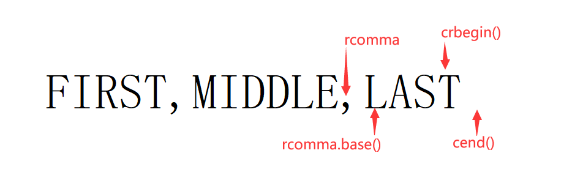

# 泛型算法

标准库没给所有容器都定义成员函数来实现查找特定元素、替换或者删除特定值、重排元素顺序，而是定义了一组**泛型算法**(generic algorithm)。

泛型算法含义：

- 算法：实现了一些经典算法的公共接口，比如排序和搜索。
- 泛型：可以用于不同类型的元素和多种容器类型(包括内置数组)

## 概述

大多算法都定义在`algorithm`中。标准库还在头文件`numeric`里定义了一组数值泛型算法。

```cpp
#include<algorithm>
#include<numeric>
```

通常算法遍历范围，对其中每个元素进行一些处理。

使用标准库算法`find`查找迭代器`vector`的特定值`42`：

```cpp
int main(){
    vector<int> vec{0,1,4,5,7,7,3,2,42,1,5};
    int val = 42;
    auto result = find(vec.cbegin(), vec.cend(), val);
    return 0;
}
```

其中的`result`就是返回结果：

- 找到：指向找到的值的迭代器
- 没找到：第二个参数

判断是否找到：

```c++
cout << (*result == val ? *result : false) << endl;
```

内置数组使用示例：

```c++
int main(){
    int val = 42;
    int ia[] = {1,2,3,4,6,42,12,3,5};
    auto result = find(begin(ia), end(ia), val);
    cout << (*result == val ? *result : false) << endl;
    return 0;
}
```

还可以在序列的子范围里面找，只要把指向子范围首元素和尾元素之后位置的迭代器

也可以指定子范围里面找，只需要将迭代器参数修改一下就行：

```cpp
auto result = find(ia+1, ia+7, val);
```

#### 算法如何工作

`find`的工作是在一个未排序的元素序列里查找一个特定元素。`find`概念步骤：

1. 访问序列首元素
2. 比较此元素与我们要查找的值
3. 若该元素与我们要查找的值匹配，`find`返回标识该元素的值
4. 否则`find`前进到下一个元素，重复2-3的步骤
5. 如果到达序列尾，`find`停止
6. 若`find`到达序列尾，则应返回一个指出没找到元素的值。该值应和步骤3返回的值必须具有相容的类型。

#### 迭代器使算法不依赖于容器，但算法依赖于元素类型的操作

上述`find`步骤除了第二步，其它步骤都可以用迭代器来实现：

- 迭代器解引用访问元素
- 若元素匹配，则返回指向该元素的迭代器，否则迭代器移动到下个元素
- 尾后迭代器可以判断`find`是否到达序列的末尾
- ...

虽然迭代器的使用使得算法不依赖于容器类型，但是大多数算法都用了一个或者多个元素类型上的操作。

比如在步骤2里面，`find`用元素类型的`==`运算符完成每个元素与给定值的比较。

其它算法可能要求元素类型支持`<`运算符。但是大多数算法提供了一种方式，允许我们可以用自定义的操作来代替默认的运算符。

类似的其他的操作还有如`count`计算指定值在容器中出现了几次

```cpp
int main(){
    int val = 42;
    int ia[] = {1,2,3,4,6,42,12,3,5};
    auto result = count(ia+1, ia+7, val);
    cout << result << endl;
    return 0;
}
```

泛型算法不会执行容器的操作，只会运行在迭代器之上，执行迭代器的操作。

编程假定：算法不会改变底层容器的大小。算法可能改变容器中保存的元素的值，也可能在容器里移动元素，但是永远不会直接添加或或者删除元素。

## 初识泛型算法

标准库提供了很多算法。这些算法有一样的结构，理解结构可以更容易学习和使用这些算法。

除少数例外，大多算法都对一个范围里的元素做操作。该元素范围称之尾"输入范围"。

理解算法的最基本的方法就是了解它们是否读取元素、改变元素或者是重新排列元素顺序。

### 只读算法

有些算法只会读取输入范围的元素，而不改变元素，比如`find`和`count`就是。

还有个只读算法是`accumulate`，定义在头文件`numeric`里。该算法接收三个参数，前两个参数接收求和的元素的范围，第三个参数是和的初始值。示例：

```cpp
int sum = accumulate(vec.cbegin(), vec.cend(), 0);
```

accumulate的第三个参数的类型决定了函数中使用哪个加法运算符以及返回值的类型

#### 算法和元素类型

其实也可以用`accumlate`来把容器里的所有`string`元素连接起来

```cpp
int main(){
    vector<string> v = {"第","一","二","三"};
    string result = accumulate(v.cbegin(), v.cend(), string("排名"));
    cout << result << endl;
    return 0;
}


// 返回: 排名第一二三
```

上例的第三个参数创建了一个临时的`string`对象传入。切记，不能用`""`的字符串字面值，因为`""`的类型是`const char*`，该类型没有`+`运算符，尝试这么做会导致编译错误。

对于只读的算法，最好传入`cbegin()`和`cend()`。但如果想要对算法返回的迭代器做改动，就要传入`begin()`和`end()`

#### 操作两个序列的算法 equal

`equal`也是个只读算法，用于确定两个序列是否保存相同的值。其将第一个序列中的每个元素和第二个序列的对应元素进行比较，判断它们是否相等。

该算法接受三个迭代器参数：

- 前两个：输入范围
- 第三个：第二个序列的首元素

**两个序列的元素数量至少应该一样。**

```cpp
int main(){
    vector<string> v{"第","一","二","三"};
    string l[] = {"第","一","二","三"};
    bool result1 = equal(v.cbegin(), v.cend(), l);
    bool result2 = equal(v.cbegin(), v.cend(), l+1);
    cout << result1 << endl;
    cout << result2 << endl;
    
    return 0;
}

/*
返回
1
0
*/
```

可以看到对比的两个序列类型不同，一个`vector`一个内置数组。

其实元素类型也可以不同，只要能用`==`来比较两个元素类型就行。

只接受一个单一迭代器来表示第二个序列的算法，都假定第二个序列至少和第一个序列一样长。

### 写容器元素的算法

一些算法把新值赋给序列里的元素。使用这类算法的时候需要确保序列原大小最小不能小于我们要求算法写入的元素数目。

有的算法会自己向输入范围写入元素。这些算法本质上不危险，顶多写入和给定序列一样多的元素。

例如`fill`算法接受输入范围，还接受一个值作为第三个参数。`fill`将给定的这个值赋予输入序列里的每个元素：

```cpp
fill(vec.begin(), vec.end(), 0);			// 把每个元素重置为0

fill(vec.begin(), vec.begin() + vec.size()/2, 10);		// 把容器的前半部分设置成10
```

有些算法从两个序列里读取元素，虽然序列的类型可以不同，但是至少要能保证可以比较两个序列里的元素。

用一个迭代器来表示第二个迭代器的算法都假定两个迭代器所指向的序列一样长。假设第二个迭代器表示的序列比第一个短，那么诸如`equal`这样的算法还是会继续访问第二个迭代器末尾之后不存在的元素，拿来与第一个序列比较。

#### 算法不检查写操作

有些算法接收一个迭代器来指出一个单独的目的位置。这些算法把新值付给一个序列里的元素，序列从目的位置迭代器指向的元素开始。

比如：`fill_n(迭代器, n, value)`：把`value`赋给迭代器指向的元素开始的`n`个元素

使用`fill_n`把一个新值赋给`vector`里的元素：

```cpp
vector<int> vec;		// 空vector
// 使用vec 赋予它不同值
fill_n(vec.begin(), vec.size(), 0);		// 把所有元素设为0

vector<int> vec2;		// 空vector
// 灾难 vec2是空的！
fill_n(vec2.begin(), 10, 0);
```

向目的位置迭代器写入数据的算法假定目的位置足够大，可以容纳要写入的元素

#### 介绍back_inserter

一种保证算法有足够元素空间来容纳输出数据的方法是使用**插入迭代器**(insert iterator)。

插入迭代器是种向容器里添加元素的迭代器。

使用`back_inserter`，它是定义在头文件`iterator`里的一个函数

`back_inserter`接受一个指向容器的引用，返回一个和这个容器绑定的插入迭代器。

使用这个迭代器赋值的时候，赋值运算符会调用`push_back`把一个具有给定值的元素添加到容器里：

```cpp
vector<int> vec;		// 空向量
auto it = back_inserter(vec);		// 通过它赋值会把元素添加到vec里
*it = 42;				// vec-->{42}
```

常用`back_inserter`来创建一个迭代器，作为算法的目的位置来使用。

```cpp
vector<int> vec;			// 空向量

fill_n(back_inserter(vec), 10, 0);		// 创建一个插入迭代器 可以用来向vec添加元素 现在vec有10个0
```

每步迭代里`fill_n`会给序列的一个元素赋值。但是我们传的是`back_inserter`插入迭代器，所以每次赋值都会在`vec`里调用`push_back`。所以最后会向`vec`添加`10`个`0`。

#### 拷贝算法

该算法接受三个参数：

- 前两个参数表示输入范围，
- 第三个表示目的序列的起始位置。

拷贝算法指：向迭代器所指向的输出序列里的元素**写入**数据的算法。

该算法把输入范围里的元素拷贝到第三个参数所表示的目的序列里。

**目的序列至少要包含和输入序列一样多的元素。**

拷贝内置数组示例：

```cpp
int a1[] = {0,1,2,3,4,5,6,7,8,9};
int a2[sizeof(a1)/sizeof(*a1)];		// a2和a1一样大小
// ret指向拷贝到a2的尾元素之后的位置
auto ret = copy(begin(a1), end(a1), a2);		// 把a1的内容拷贝给a2
```

`copy`返回的是目的位置迭代器(递增后)的值。也就是`ret`正好拷贝到`a2`的尾元素之后的位置(尾后迭代器)。

`replace`算法读入一个序列，并把里面所有等于给定值的元素都改成另一个值。该算法接受4个参数：

- 前两个是输入范围
- 第三个是要搜索的值
- 第四个是替换后的值

也就是在指定范围里搜索第三个参数的值替换成第四个参数的值。

```cpp
replace(ilst.begin(), ilst.end(), 0, 42);
```

如果想保留原序列，那么可以调用`replace_copy`，相比`replace`更多出一个参数，原来的第三第四个参数往后移，原本第三个参数是搜索的值，现在第三个参数是指出在替换之后保存序列的位置：

```cpp
// ivec保存ilst替换之后的状态 ilst内容不变
replace_copy(ilst.cbegin(), ilst.cend(), back_inserter(ivec), 0, 42)
```

使用示例：

```cpp
int main(){
    int a1[] = {0,1,2,3,4,5,6,7,8,9};
    vector<int> ivec;
    replace_copy(begin(a1), end(a1), back_inserter(ivec), 5, 10);
  
    cout << "now ivec:";
    for (int i: ivec)
        cout << i << ' ';
    cout << endl;
    cout << "now a1:";
    for (int i: a1)
        cout << i << ' ';
    cout << endl;
    return 0;
}

/*返回示例
now ivec:0 1 2 3 4 10 6 7 8 9 
now a1:0 1 2 3 4 5 6 7 8 9
*/
```

### 重排容器元素算法

重新排列容器元素的顺序

比如`sort`会将序列的元素重新排列，它是利用元素类型的`<`运算符来实现的。

可以使用标准库算法`unique`来对容器去重，但是因为算法不能执行容器操作，所以还得用容器的如`erase`这样的成员函数来完成真正的删除操作：

```cpp
#include<iostream>
#include<algorithm>
#include<numeric>
#include<vector>
#include<string>
using namespace::std;

void elimDups(vector<string> &words)
{
    // 按字典顺序排列words 以便查找重复的单词
    sort(words.begin(), words.end());
    // unique重新排列输入范围 使每个单词只出现一次
    // 排列在范围的前部 返回指向不重复区域之后一个位置的迭代器
    auto end_unique = unique(words.begin(), words.end());       // 通过erase可以得知去重后的排列是 {不重复, 重复} 而返回的就是指向重复的第一个值的迭代器
    // 使用向量操作erase删除重复的单词
    words.erase(end_unique, words.end());
    for (string i: words)
        cout << i << ", ";
    cout << endl;
}

int main(){
    vector<string> my_words{"a", "b", "c", "a", "c", "d", "d", "z", "i"};
    // ↑ 该容器重新排序且去重后的顺序是 a, b, c, d, i, z
    elimDups(my_words);
    return 0;
}
```

标准库算法对迭代器而不是容器进行操作。所以算法不能直接添加或者删除元素。

这样使用`erase`是安全的，即使容器没有重复值，那么顶多不过是传了个空的范围而已。

## 定制操作

很多算法都用`<`或`=`来完成元素比较。但标准库其实还允许用户提供自己定义的操作来代替默认运算符。

### 向算法传递函数

例如可以使用`sort`的重载版本，接受第三个参数，该参数是个**谓词**(predicate)。

#### 谓词

谓词是个可以调用的表达式，返回一个可以作为条件的值。

标准库算符所使用的谓词：

- **一元谓词**(unary predicate)：只接受单一参数
- **二元谓词**(binary predicate)：有两个参数

接受谓词参数的算法对序列里的元素使用谓词。所以元素类型必须可以转换成谓词的类型。

`sort`还可以接受二元谓词，可以将`isShorter`传递给它。

示例使用`sort`进行长度排序(原本是大小排序)：

```cpp
// 比较函数 用来按长度排序单词 短的在前 长的在后
bool isShorter(const string &s1, const string &s2)		// 二元谓词 接受两个参数
{
    return s1.size() < s2.size();
}

int main(){
    vector<string> my_words{"abaaa", "ba", "cddd", "z"};
    // ↑ 该容器重新排序且去重后的顺序是 "z", "ba", "cddd", "abaaa"
    sort(my_words.begin(), my_words.end(), isShorter);
    for (string i: my_words)
        cout << i << ' ';
    return 0;
}
```

#### 排序算法

在按长度排序的基础上还希望相同长度的单词按字典排序，可以用`stable_sort`算法。

```cpp
int main(){
    vector<string> my_words{"abaaa", "a", "ba", "cddd", "b", "z", "c", "a", "z", "cddd"};
    // ↑ 该容器重新排序且去重后的顺序是 "a", "b", "c", "z","ba", "cddd", "abaaa"
    elimDups(my_words);         // 按字典序重排后去重
    stable_sort(my_words.begin(), my_words.end(), isShorter);       // 按长度重新排序 这种算法维持长度相等的元素原有顺序
    for (string i: my_words)
        cout << i << ' ';
    return 0;
}
```

### 练习

标准库定义了名为`partition`的算法，其接受一个谓词，对容器内容进行划分：

- 谓词为`true`的值会排在容器前半部分
- 谓词为`false`的排在容器后半部分

算法返回一个迭代器，指向最后一个使谓词`true`的元素之后的位置。

使用它来写个函数，令其接受一个`string`，返回一个`bool`值，指出`string`是否有5个或更多字符。使用该函数划分`words`。打印出长度大于等于`5`的元素。

```cpp
bool isBig4(const string &s1)
{
    return s1.size() > 4;
}

void myPartition(vector<string> &words)
{
    vector<string>::iterator piter = partition(words.begin(), words.end(), isBig5);
    words.erase(piter, words.end());
    for (string i : words)
        cout << i << ' ';
    cout << endl;
}

int main(){
    vector<string> words{"12", "abcde", "123456", "2468", "13579", "asdfghjkl"};
    // 过滤 12 2468
    myPartition(words);
    return 0;
}
```

### lambda表达式

示例求大于等于指定长度的单词有多少，修改输出使程序只打印大于等于给定长度的单词：

```c++
void biggies(vector<string> &words, vector<string>::size_type sz)
{
    elimDups(words);										// 将按字典序排列 删除重复单词
    
    stable_sort(words.begin(), words.end(), isShorter);		// 按长度排序 长度相同的单词维持字典序
    // 获取一个迭代器 指向第一个满足 size()>=sz的元素
    // 计算满足size>=sz的元素的数目
    // 打印长度大于等于给定值的单词 每个但此后接个空格
}
```

新问题是在`vector`里找第一个大于等于给定长度的元素。只要找到了这个元素，根据它的位置，就可以计算出有多少元素的长度大于等于指定的长度

可以使用标准库算法`find_id`来查找第一个具有特定大小的元素。

`find_if`算法接受输入范围，第三个参数是个谓词。返回第一个使谓词返回非`fasle`的元素，若不存在这种元素，则返回尾迭代器。

也就是说要写个函数，让它接受一个`string`和长度，并返回一个`bool`表示该`string`是否大于长度。

#### 介绍lambda

可以向一个算法传递任何类别的**可调用对象**(callable object)。对于一个对象或者一个表达式如果可以对其使用调用运算符`(参数)`，就称之可调用。

前面使用过的可调用对象有函数和函数指针。

还有其它两种可调用对象：

- 重载了函数调用运算符的类(后面会学)
- **lambda表达式**(lambda expression)。

一个lambda表达式表示一个可以第哦啊用的代码单元。可将其理解为一个未命名的内联函数。

lambda表达式格式：

```cpp
[捕获列表(所在函数的局部变量列表,通常为空)] (参数列表) -> return 返回类型 ( 函数体 )
```

`lambda`必须用[尾置返回](https://github.com/nafnix/Cpp-Primer5th-Note-chinese/blob/master/Part-6/%E5%87%BD%E6%95%B0.md#%E4%BD%BF%E7%94%A8%E5%B0%BE%E7%BD%AE%E8%BF%94%E5%9B%9E%E7%B1%BB%E5%9E%8B)来指定返回类型。

参数列表和返回类型可以没有，但是必须要有捕获列表和函数体。

```cpp
// 定义一个可调用对象 不接受参数 返回42
auto f= [] { return 42; }
f();			// 调用
```

如果只是一个`return`语句，没有指定返回类型，那么返回类型从返回的表达式的类型推断而来。否则返回类型是`void`。

如果lambda的函数体包含任何单一`return`语句外的内容，且未指定返回类型，则返回`void`。

#### 向lambda传递参数

lambda不能有默认参数。实参和形参的类型必须匹配。

```cpp
// 与原isShorter函数完成相同功能的lambda
bool isShorter = [] (const string &a, const string &b) { return a.size() < b.size(); };
```

也可以直接内嵌调用`stable_sort`：

```c++
stable_sort(words.begin(), words.end(), [] (const string &a, const string &b) { return a.size() < b.size(); })
```

#### 使用捕获列表

```cpp
[sz](const string &a) { return a.size() >= sz; };
```

`sz`是当前`lambda`所在的函数内定义的局部变量，若要使用该局部变量，那么捕获列表不可忽略该变量。

#### 调用find_if

还可以用该`lambda`查找第一个长度大于等于`sz`的元素：

```cpp
// 获取一个迭代器 指向第一个满足 size() >= sz 的元素
auto wc = find_if(words.begin(), words.end(), [sz](const string &a) { return a.size() >= sz; };)
```

使用示例，在`words`容器中查找第一个长度大于`sz`的位置：

```cpp
int main(){
    vector<string> words{"12", "abcde", "123456", "2468", "13579", "asdfghjkl"};
    string::size_type sz = 4;
    vector<string>::iterator wc = find_if(words.begin(), words.end(), [sz](const string &a) { return a.size() >= sz; });
    cout << *wc << endl;
    return 0;
}
```

结果是`"abcde"`。

还可以用它来计算从它开始到`words`末尾一共有几个元素：

```cpp
// 计算满足size >= sz的元素的数目
auto count = words.end() - wc;		// 计算words距离第一个长度大于sz总共有多远
```

#### for_each算法

为打印`words`中长度大于等于`sz`的元素，可以用`for_each`。

该算法接受一个可以调用的对象，并对输入序列中每个元素调用此对象：

```cpp
// 打印长度大于等于给定值的单词 每个单词后接一个空格
for_each(wc, words.end(), [](const string &s){cout << s << ' ';});
cout << endl;
// 返回 abcde 123456 2468 13579 asdfghjkl
```

lambda可以直接使用定义在当前函数之外的名字。例如本例的`cout`。

#### 完整的biggies

```cpp
string make_plural(size_t ctr, const string &word, const string &ending)
{
    return (ctr > 1) ? word + ending : word;
}

void biggies(vector<string> &words, vector<string>::size_type sz)
{
    elimDups(words);        // 将words按字典重新排序 删除重复单词
    // 按长度排序 长度相同的单词维持字典序
    stable_sort(words.begin(), words.end(), [](const string &a, const string &b){ return a.size() < b.size(); });
    // 获取一个迭代器 指向第一个size()>=sz的元素
    vector<string>::iterator wc = find_if(words.begin(), words.end(), [sz](const string &a){ return a.size() >= sz; });
    // 计算size>=sz的元素的数目
    auto count = words.end() - wc;
    // 调用make_plural来输出"word"或者"words"
    cout << count << " " << make_plural(count, "word", "s") << " of length " << sz << " or longer" << endl;
    // 打印长度等于给定值的单词 每个单词后接一个空格
    for_each(wc, words.end(), [](const string &s){cout << s << " ";});
    cout << endl;
}

int main(){
    vector<string> words{"ab", "abcde", "abcdef", "eda", "bbbbb", "asdfghjkl", "zsadf"};
    biggies(words, 4);
    return 0;
}
```

### lambda捕获和返回

定义一个lambda时候，编译器生成一个和lambda对应的新的(未命名的)类类型。

可以理解成向一个函数传递一个lambda时候，同时定义了一个新类型和该类型的一个对象：

传递的参数就是该编译器生成的类类型的未命名对象。

类似，使用`auto`定义一个用lambda初始化的变量时，定义了一个从lambda生成的类型的对象。

默认从lambda生成的类都包含一个对应该lambda所捕获的变量的数据成员。

类似其它类的数据成员，lambda的数据成员也在lambda对象创建的时候被初始化。

#### 值捕获

被捕获的值是在lambda创建时候拷贝，而不是调用时候拷贝。

因为是在创建的时候拷贝，所以在之后对拷贝的原对象做修改，不会改变lambda里面已经拷贝完成的值。

#### 引用捕获

```cpp
void fcn2()
{
    size_t v1 = 42;			// 局部变量
    // 对象f2包含v1的引用
    auto f2 = [&v1] { return v1; };
    v1 = 0;
    auto j = f2();			// 是0
}
```

当以引用方式捕获一个变量的时候，必须要确保在lambda执行的时候变量是存在的。

如果以lambda作为函数的`return`返回值，那么不要返回引用捕获的值，因为出了函数，那个引用就会失效。就跟不要返回局部变量的引用一样。

如果捕获一个指针或者迭代器或是引用，就要确保lambda执行时，绑定的指针或迭代器或引用仍然存在。且需要保证对象具有预期的值。在lambda执行到创建的过程中，可能还有其它代码修改绑定的对象的值。也就是说，在指针或者引用被捕获的时候，绑定的对象的值是我们所期望的，但是在lambda执行完后，该对象的值可能已经完全不同了。

一般我们应该尽量减少捕获的数据量，使之避免潜在的捕获导致的问题。且，如果可能的话，应该避免捕获指针或者引用。

#### 隐式捕获

还可以让编译器根据lambda里的代码来推断我们想用哪些变量。

为了指示编译器推断捕获列表，应在捕获列表中写个`&`或者`=`：

- `&`：告诉编译器采用捕获引用方式
- `=`：告诉编译器采用值捕获方式。

```cpp
wc = find_if(words.begin(), words.end(), [=](const string &s) {return s.size() >= sz;})
```

如果想对部分值使用值捕获，其他变量用引用捕获，可以混合使用隐式捕获和显式捕获：

```cpp
void biggies(vector<string> *words, vector<string>::size_type sz, ostream &os = cout, char c = ' ')
{
    // 其它处理和前面的一样
    // os隐式捕获 引用捕获方式 c显式不糊哦 值捕获方式
    for_each(words.begin(), words.end(), [&, c](const string &s) {os << s << c;});
}
```

混合使用的时候，捕获列表的第一个元素必须是`&`或`=`。此符号制定了默认捕获方式为引用或者值。

且混合使用的时候，显式捕获的变量必须使用和隐式捕获不同的方式，并且如果隐式捕获是值捕获，那么显式捕获不能有this，显式捕获的值都得用`&`。

#### 可变lambda

默认情况下，对于一个值被拷贝的变量，lambda不会改变其值。如果想改变一个被捕获的变量的值，就得在参数列表前加上关键字`mutable`：

```cpp
void fcn3()
{
    size_t v1 = 42;		// 局部变量
    // f可以改变它所捕获的变量的值
    auto f = [v1] () mutable { return ++v1; };
    v1 = 0;
    auto j = f();		// j是43
}
```

#### 指定lambda返回类型

默认如果一个lambda体包含`return`之外的任何语句，则编译器假定该lambda返回void。

可以使用标准库`transform`算法和一个lambda来把一个序列里的每个负数替换成该负数的绝对值：

```cpp
transform(vi.begin(), vi.end(), vi.begin(), [](int i){return i<0?-1:i;});
```

函数`transform`接受三个迭代器参数和一个可以调用的对象。前两个迭代器表示输入序列，第三个是目的位置。

算法对输入序列里的每个元素调用可调用对象，并把结果写到目的位置。

如果输入迭代器和目的迭代器一样，那么`transform`会把输入序列里的每个元素替换成可调用对象操作该元素得到的结果。

上述例子没有指定返回值类型，因为可以根据条件运算符的类型推断出来。但如果把程序改成看着是等价的`if`语句，就会产生编译错误：

```cpp
// 错误 不能推断lambda的返回类型
transform(vi.begin(), vi.end(), vi.begin(), [](int i){if(i<0)return -i;else return i;});
```

编译器推断这个版本的lambda返回的类型是`void`，但是它却返回了个`int`值。

如果要给lambda定义返回类型，要用[尾置返回类型](https://github.com/nafnix/Cpp-Primer5th-Note-chinese/blob/master/Part-6/%E5%87%BD%E6%95%B0.md#%E4%BD%BF%E7%94%A8%E5%B0%BE%E7%BD%AE%E8%BF%94%E5%9B%9E%E7%B1%BB%E5%9E%8B)：

```cpp
transform(vi.begin(), vi.end(), vi.begin(), [](int i) -> int {if(i<0) return -i; else return i;});
```

### 参数绑定

对于只在一两个地方用的简单操作，lambda表达式是最有用的。

但如果要在很多地方用相同操作，就要定义一个函数了，而不是多次编写相同的lambda表达式。同样如果一个操作要很多语句才能完成，通常用函数更好。

如果lambda的捕获列表是空的，通常可以用函数来代替。但是如果捕获列表有值，那函数就不好替代了。

比如可以在`find_if`函数里调用lambda比较一个`string`和一个给定大小。如果用函数写一个完成工作的函数很简单，只需要接受一个`string`和一个给定大小然后返回比较值就行了。但是不能用这个函数作为`find_if`的一个参数。

`find_if`接受一个一元参数，而这个函数需要一个`string`和一个给定大小！

如果要解决使用该函数替代lambda，就得解决怎么向函数的第二个参数(给定大小)传值的问题。

#### 标准库bind函数

解决方法是用一个名为`bind`的标准库函数，其定义在头文件`functional`里。

可以把`bind`函数看成是一个通用的[函数适配器](https://github.com/nafnix/Cpp-Primer5th-Note-chinese/blob/master/Part-9/%E9%A1%BA%E5%BA%8F%E5%AE%B9%E5%99%A8.md#%E5%AE%B9%E5%99%A8%E9%80%82%E9%85%8D%E5%99%A8)，接受一个可调用对象，生成一个新的可调用对象来"适应"原对象的参数列表。

格式：auto _newCallable_ = bind(_callable_, _arg_list_);

- newCallable：可调用对象
- arg_list：逗号分隔的参数列表，对应callable的参数

调用newCallable的时候，newCallable会调用callable，并传递给它arg_list里的参数。

arg_list里的参数可能包含像_n_的名字，n是个整数。这些参数是"占位符"，表示newCallable的参数，占据了传递给newCallable的参数的"位置"。数值n表示生成的可调用对象里参数的位置：*_1*是newCallable的第一个参数，*_2*是第二个参数，以此类推。

而*_1*和*_2*这种占位符定义在`std`命名空间的`placeholders`命名空间中，所以使用前要导入这些命名

#### 绑定check_size的sz参数

```cpp
#include<functional>
#include<string>
using std::string;
using std::bind;
using std::placeholders::_1;			// 导入_1和_2这些占位符的命名空间

bool check_size(const string &s, string::size_type sz)
{
    return s.size() >= sz;
}

int main(){
    // check6是一个可以调用的对象，接受一个string类型的参数
	// 并且用该string和值6来调用check_size
    auto check6 = bind(check_size, _1, 6);		// 只有一个占位符_1 表示check6的这个参数对那个check_size的第一个参数。当check6接收到该参数的时候，会将该参数传递给check_size
    return 0;
}
```

使用，使用`check6`或者在`find_if`里使用参数绑定

```cpp
    string s("hello");
    auto check6 = bind(check_size, _1, 6);
    bool b1 = check6(s);            // 相当于调用check_size(s, 6)
    auto wc = find_if(words.begin(), words.end(), bind(check_size, _1, sz));
```

其实也有另一种`using`语法，而不是分别声明每个占位符：

```cpp
using namespace 命名空间;
```

表示希望所有来自命名空间里的名字都可以在我们的程序里直接使用：

```cpp
using namespace std::placeholders;
```

`bind`和`placeholders`命名空间都帝国一在`function`头文件里。

#### bind的参数

```cpp
auto g = bind(f, a, b, _2, c, _1);
```

生成一个新的可调用对象，又两个参数，分别用占位符*_2*和*_1*表示。该对象将它自己的参数作为第三个和第五个传递给`f`。`f`的第一、二、四个参数绑定到`a`和`b`和`c`上。

`bind`调用参数映射：

```cpp
g(_1, _2);		// 假如_1是X _2是Y

f(a, b, Y, c, X);
```

#### 用bind重排参数顺序

可以用`bind`颠倒`isShorter`的含义

```cpp
// 按单位长度由短到长排序
sort(words.begin(), words.end(), isShorter);

// 按单位长度由长到短排序
sort(words.begin(), words.end(), bind(isShorter, _2 ,_1));
```

#### 绑定引用参数

默认`bind`的那些不是占位符的参数被拷贝到`bind`返回的可调用对象里。但是和lambda类似，有时对有些绑定的参数我们希望以引用方式传递，或者是要绑定的参数的类型没有办法拷贝。

例如对`iostream`这类参数就不能拷贝。

```cpp
ostream &print(ostream &os, const string &s, char c)
{
    return os << s << c;
}

// os是个局部变量，引用一个输出流
// c是个局部变量 类型是char
for_each(words.begin(), words.end(), [&os, c](const string &s){os << s << c;});
```

但是不能直接用`bind`来代替对`os`的捕获

```cpp
// 错误 不能拷贝os
for_each(words.begin(), words.end(), bind(print, os, _1, ' '));
```

原因是`bind`拷贝它的参数，而我们不可以拷贝一个`ostream`。如果我们希望传递给`bind`一个对象而又不拷贝它，就必须用标准库`ref`函数。

```cpp
for_each(words.begin(), words.end(), bind(print, ref(os), _1, ' '));
```

旧版本的C++提供的绑定函数参数的语言特性限制更多，也更加复杂。标准库定义了两个分别名为`bind1st`和`bind2nd`的函数。类似`bind`，这两个函数接受一个函数作为参数，生成一个新的可调用对象，该对象调用给定函数，并将绑定的函数传递给它。但是这些函数分别只能绑定一个或者两个参数。因为这些函数局限性太强，在新标准中已被弃用(deprecated)。也就是新版本中不再支持的特性。新的C++程序应该用`bind`。

## 再探迭代器

除了容器定义的迭代器之外，标准库在头文件`iterator`里还定义了额外几种迭代器：

- **插入迭代器**(insert iterator)：这些迭代器被绑定到一个容器上，可以用来向容器插入元素
- **流迭代器**(stream iterator)：这些迭代器被绑定到输入或者输出流上，可以用来遍历所有关联的IO流。
- **反向迭代器**(reverse iterator)：这些迭代器向后而不是向前移动。除了`forward_list`外的标准库容器都有反向迭代器。
- **移动迭代器**(move iterator)：这些迭代器是用于移动其中的元素。

### 插入迭代器

这是一种迭代器适配器，接受一个容器，生成一个迭代器，能实现向给定容器添加元素。

插入迭代器操作：

- `it = t`：在`it`指定的当前位置插入值`t`。假定`c`是`it`绑定的容器，依赖于插入迭代器的不同种类，此赋值会分别调用`c.push_back(t)`、`c.push_front(t)`或者`c.insert(t, p)`，其中`p`是传递给`inserter`的迭代器位置
- `*it, ++it, it++`：这些操作虽然存在，但不会对`it`做任何事情。每个操作都返回`it`。

插入器的三种类型：

- `back_inserter`：创建一个使用`push_back`的迭代器
- `front_inserter`：创建一个使用`push_back`的迭代器
- `inserter`创建一个使用`insert`的迭代器。该函数可以接受第二个参数，这个参数必须是个指向给定容器的迭代器。元素将被插入到给定迭代器所表示的元素之前。

当调用`inserter(c, iter)`时候，我们得到一个迭代器，接下来再用它的时候，会把元素插入到`iter`原来所指的元素之前的位置。

就是如果`it`是由`inserter`生成的迭代器，那么下面这样的赋值语句：

```cpp
*it = val;
```

其效果与下面代码一样：

```cpp
it = c.insert(it, val);		// it 指向新加入的元素
++it;						// 递增it使它指向原来的元素
```

`front_inserter`会把元素插入到容器的第一个元素之前。

```cpp
list<int> lst = {1,2,3,4};
list<int> lst2, lst3;

// 因为是插入到容器的第一个元素之前 所以值会颠倒过来 所以lst2的值是 4, 3, 2, 1
copy(lst.begin(), lst.end(), front_inserter(lst2));

// 因为是插入到当前位置 然后返回的是[旧]当前位置 所以lst3是1,2,3,4
copy(lst.cbegin(), lst.cend(), inserter(lst3, lst3.begin()));
```

### iostream迭代器

- `is_iterator`读取输入流
- `ostream_iterator`向一个输出流写数据。

这些迭代器将它们对应的流当作是一个特定类型的元素序列来处理。

通过流迭代器，我们可以用泛型算法从流对象读取数据以及向其写入数据。

#### istream_iterator操作

创建流迭代器的时候，必须要指定迭代器将要读写的对象类型。

因为`istream_iterator`使用`>>`读入流。所以其要读取的类型必须定义了输入运算符。

创建一个`istream_iterator`的时候，可以把它绑定到一个流。

```cpp
istream_iterator<int> int_it(cin);		// 从cin读取int
istream_iterator<int> int_eof;			// 尾后迭代器
ifstream in("afile");
istream_iterator<string> str_it(in);	// 从"aile"读入字符串
```

使用`istream_iterator`从标准输入读取数据，存入`vector`示例：

```cpp
#include<iostream>
#include<vector>
#include<iterator>

using namespace std;

int main()
{
    istream_iterator<int> int_iter(cin);        // 从cin读取int
    istream_iterator<int> eof;                  // 因为是空的 所以可以当作istream尾后迭代器来使用
    vector<int> vec;
    while(int_iter != eof)                      // 当有数据可以读取的时候
        // 后置递增运算读取流 返回迭代器的旧值
        // 解引用迭代器 获得从流读取的前一个值
        vec.push_back(*int_iter++);
    return 0;
}
```

此循环从`cin`读取`int`值，保存在`vec`里。

可以重写成如下形式：

```cpp
istream_iterator<int> int_iter(cin), eof;		// 从cin读取int
vector<int> vec(in_iter, eof);					// 从迭代器范围构造vec
```

| 操作                          | 含义                                                       |
| ----------------------------- | ---------------------------------------------------------- |
| `istream_iterator<T> in(is);` | `in`从输入流`is`读取类型是T的值                            |
| `istream_iterator<T> end;`    | 读取类型是T的值的`istream_iterator`迭代器，表示尾后位置    |
| `in1 == in2`                  | 两者需是相同类型。判断两者是否相等                         |
| `in1 != in2`                  | 同上，不过是不相等                                         |
| `*in`                         | 返回从流中读取的值                                         |
| `in->mem`                     | 与`(*in).mem`的含义相同                                    |
| `++in, in++`                  | 返回指向迭代器的引用，具体哪个引用看是前置递增还是后置递增 |

#### 使用算法操作流迭代器

流迭代器缺少某些迭代器操作的支持。具体有哪些算法可以用于流迭代器会在后面说。

#### istream_iterator允许使用懒惰求值

把一个`istream_iterator`绑定到一个流的时候，标准库不能保证迭代器能够马上从流里面读取数据。其实是直到我们使用迭代器时从真正读取。

大多时候立即读取还是推迟读取没有区别。但如果创建一个`istream_iterator`还没用就销毁了，或者正在从多个不同的对象同步读取同一个流，那么什么时候读取可能就很重要了。

#### ostream_iterator操作

可以对具有`<<`的类型定义`ostream_iterator`。

创建`ostream_iterator`的时候可以(选择)提供第二个参数，它是个字符串，在输出每个元素之后打印该字符串。该字符串必须是个C风格字符串(一个字符串字面常量或者一个指向以空字符结尾的字符数组的指针)。

必须把`ostream_iterator`绑定到一个流，不允许空的或者表示尾后位置的`ostream_iterator`。

| 操作                              | 含义                                                         |
| --------------------------------- | ------------------------------------------------------------ |
| `ostream_iterator<T> out(os);`    | `out`将类型为`T`的值写到输出流`os`里                         |
| `ostream_iterator<T> out(os, d);` | `out`将类型为`T`的值写道输出流`os`里，每个值后面都带个`d`。  |
| `out = val`                       | 用`<<`运算符将`val`写入到`out`所绑定的`ostream`里。注意`val`的类型 |
| `*out, ++out, out++*`             | 这些运算符存在，但是不对`out`做任何事情。每个运算符的返回都是`out` |

使用`ostream_iterator`输出值的序列：

```cpp
ostream_iterator<int> out_iter(cou, " ");
for (auto e : vec)
    *out_iter++ = e;		// 每次 赋值语句实际上把元素写到cout
cout << endl;
```

向`out_iter`赋值的时候，可以忽略解引用和递增运算。也就是可以重写成如下形式

```cpp
for (auto e : vec)
	out_iter = e;
cout << endl;
```

但是推荐第一种写法，便于理解的同时也便于修改迭代器类型(毕竟大家用法都一样)。

升值可以用`copy`来打印`vec`里的元素，这样比编写循环更加简单：

```cpp
copy(vec.begin(), vec.end(), out_iter);
cout << endl;
```

#### 使用流迭代器处理类类型

由于`Sales_item`既有输入运算符又有输出运算符，所以可以用IO迭代器重写书店程序：

```cpp
istream_iterator<Sales_item> item_iter(cin), eof;
ostream_iterator<Sales_item> out_iter(cout, "\n");
// 将第一笔交易记录存在sum里 并读取下一条记录
Salse_item sum = *item_iter++;
while (item_iter != eof) {
    // 如果当前交易记录(存在item_iter里)有着相同的ISBN号
    if (item_iter->isbn() == sum.isbn())
        sum += *item_iter++;		// 将其加到sum上并且读取吓一跳记录
   	else {
        out_iter = sum;				// 输出sum当前值
        sum = *item_iter++;			// 读取下一条记录
    }
}
out_iter = sum;		// 打印最后一组记录的和
```

### 反向迭代器

反向迭代器就是在容器里从尾元素向首元素反向移动的迭代器。

除了`forward_list`之外的容器都支持反向迭代器。

使用反向迭代器示例，逆序打印容器元素：

```cpp
vector<int> vec = {0,1,2,3,4,5,6,7,8,9};
// 将r_iter绑定到尾元素
// crend指向首前元素
// ++r_iter实际上是递减
for (auto r_iter = vec.crbegin(); r_iter != vec.crend(); ++r_iter)
	cout << *r_iter << endl;		// 打印9,8,7...2,1,0
```

可以通过向`sort`传递一堆反向迭代器来把`vector`整理成递减序：

```cpp
sort(vec.begin(), vec.end());		// 按 "正常序" 排序vec
sort(vec.rbegin(), vec.rend());		// 按逆序排序 最小元素放在vec的末尾
```

#### 反向迭代器需要递减预算夫

只能从支持`++`和`--`的迭代器来定义反向迭代器。毕竟反向迭代器的目的是在序列里反向移动。

除了`forward_list`外的保准容器都支持递增递减运算。

但是流迭代器不支持递减运算，因为不可能在一个流中反向移动。

#### 反向迭代器和其他迭代器间的关系

使用反向迭代器打印最后一个单词：

```cpp
auto rcomma = find(line.crbegin(), line.crend(), ',');
/*
因为传递的是反向迭代器，所以find会从最后一个字符开始向前搜索。
如果有逗号，那么就指向最后一个逗号。否则返回line.crend()，也就是首前元素的迭代器
*/
// 当我们试图用rcomma打印找到的单词: 在FIRST,MIDDLE,LAST里找LAST
cout << string(line.crbegin(), rcomma) << endl;		// 该语句会打印TSAL
```

因为我们用的是反向迭代器，会反向处理`string`。所以上述输出语句从`crbegin`开始反向打印`line` 里内容就会反向输出`string`内容。

也就意味着不能直接使用`rcomma`，它会反向朝着`string`的开始位置移动。

需要把`rcomma`转成一个普通迭代器，可以在`line`里正向移动。可以通过调用`reverse_iterator`的`base`成员函数来完成这个转换，该成员函数会返回对应的普通迭代器(指向`L`)：

```cpp
cout << string(rcomma.base(), line.cend()) << endl;
```



技术上来说，普通迭代器与反向迭代器的关系反映了作弊和区间的特性。

> #### 使用左闭合范围蕴含的编程假定
>
> - 如果`begin`和`end`相等，那么范围就是空
> - 如果`begin`和`end`不相等，那么范围至少包含一个元素，并且`begin`指向该范围中的第一个元素
> - 我们可以对`begin`递增若干次，使得`begin==end`

关键在于`[line.crbegin(). rcomma]`和`[rcomma.base(), line.cend()]`指向`line`中相同的元素范围。为了实现这点，`rcomma`和`rcomma.base()`必须生成相邻位置而不是相同位置，`crbegin()`和`cend`也是这样。

需要注意使用普通迭代器给反向迭代器赋值，或者是给反向迭代器赋值时，结果迭代器和原迭代器指向的并不是相同的元素。

## 泛型算法结构

所有算法的最基本的特性是它要求其迭代器提供哪些操作。

像`find`算法只要求通过迭代器访问元素、递增迭代器以及比较两个迭代器是否相等这些能力。其它有些算法还要求读写随机访问元素的能力。

算法所要求的迭代器操作分为五个**迭代器类别**(iterator category)，每个算法都会对它的每个迭代器参数指明须提供哪类迭代器：

| 迭代器类别     | 读   | 写   | 扫描 | 递增 | 递减 |
| -------------- | ---- | ---- | ---- | ---- | ---- |
| 输入迭代器     | ✔    |      | 单遍 | ✔    |      |
| 输出迭代器     |      | ✔    | 单遍 | ✔    |      |
| 前向迭代器     | ✔    | ✔    | 多遍 | ✔    |      |
| 双向迭代器     | ✔    | ✔    | 多遍 | ✔    | ✔    |
| 随机访问迭代器 | ✔    | ✔    | 多遍 | ✔    | ✔    |

### 五类迭代器

对于向一个算法传递错误类别的迭代器的问题，很多编译器都不会给出任何警告或者提示

#### 迭代器类别

- **输入迭代器**(input iterator)：可以读取序列里的元素。输入迭代器只用于流访问，递增它可能会导致所以指向流的迭代器失效。对于输入迭代器，不可以百分百确定它的状态可以保存并且可以用来访问元素。所以输入迭代器只能用于单边扫描算法，比如`find`和`accumulate`要求输入迭代器。
- **输出迭代器**(output iterator)：可以看出输入迭代器功能上的补集——只写但是不读元素。只能向一个输出迭代器赋值一次。类似输入迭代器，输出迭代器之只能用在单遍扫描算法。用作目的位置的迭代器通常都是输出迭代器。比如`copy`函数的第三个参数。
- **前向迭代器**(forward iterator)：可以读写元素。此类迭代器只能在序列里朝着一个方向移动。前向迭代器支持所有输入和输出迭代器的操作，而且可以多次读写同一个元素。所以我们可以保存前向迭代器的状态，使用前向迭代器的算法可以对序列进行多次扫描。算法`replace`要求前向迭代器，`forward_list`上的迭代器就是前向迭代器。
- **双向迭代器**(bidirectional iterator)：可以正向/反向读写序列里的元素。除了支持所有前向迭代器的操作，还支持前置后置运算。算法`reverse`要求双向迭代器。除`forward_list`之外的容器都提供符合双向迭代器要求的迭代器。
- **随机访问迭代器**(random-access iterator)：提供在常量时间内访问序列中任意元素的能力。此类迭代器支持双向迭代器的所有功能，也支持迭代器的所有运算操作。算法`sort`就要求随机访问迭代器。`array`、`deque`、`string`、`vector`的迭代器都是随机访问迭代器，并且用于访问内置数组的指针也是。

### 算法形参模式

大多算法具有如下4种形式之一：

```cpp
算法名(beg, end, other args);
算法名(beg, end, dest, other args);
算法名(beg, end, beg2, other args);
算法名(beg, end, beg2, end2, other args);
```

`beg, end`表示算法所操作的输入范围。其中`dest`代指目的位置，`beg2, end2`指第二个范围的角色。除了这些参数，一些算法还接受额外的、非迭代器的特定参数。

如果只接受一个`beg2`参数，那么算法会假定从`beg2`开始的范围和`beg,end`所表示的范围至少一样。毕竟你没有告诉人家有多长，人家也不知道你有多长嘛

`dest`参数是个表示算法可以写入的目的位置的迭代器。算法假定(assume)：按其需要写入数据，不管写多少个元素都是安全的。

### 算法命名规范

除了参数规范，算法还遵循一套命名和重载规范。

#### 一些算法使用重载版本传递一个谓词

接受谓词参数来代替`<`或者`==`运算符的算法，以及那些不接受额外参数的算法，通常都是重载函数。

```cpp
unique(beg,end);					// 使用==运算符比较元素
unique(beg,end,comp);				// 使用comp比较元素
```

#### _if版本的算法

接受一个元素值的算法通常由另一个不同名的(非重载)版本，该版本接受一个谓词代替元素值。接受谓词参数的算法都有附加的`_if`前缀：

```cpp
find(beg, end, val);				// 查找输入范围里val第一次出现的位置
find_if(beg, end, pred);			// 查找第一个让pred为真的元素
```

#### 区分拷贝元素的版本和不拷贝的版本

默认重排元素的算法把重排之后的元素写回给定的序列里面。这些算法还提供了另外一个版本，把元素写到一个指定的输出目的位置。如我们所见，写到额外目的空间的算法都在名字后面附加一个`_copy`：

```cpp
reverse(beg, end);					// 反转输入范围里元素的顺序
reverse_copy(beg, end, dest);		 // 将元素按逆序拷贝到dest
```

有些算法同时提供`_if`和`_copy`版本：

```cpp
bool notZero(int i)
{
    return i % 2;
}

// 从v1里删除奇数元素
remove_if(v1.begin(), v1.end(), notZero);

// 将偶数元素从v1拷贝到v2 v1不变
remove_copy(v1.begin(), v1.end(), back_inserter(v2), notZero);
```

## 特定容器算法


和其它容器不同，链表类型`list`和`forward_list`定义了几个成员函数形式的算法。特别是它们定义了独有的`sort`、`merge`、`remove`、`reverse`和`unique`。通用版本的`sort`要求随机访问迭代器，所以不能用在`list`和`forward_list`，因为这两个类型分别提供双向迭代器和前向迭代器。

链表可以通过改变元素间的链接而非真的交换它们的值来快速"交换"元素。链表版本的算法的性能相比起通用版本好很多。

也就是说对于`list`和`forward_list`，优先使用成员函数版本的算法，而非通用版本的算法。


`list`和`forward_list`成员函数版本的算法(都是返回`void`)：

- `lst.merge(lst2)`和`lst.merge(lst2, comp)`：将来自`lst2`的元素合并入`lst`。
  - `lst`和`lst2`都必须要是有序的。
  - 元素从`lst2`里删除。
  - 合并后`lst2`变空。
  - 若没有`comp`谓词参数就使用`<`比较运算符，若有`comp`谓词参数，则使用`comp`的比较操作
- `lst.remove(val)`和`lst.remove_if(pred)`：调用`erase`删除掉于给定值相等`==`或者另一元谓词为真的每个元素
- `lst.reverse()`：反转`lst`元素的顺序
- `lst.sort()`和`lst.sort(comp)`：使用`<`或者给定比较操作排序元素
- `lst.unique()`和`lst.unique(pred)`：调用`erase`删除同一个值的连续拷贝。若无谓词则使用`==`，如果有二元谓词，就用给定二元谓词比较。

#### splice成员

链表类型还定义了`splice`算法。此算法是链表数据结构所特有的。

`list`和`forward_list`的`splice`成员函数的参数含义调用方式：`lst.splice(args)`或者`flst.splice_after(args)`

| 成员函数的参数    | 含义                                                         |
| ----------------- | ------------------------------------------------------------ |
| `(p, lst2)`       | `p`是指向`lst`内元素或`flst`首前元素的迭代器。<br />函数把`lst2`的所有元素移动到`lst`里`p`前的位置或是`flst`里`p`后的位置。<br />把元素从`lst2`里删除。<br />`lst2`的类型必须和`lst`或`flst`相同 |
| `(p, lst2, p2)`   | `p2`是指向`lst2`里位置的有效的迭代器。<br />把`p2`指向的元素移动到`lst`里，或者把`p2`之后的元素移动到`flst`里。<br />`lst2`可以是和`lst`或者`flst`相同的链表 |
| `(p, lst2, b, e)` | `b`和`e`必须表示`lst2`的合法范围。<br />把指定范围里的元素从`lst2`移动到`lst`或者`flst`。<br />`lst2`和`lst`或`flst`可以是相同的链表，但是`p`不能指向给定范围中元素。 |

#### 链表特有的操作会改变容器

链表特有版本和通用版本的关键区别是会改变底层的容器。

如`remove`的链表版本回删除指定的元素。`unique`的链表版本会删除第二个和后继的重复元素。

如：

- 链表版本的`merge`函数会销毁给定的链表——元素从参数指定的链表里删除，被合并到调用`merge`的链表对象里。在`merge`之后，来自两个链表的元素还在，但是它们都已经在同一个链表里面了。
- 通用版本的`merge`将合并的序列写到第一个给定的目的迭代器；两个输入序列是不变的。

