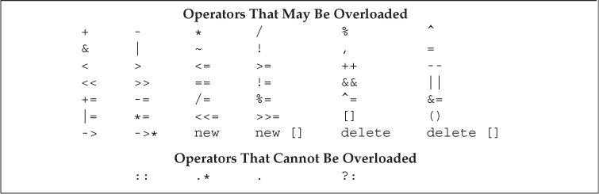

# 重载运算与类型转换

## 基本概念

重载的运算符是有特殊名字的函数。

对于二元运算符，左侧运算对象传递第一个参数，右侧运算对象传递给第二个参数。

除了重载的函数调用运算符`operator()`之外，其他的重载运算符不能含有默认实参。

若一个运算符函数是成员函数，那它的左侧对象绑定到隐式的`this`指针上。所以成员运算符函数的参数看起来比实际运算对象少一个。

无法改变内置类型的运算符。只能重载已有的(大多数)运算符。



能像调用函数一样调用运算符函数

```cpp
// 等价调用
data1 + data2;
operator+(data1, data2);
    
data1 += data2;
data1.operator+=(data2);
```

有些运算对象的求值顺序无法应用到重载的运算符上。特别是：`&&`、`||`、`,`。且`&&`、`||`运算符的重载版本无法保留内置运算符的短路求值属性，两个运算对象总是会被求值。所以对于这些运算符最好不要重载，否则会导致用户不习惯重载之后的求值规则。

不重载`,`、`&`的原因：C++已经定义了这两种运算符用于类类型对象时的特殊含义，重载它们可能让人们难以适应新的规则。

设计类应该首先考虑该类有哪些操作，在确定之后在考虑应该把每个类操作设成普通函数还是重载的运算符。若某些操作在逻辑上和运算符有关那它们才适合定义成重载运算符。

- 若类执行IO操作，那么移位运算符应该和内置类型的IO一样。
- 如果要比较类的相等性，那就定义`operator==`，事实上应该和`operator!=`一起定义。
- 关系操作应该一起定义。
- 重载运算符的返回类型一般应该和内置版本的返回类型兼容。

过分滥用运算符重载会使类变得难以理解。只有操作的含义对用户清晰明了的时候才应该使用运算符。

如果有算术运算符或位运算符，那么最好也提供复合赋值运算符。

选择作为成员函数还是普通非成员函数的准则：

- 赋值、下标、调用、箭头运算符必须是成员。
- 复合赋值一般是成员，但不是必须。
- 像递减、递增、解引用这些改变对象状态的运算符或者和给定类型相关的运算符，应该是成员。
- 有对称性的运算符，像算术、相等性、关系和位运算符等，一般应该是普通的非成员函数。

如果希望提供含有类对象的混合类型表达式，那么运算符必须定义成非成员函数。

将运算符定义成成员函数时，它的左侧运算对象必须是运算符所属类的一个对象：

```cpp
string s = "world";
string t = s + "!";			// 正确 能把一个const char* 加到一个string对象中
string u = "hi" + s;		// 若+是string的成员 那么会产生错误
```

若`operator`是`string`类的成员，那么`t=s.opeartor+("!")`。一样，`"hi".opreator+(s)`。显然`"hi"`的类型是`const char*`，这是一种内置类型，根本没有成员函数。

因为`string`把`+`定义成了普通的非成员函数，所以`"hi"+s`等价于`operator+("hi", s)`。

## 输入和输出运算符

### 重载输出运算符<<

一般形参一是变量`ostream`对象的引用，因为向流写入内容会改变其状态以及无法直接复制一个`ostream`对象，所以是变量引用。

形参二是常量引用，这个常量是我们想打印的类类型。引用的原因是避免复制，常量是引用打印对象不会改变对象内容。

`operator<<`一般要返回它的`ostream`形参。

#### Sales_data的输出运算符

```cpp
ostream &operator<<(ostream &os, const Sales_data &item)
{
    os << item.isbn() << " " << item.units_sold << " " << item.revenue << " " << item.avg_price();
    return os;
}
```

#### 输出运算符尽量减少格式化操作

用于内置类型的输出运算符不太考虑格式化操作，尤其是不会打印换行符。类的输出运算符亦应如此。

输出运算符应该主要负责打印对象而非控制格式，输出运算符不该打印换行符。

#### 输入输出运算符必须是非成员函数

和`iostream`标准库兼容的输入输出运算符必须是普通的非成员函数，而不能是类的成员函数。

不然它的左侧运算对象会是该类的对象：

```cpp
Sales_data data;
data << cout;			// 若operator<<是Sales_data的成员
```

如果输入输出运算符是某个类的成员，那他们也得是`iostream`的成员，但是这两个类属于标准库，我们无法给标准库的类添加成员。

所以如果要定义IO运算符，应该是非成员函数。而IO运算符通常要读写类的非公有数据成员，所以应该把它们声明成友元。

### 重载输入运算符>>

一般输入运算符的第一个形参是运算符将要读取的流的引用，第二个形参是将要读入到的变量对象的引用。

该运算符通常会返回某个给定流的引用。而第二个形参之所以是变量是因为输入运算符本身的目的就是要把数据读入到这个对象中。

#### Sales_data的输入运算符

```cpp
istream &operator>>(istream &is, Sales_data &item)
{
    double price;		// 不需要初始化 因为先读入数据到price 然后才用它
    is >> item.bookNo >> item.units_sold >> price;
    if (is)				// 检查输入是否成功
        item.revenue = item.units_sold * price;
    else
        item = Sales_data();		// 输入失败 对象被赋予默认的状态
    return is;
}
```

输入运算符应该处理输入可能失败的情况，而输出运算符则不需要。

#### 输入时错误

输入运算符错误时可能发生的错误：

- 流含有错误类型的数据时读取操作可能失败。比如读完`bookNo`后，输入运算符就会假定接下来读取的是两个数字数据。如果不是数字数据，那么读取操作以及后续对流的其它操作会会失败。
- 如果读取操作到了文件末尾或者遇到输入流的其他错误的是偶也会失败。

程序里我们没有一个一个区检查读取操作，而是读完所有数据然后在返回前一次检查也就是`if (is) ... else ...`。

如果读取操作失败，那么`price`的值会是未定义的。所以在用`price`之前需要先检查输入流的合法性。然后才能执行计算并将结果存入`revenue`。

而且就算失败了，我们也可以重新初始化一个`Sales_data`，代替失败后的结果。

如果读取操作失败，输入运算符应该负责从错误中恢复。

#### 标示错误

一些输入运算符需要做更多数据验证的工作。比如我们的输入运算符可能需要检查`bookNo`是否符合规范的格式。在这样的例子中，即使从技术上来看`IO`是成功的，输入运算符也应该设置流的条件状态以标示出失败信息。

通常输入运算符只设置`failbit`。除此之外，设置`eofbit`表示文件耗尽，而设置`badbit`表示流被破坏。最好的方式是由`IO`标准库自己来标示这些错误。

## 算术和关系运算符

通常把算术运算符和关系运算符定义成非成员运算符，允许对左侧或右侧的运算对象进行转换。

因为这些运算符一般不需要改变运算对象的状态，所以形参都是常量的引用。

算术运算符通常计算两个运算对象然后得到新值，该值独立，位于一个局部变量内，操作完成后返回该变量的副本作为结果。

类的算术运算符和复合赋值运算符一般都一起定义，这时候最好是用复合赋值来定义算术运算符：

```cpp
Sales_data operator+(const Sales_data &lhs, const Sales_data &rhs)
{
    Sales_data sum = lhs;				// 把lhs的数据成员拷贝给sum
    sum += rhs;							// 将rhs加到sum中
    return sum;							// 返回sum副本
}
```

### 相等运算符

类的相等运算符应该比较对象的每一个数据成员，只有当所有对应的成员都相等时才认为两个对象相等。

```cpp
bool operator==(const Sales_data &lhs, const Sales_data &rhs)
{
    return lhs.isbn() == rhs.isbn() &&
        lhs.units_sold == rhs.units_sold &&
        lhs.revenue == rhs.revenue;
}

bool operator!=(const Sales_data &lhs, const Sales_data &rhs)
{
    return !(lhs == rhs);
}
```

重要的是设计准则：

- 如果类含有判断两个对象是否相等的操作，那就应该把函数定义成`operator==`，而不是另写一个新的函数。
- 如果类定义了`operator==`，那么这个运算符也应该可以判断一组给定的对象里是否有重复数据。
- 通常情况下，相等运算符应该具有传递性，也就是说，如果`a==b`且`b==c`，那么`a==c`。
- 如果类定义了`operator==`，那也应该定义`operator!=`。毕竟这是两个很相似的操作。
- 相等运算符和不相等运算符里的一个应该把工作委托给另一个。

### 关系运算符

设计准则：

1. 定义顺序关系
2. 若类同时有相等运算符，那么要有种关系和相等一致，特别是如果两个对象不相等的时候，必须要有一个对象小于另一个。

对于`Sales_data`来说，如果只是比较ISBN，那么就会出现`Sales_data`对象相等但是`revenue`和`units_sold`不相等：两个`Sales_data`对象相等，但是同时有一个比另一个小。

即使每个成员都比较了，但是顺序怎么办？先比较ISBN还是先比较`revenue`或`units_sold`，它们内部又该如何进行比较？在不同时期可能有不同的需求。

所以对于`Sales_data`来说，不存在任何一种逻辑可靠的关系运算符，该类不定义关系运算符或许更好。

## 赋值运算符

类能够定义一些赋值运算符供给别的类型作为右侧运算对象。

如`vector`类还定义了第三种赋值运算符：

```cpp
vector<string> v;
v = {"a", "b", "c"};
```

我们也能够将该运算符添加至`StrVec`类中：

```cpp
class StrVec {
public:
    StrVec &operator=(std::initializer_list<std::string>);
    ...
};
```

该运算符将返回其左侧运算对象的引用：

```cpp
StrVec &StrVec::operator=(initializer_list<std::string> il)
{
  	// alloc_n_copy分配内存空间并从给定范围拷贝元素
    auto data = alloc_n_copy(il.begin(), il.end());
    free();							// 销毁对象中的元素并释放内存空间
    elements = data.first;			// 更新数据成员使其指向新空间
    first_free = cap = data.second;
    return *this;
};
```

与拷贝赋值和移动赋值运算符一样，其他重载的赋值运算符也必须先释放当前内存空间，再创建一片新空间。

#### 复合赋值运算符

这就不非得是类的成员了，但最好还是把所有赋值运算符定义在类内。

类的复合赋值运算符也要返回左侧运算对象的引用。

```cpp
Sales_data& Sales_data::operator+=(const Sales_data &rhs)
{
    units_sold += rhs.units_sold;
    revenue += rhs.revenue;
    return *this;
}
```

赋值运算符必须定义成类成员，复合赋值运算符通常也该这么做。这两类运算符都应该返回左侧运算对象的引用。

## 下标运算符

容器类通常都能通过下标运算符来访问元素。下标运算符必须是成员函数。

下标运算符通常用访问元素的引用作为返回值，好处是下标运算符可以出现在赋值运算符的任意一边。

定义下标运算符的时候最好定义常量版本和非常量版本，作用在一个常量对象的时候，下标运算符返回常量引用来确保我们不会给返回的对象赋值。

示例`StrVec`的下标运算符：

```cpp
class StrVec {
public:
    std::string& operator[](std::size_t n) { return elements[n]; }
    const std::string& operator[](std::size_t n) const { return elements[n]; }
    ...
private:
    std::string *elements;			// 指向数组首元素的指针
}
```

用法：

```cpp
// 假设svec是个StrVec对象
const StrVec cvec = svec;			// 将svec的元素拷贝到cvec中
// 若svec中含有元素 对第一个元素执行string的empty函数
if (svec.size() && svec[0].empty()) {
    svec[0] = "zero";				// 正确 下标运算符返回string的引用
    cvec[0] = "Zip";				// 错误 对cvec取下标返回的是常量引用
}
```

## 递增和递减运算符

迭代器类中常实现`++`和`--`运算符，这使得类可以在元素的序列中前后移动。

这两个运算符不强制是类成员，但因为它们改变的正式所操作对象的状态，所以最好定义成类成员。

这两个运算符在内置类型中都有前置和后置版本，当类定义它们时，通常也该如此。

#### 定义前置版本

```cpp
class StrBlobPtr {
public:
    // 递增和递减运算符
    StrBlobPtr& operator++();		// 前置版本
    StrBlobPtr& operator--();
    ...
}
```

为了与内置版本移至，前置版本应返回操作后的对象的引用。

递增示例：

```cpp
// 前置版本
StrBlobPtr& StrBlobPtr::operator++()
{
    // 若curr已指向容器的尾后位置 则无法递增它
    check(curr, "increment past end of StrBlobPtr");
    ++curr;			// 将curr在当前状态下向前移动一个元素
    return *this;
}

StrBlobPtr& StrBlobPtr::operator--()
{
    // 若curr是0 再递减它会产生一个无效的下标
    --curr;			// 将curr在当前状态下向后移动一个元素
    check(curr, "decrement past end of StrBlobPtr");
    return *this;
}
```

递增运算符先将`curr`传递给`check`函数，如果`curr`有效，则递增`curr`并且返回。

递减运算符先递减`curr`，如果递减前的`curr`已经是`0`了，那么递减完成后的`curr`就是一个无效下标的未知数值。

#### 区分前置与后置

前置与后置使用的是相同的符号，所以重载的版本的名字也是相同的。

对于后置版本，为了解决这个问题，所以接受一个额外的`int`类型的形参。使用后置版本时候，编译器为该形参提供一个值为`0`的实参。虽然从语法上来看后置版本可以用这个形参，但是实际中不要这么做。

该形参的唯一作用就是区分前置后置版本。

```cpp
class StrBlobPtr {
public:
    // 递增和递减运算符
    StrBlobPtr operator++(int);			// 后置运算符 因为不用int 所以不用给其命名
    StrBlobPtr operator--(int);
}
```

为了和内置版本保持一致，后置版本应该返回对象原值而非引用。

后置版本递增前要记录对象状态：

```cpp
StrBlobPtr	StrBlobPtr operator++(int)
{
    // 这里不需要检查有效性 只有前置版本才需要检查
    StrBlobPtr ret = *this;		// 记录当前值
    ++*this;					// 向前移动一格元素 前置++需要检查递增的有效性
    return ret;					// 返回之前记录的状态
}

StrBlobPtr	StrBlobPtr operator--(int)
{
    // 这里不需要检查有效性 只有前置版本才需要检查
    StrBlobPtr ret = *this;		// 记录当前值
    --*this;					// 向后移动动一格元素 前置++需要检查递减的有效性
    return ret;					// 返回之前记录的状态
}
```

这里的后置版本事实上也就是执行调用前置版本并最终返回原值的操作。

所以最终的结果就是对象本身前移了一个元素，而返回结果仍然反映对象在未递增前的值。

#### 显式调用后置运算符

```cpp
StrBlobPtr p(a1);				// p指向a1中的vector
p.operator++(0);				// 调用后置版本
p.operator--();					// 调用前置版本
```

## 成员访问运算符

迭代器类及智能指针类中常用到解引用运算符和箭头运算符。

向`StrBlobPtr`类中也添加它们：

```cpp
class StrBlobPtr {
public:
    std::string& operator*() const {
        auto p = check(curr, "dereference past end");
        return (*p)[curr];			// (*p)是对象所指的vector
    }
    std::string& operator->() const {
        // 将实际工作交给解引用运算符
        return & this->operator*();
    }
    ...
}
```

箭头运算符必须是类成员。解引用运算符通常也是类成员，但非必要。

因为它们不会改变对象状态，所以返回的是`const`。

使用：

```cpp
StrBlob a1 = {"hi", "bye", "now"};
StrBlobPtr p(a1);		// p指向a1的vector
*p = "okay";			// 给p1首元素赋值
cout << p->size() << endl;		// 打印4 这是a1首元素的大小
cout << (*p).size() << endl;	/ 等价于p->size()
```

事实上`operator*`无论返回什么都行，与对象无关的固定值、打印对象内容、执行无谓的增删操作等等。但是对于箭头运算符，不应该失去它原本的含义：成员访问。我们可以改变的只有箭头从哪个对象当中获取成员。

例如`point->mem`这样的表达式。`point`必须是指向类对象的指针或是重载了`operator->`的类的对象。

## 函数调用运算符

若类重载了函数调用运算符，那就能像使用函数一样使用该类对象。同时因为这样的类能够存储状态，所以相较普通函数更加灵活。

示例：

```cpp
struct asbInt {
    int operator()(int val) const {
        return val < 0 ? -val : val;
    }
}
```

该类仅定义一种操作：函数调用运算符，接受一个`int`类型的实参，然后返回该实参的绝对值。

使用：

```cpp
int i = -42;
absInt absObj;				// 含有函数调用运算符的对象
int ui = absObj(i);			// 将i传递给absObj.operator()
```

函数调用运算符必须是成员函数。一个类可以定义多个不同版本的调用运算符，相互间应在参数数量或类型上有所区别。

定义了调用运算符的类，该类对象称为**函数对象**(function object)。因为可以调用这种对象，所以这些对象的“行为像函数一样”。

#### 含有状态的函数对象类

函数对象类通常有些数据成员，这些成员被用于定制调用运算符中的操作。

例如定义一个打印`string`实参内容的类。

```cpp
class PrintString {
public:
    PrintString(ostream &o = cout, char c = ' '): os(o), sep(c) { }
    void operator()(const string &s) const { os << s << sep; }
private:
    ostream &os;		// 用于写入的目的流
    char sep;			// 用于将不同输出隔开的字符
}
```

该类的构造函数接受一个输出流的引用以及一个用于分隔的字符，这两个形参的默认实参分别是`cout`和空格。

使用

```cpp
PrintString printer;		// 使用默认值 打印到cout
printer(s);					// 在cout中打印s 后跟空格
PrintString errors(cerr, '\n');
errors(s);					// 在cerr中打印s 后跟换行符
```

函数对象常作为泛型算法的实参。例如可以用标准库`for_each`算法[^1]和`PrintString`类来打印容器内容：

```cpp
for_each(vs.begin(), vs.end(), PrintString(cerr, '\n'));
```

当程序调用`for_each`时候，会把`vs`里的每个元素依次打印到`cerr`里，元素间用换行符分隔。

### lambda是函数对象

编写`lambda`后，编译器会把表达式翻译成一个未命名类的未命名对象。在`lambda`表达式产生的类中含有一个重载的函数调用运算符。例如对于传递给`stable_sort`作为其最后一个实参的`lambda`表达式来说：

```cpp
// 根据单词长度进行排序，对于长度相同的单词按照字母表顺序排序
stable_sort(
    words.begin(), 
    words.end(), 
    [](const string &a, const string &b) { return a.size() < b.size();}
);
```

行为类似于下面类的一个未命名对象：

```cpp
class ShorterString {
public:
    bool operator() (const string &s1, const string &s2) const {
        return s1.size() < s2.size();
    }
}
```

产生的类只有一个函数调用运算符成员，该成员接受两个`string`并且比较它们的长度。

因为默认`lambda`不能改变捕获的变量，所以由`lambda`产生的类的函数调用运算符也是个`const`成员函数。

如果`lambda`被声明成可变的，那么调用运算符也就不是`const`了。

用该类替代`lambda`表达式后，可以重写调用：

```cpp
stable_sort(words.begin(), words.end(), ShorterString());
```

#### 表示lambda及相应捕获行为的类

通过值捕获的变量被拷贝到`lambda`里，所以这种`lambda`产生的类必须给每个值捕获的变量建立对应的数据成员，同时创建构造函数，用它捕获到的变量来初始化数据成员。

例如：

```cpp
class SizeComp {
    SizeComp(size_t n): sz(n) { }		// 该形参对应捕获的变量
    // 该调用运算符的返回类型、形参和函数体都和lambda一样
    bool operator() (const string &s) const { return s.size >= sz; }
private:
    size_t sz;		// 该数据成员对应通过值捕获的变量
}
```

该类有个数据成员，以及用于初始化该成员的构造函数，且该类没有默认构造函数，所以必须要传递一个实参：

```cpp
auto wc = find_if(words.begin(), words.end(), SizeComp(sz));
```

对应的`lambda`表达式：

```cpp
auto wc = find_if(
	words.begin(),
    words.end(),
    [sz](const string &a) { return a.size() >= sz; }
);
```

`lambda`表达式产生的类不含默认构造函数、赋值运算符、默认析构函数，它是否含有默认的拷贝/移动构造函数则通常要视捕获的数据成员类型而定。

### 标准库定义的函数对象

标准库定义了一组表示算术运算符、关系运算符和逻辑运算符的类，每个类分别定义了一个执行命名操作的调用运算符。

例如：

- `Plus`类定义了一个函数调用运算符用于对一对运算对象执行`+`的操作

- `modulus`类定义了一个调用运算符执行二元的`%`操作；
- `equal_to`类执行`==`
- 等等

这些类都被定义成模板的形式，可以为其指定具体的应用类型，这里的类型就是调用运算符的形参类型。

例如`plus<string>`使`string`加法运算符作用于`string`对象，`plus<int>`的运算对象是`int`，`plus<Sales_data>`对`Sales_data`对象执行加法运算。

```cpp
plus<int> intAdd;			// 可执行int加法的函数对
negate<int> intNega;		// 可对int值取反的函数对象
// 使用intAdd::operator(int, int)求 10和20的和
int sum = intAdd(10, 20);			// 等价于sum = 30
sum = intNega(intAdd(10, 20));		// 等价于sum = -30
// 使用intNegate::operator(int)生成-10
// 然后将-10作为intAdd::operator(int, int)的第二个参数
sum = intAdd(10, intNegate(10));	// sum = 0
```

下表操作定义在`functional`头文件中：

| 算术               | 关系                  | 逻辑                |
| ------------------ | --------------------- | ------------------- |
| `plus<Type>`       | `equal_to<Type>`      | `logical_and<Type>` |
| `minus<Type>`      | `not_equal_to<Type>`  | `logical_or<Type>`  |
| `multiplies<Type>` | `greater<Type>`       | `logical_not<Type>` |
| `divides<Type>`    | `greater_equal<Type>` |                     |
| `modulus<Type>`    | `less<Type>`          |                     |
| `negate<Type>`     | `less_equal<Type>`    |                     |

#### 算法中使用标准库函数对象

表示运算符的函数对象常用于替换算法中的默认运算符。

比如在默认情况下排序算法用`operator<`将序列按照升序排列。如果要执行降序排列的画，可以传入`greater`类型的对象。该类产生一个调用运算符并负责执行待排序类型的大于运算。比如，如果`svec`是个`vector<string>`：

```cpp
// 传入一个临时的函数对象用于执行两个string对象的>比较运算
sort(svec.begin(), svec.end(), greater<string>());
```

上面语句将按降序对`svec`进行排序，第三个参数`greater<string>`类型是个未命名对象。所以`sort`比较元素的时候，不再用默认的排序算法，而是调用给定的`greater`函数对象。而这个对象负责在`string`元素间执行`>`比较运算。

**注意**：标准库规定函数对象对于指针同样适用。比如通常比较指针的内存地址来排序指针的`vector`，直接这么做会发生未定义后果，但是可以用标准库函数对象来实现该目的：

```cpp
vector<string *> nameTable;		// 指针向量
// 错误 nameTable里的指针彼此没有关系 比较的话会发生未定义结果
sort(
    nameTable.begin(), 
    nameTable.end(), 
    [](string *a, string *b) { return a<b; }
);

// 正确 标准库规定指针的less是定义良好的
sort(nameTable.begin(), nameTable.end(), less<string *>());
```

关联容器使用`less<key_type>`对元素排序，所以我们还能定义一个指针的`set`或者在`map`中使用指针作为关键值而不用直接声明`less`。

### 可调用对象和function

可调用对象也有类型，但是两个不同类型的可调用对象却可能共享同一种**调用形式**(call signature)。

调用形式指明了调用返回的类型以及传递给调用的实参类型。一种调用形式对应一个函数类型。

如：

```cpp
int(int, int)
```

是个函数类型，接受两个`int`、返回一个`int`。

#### 不同类型可能具有相同的调用形式

示例：

```cpp
// 普通函数
int add(int i, int j) { return i + j; }

// lambda, 产生一个未命名的函数对象类
auto mod = [](int i, int j) { return i % j; };

// 函数对象类
struct divide {
    int operator()(int denominator, int divisor) {
        return denominator / divisor;
    }
};
```

上面这些可调用对象分别对其参数执行了不同的算术运算，尽管它们的类型各不相同，但是共享同一种调用形式：`int(int, int)`。

可能想用这些可调用对象构建一个简单的桌面计算器。为实现该目的，定义一个**函数表**(function table)用于存储指向这些可调用对象的“指针”。当程序需要执行某个特定操作时，从表中找出该调用的函数。

C++中，函数表能简单的通过`map`实现。

假定所有函数都相互独立，并且只处理关于`int`的二元运算，那么`map`可以定义成如下形式：

```cpp
// 构建从运算符到函数指针的映射关系 其中函数接受两个int 返回一个int
map<string, int(*)(int, int)> binops;

// 将add指针添加到binops中
binops.insert({"+", add});		// {"+". add}是个pair

// 不能将mod或divide存入binops
```

由于`mod`是个`lambda`表达式，而每个`lambda`有其自己的类类型，该类型与存储在`binops`中的值的类型不匹配。

#### 标准库function类型

可以用叫`function`的新标准库类型解决上述问题。该类型也是定义在`functional`里。

| 操作                                                         | 含义                                                         |
| ------------------------------------------------------------ | ------------------------------------------------------------ |
| `function<T> f;`                                             | `f`是个用来存储可调用对象的空`function`，这些可调用对象的调用形式应该和函数类型`T`相同(`T`是`retType(args)`) |
| `function<T> f(nullptr);`                                    | 显式构造空`function`                                         |
| `function<T> f(obj);`                                        | `f`中存储可调用对象`obj`的副本                               |
| `f`                                                          | 将`f`作为条件：在`f`有一个可调用对象时为真，否则假           |
| `f(args)`                                                    | 调用`f`中的对象，参数是`args`                                |
|                                                              |                                                              |
| 定义为function<T>的成员的类型                                |                                                              |
| `result_type`                                                | 该`function`类型的可调用对象返回的类型                       |
| `argument_type`<br />`first_argument_type`<br />`second_argument_type` | 当`T`有一个或者两个实参时定义的类型。<br />若`T`只有一个实参，则`argument_type`是该类型的同义词<br />若`T`有两个实参，则`first_argument_type`和`second_argument_type`分别代表两个实参的类型 |

`function`是个模板，创建模板时需要提供额外的信息。`function`的额外信息指`function`类型能够表示的对象的调用形式。

```cpp
function<int(int, int)>
```

此处生命了一个`function`类型，表示一个可以接受两个`int`、返回一个`int`可调用对象。

用这个新声明的类型表示任意一种桌面计算机用到的类型：

```cpp
function<int(int, int)> f1 = add;		// 函数指针
funciton<int(int, int)> f2 = divide();	// 函数对象类的对象
function<int(int, int)> f3 = [](int i, int j) { return i % j; };	// lambda

cout << f1(4, 3) << endl;			// 打印7
cout << f2(4, 2) << endl;			// 打印2
cout << f3(4, 2) << endl;			// 打印8
```

使用该类型可以重新定义`map`：

```cpp
// 列举了可调用对象与二元运算符对应关系的表格
// 所有可调用对象都必须接受两个int、并返回一个int
// 其中的元素可以是函数指针、函数对象、lambda
map<string, function<int(int, int)>> binops;

map<string, function<int(int, int)>> binops = {
    {"+", add},												// 函数指针
    {"-", std::minus<int>()},									// 标准库函数对象
    {"/", divide()},											// 用户定义的函数对象
    {"*", [](int i, int j) { return i * j; }},								// 未命名的lambda
    {"%", mod}												// 命名了的lambda对象
};


binops["+"](10, 5);		// 调用add(10, 5)
binops["-"](10, 5);		// 使用minus<int>对象的调用运算符
binops["/"](10, 5);		// 使用divide对象的调用运算符
binops["*"](10, 5);		// 调用lambda函数对象
binops["%"](10, 5);		// 调用lambda函数对象
```

#### 重载的函数与function

不能直接把重载函数的名字存入`function`类型对象中：

```cpp
int add(int i, int j) { return i + j; }
Sales_data add(const Sales_data&, const Sales_data&);
map<string, function<int(int, int)>> binops;
binops.insert( {"+", add} );		// 错误 无法判断到底是哪个add
```

解决这个二义性问题的一条途径是存储函数指针，而非函数名：

```cpp
int (*fp)(int, int) = add;			// 指针所指的add是接受两个int的版本
binops.insert( {"+", fp} );			// 正确 fp指向一个正确的add版本
```

也可以用`lambda`消除二义性：

```cpp
// 正确 使用lambda指定我们希望使用的add版本
binops.insert( {"+", [](int a, int b) { return add(a, b); } } );
```

该调用只能匹配介绍两个`int`的`add`版本。

新版本标准库中的`function`类与旧版本的`unary_function`和`binary_function`没有关联，后两个类已经被更加通用的`bind`函数替代了。

## 重载、类型转换与运算符

转换构造函数和类型转换运算符共同定义了**类类型转换**(class-type conversions)，这样的转换有时也被称为**用户定义的类型转换**(user-defined conversions)

### 类型转换运算符

**类型转换运算符**(conversions operator)是类的一种特殊成员函数，负责将一个类类型的值转换成其他类型。

```cpp
operator type() const;
```

其中`type`表示某种类型。类型转换运算符可以面向任意类型(除`void`)进行定义，只要那个类型能作为函数返回类型[^2]。所以我们能转换成指针或者引用类型。

类型转换运算符：

- 没有显式返回类型(不能声明返回类型)
- 没有形参
- 必须定义成类的成员函数。
- 不应该改变待转换对象的内容
- 类型转换运算符一般被定义成`const`成员。

#### 定义含有类型转换运算符的类

```cpp
class SmallInt {
public:
    SmallInt(int i = 0): val(i)
    {
        if (i < 0 || i > 255)
            throw std::out_of_range("Bad SmallInt value");
    }
    operator int() const { return val; }

private:
    std::size_t val;
}
```

`SmallInt`类既定义了向类类型的转换，也定义了从类类型向其它类型的转换。

其中，构造函数将算术类型的值转换成`SmallInt`对象，而类型转换运算符将`SmallInt`对象转换成`int`：

```cpp
SmallInt si;
si = 4;				// 隐式将4转成SmallInt 然后调用SmallInt::operator=
si + 3;				// 隐式将si转成int 然后执行int的加法运算
```

虽然编译器一次只能执行一个用户定义的类型转换，但隐式的用户定义转换可以置于一个标准内置类型转换之前或之后，并与其一起使用。所以，可以把任何算术类型传递给`SmallInt`的构造函数。

```cpp
// 内置类型转换将double实参转换成int
SmallInt si = 3.14;		// 调用SmallInt(int)构造函数
// SmallInt的类型转换运算符将is转成int
si + 3.14;				// 内置类型转换将int(si)转成double 然后与3.14相加
```

因为类型转换运算符是隐式执行的，所以无法给这些函数传递实参。也就不能在类型转换运算符的定义中使用任何形参。

并且，虽然类型转换函数不负责指定返回类型，但实际上每个类型转换函数都会返回一个对于类型的值。

```cpp
class SmallInt;
operator int(SmallInt&);		// 错误 不是成员函数
class SmallInt {
public:
    int operator int() const;	// 错误 指定了返回类型
    operator int(int=0) const;	// 错误 有形参
    operator int*() cosnt { return 42; }	// 错误 42不是指针
}
```

我们应该避免过度使用类型转换函数。如果在类类型和转换类型间不存在明显的映射关系，那么这样的类型转换可能具有误导性。

例如某个表示Date的类，如果给他添加一个从Date到`int`的转换。那么类型转换函数的返回值应该是什么？问题在于Date类型的对象和int类型的值之间不存在明确的一对一映射关系。因此在此例中，不定义该类型转换运算符或许更好。作为替代手段，类可以定义一个或多个普通的成员函数从各种不同形式提取所需信息。

#### 类型转换运算符可能产生意外结果

实际情况中类很少提供类型转换运算符。只有一种例外的情况，定义向bool类型的转换。

C++标准早期版本中，若类想定义一个向`bool`类型的转换，常会遇到一个问题：将类对象转成`bool`后就能够被用在任何需要算术类型的上下文中。这样的类型转换可能引发意向不到的结果，特别是当`istream`含有向`bool`的类型转换时，下面的代码将被编译通过：

```cpp
int i = 42;
cin << i;		// 若向bool的类型转换不是显式的，那么这段代码在编译器看来是合理的。
// cin没有<< 但是能够调用bool类型转换将cin转成bool 而因为i是int 所以cin就变成了cin-->bool-->int
// 最终也就是 int(0/1) << i(42)
```

这段代码试图将输出运算符用作输入流，因为`istream`本身没有定义`<<`，所以本来代码应该产生错误，但是这段代码能够使用`bool`类型转换运算符将`cin`转成`bool`，而这个`bool`值接着会被提升成`int`然后用作内置的左移运算符的左侧运算对象。如此一来，提升后的`bool`值(`1`或`0`)会被左移`42`个位置。

#### 显式的类型转换运算符

为防止上述异常情况，C++11引入**显式的类型转换运算符**(explicit conversion operator)：

```cpp
class SmallInt {
public:
    // 编译器不会自动执行该类型转换
    explicit operator int() const { return val; }
    ...
}
```

与显式构造函数相同，编译器通常不会将显式类型转换运算符用于隐式类型转换：

```cpp
SmallInt si = 3;			// 正确 SmallInt的构造函数不是显式的
si + 3;						// 错误 此处需要隐式的类型转换 但类的运算符是显式的
static_cast<int>(si) + 3;		// 正确 显式请求类型转换
```

该规定有个例外，若表达式被用作条件，那么编译器会把显式的类型转换自动应用于它。在下列情况中，显式类型转换会被隐式执行：

- if、while及do语句的条件部分
- for语句头的条件表达式
- `!`、`||`、`&&`这些运算符的运算对象
- 条件运算符`?:`的条件表达式

#### 转为bool

早期C++中，IO类型定义了向`void*`的转换规则，以避免上述问题。C++11后，IO标准库通过定义一个向`bool`的显式类型转换实现同样的目的。

无论什么时候在条件中使用流对象，都会使用IO类型定义的`operator bool`，例如：

```cpp
while (std::cin >> value)
```

向`bool`的类型转换通常用在条件部分，所以`operator bool`一般定义成`explicit`的。

### 避免有二义性的类型转换

若类中有多个类型转换，那么就要确保类类型和目标类型间只有一个转换方式。不然容易具有二义性。

两种情况下可能产生多重转换路径：

1. 两个类提供相同的类型转换
   1. A类定义了一个接受B类对象的转换构造函数
   2. B类定义了一个转换目标是A类的类型转换运算符
   3. 此时A类和B类就是提供了相同的类型转换
2. 类定义了多个转换规则，则这些转换涉及的类型本身可以通过其它类型转换联系在一起。

通常不要给类定义相同的类型转换，也不要在类里定义两个及以上的转换源或转换目标是算术类型的转换。

#### 实参匹配和相同的类型转换

示例将B装成A：

```cpp
struct B;
struct A {
    A() = default;
    A(const B&);		// 构造函数 将B转成A
};

struct B {
    operator A() cosnt;		// 将B转成A
};

A f(const A&);		// constA会被转成B
B b;
A a = f(b);		// 二义性错误 含义是f(B::operator A())还是f(A::A(const B&))?
```

因为同时存在两种由B获得A的方法，所以使得编译器无法判断应该运行哪个类型转换，也就是对`f`的调用存在二义性。该调用可以使用以`B`为参数的`A`的构造函数，也可以用`B`中将`B`转成`A`的类型转换运算符。

如果确实想用上例调用，就得显式地调用类型转换运算符或者转换构造函数：

```cpp
A a1 = f(b.operator A());		// 正确 使用B的类型转换运算符
A a2 = f(A(b));					// 正确 使用A的构造函数
```

也无法使用强制类型转换来解决二义性问题，因为强制类型转换本身也面临二义性。

#### 二义性与转换目标为内置类型的多重类型转换

若类定义了类型转换，它们的转换源类型本身可以通过其他类型转换联系在一起，则同样也会产生二义性问题。最简单也是最困扰人的例子就是类中定义了多个参数都是算术类型的构造函数，或者转换目标都是算术类型的类型转换运算符。

比如在下述类：

```cpp
struct A {
    A(int = 0);		// 最好不要创建两个转换源都是算术类型的类型转换
    A(double);
    
    operator int() const;		// 最好不要创建两个转换对象都是算术类型的类型转换
    operator double() cosnt;
    ...
}

void f2(long double);
A a;
f2(a);		// 二义性错误 含义是f(A::operator int())还是f(A::operator double())?

long lg;
A a2(lg);	// 二义性错误 含义是A::A(int)还是A::A(double)?
```

对`f2`的调用中，哪个类型转换都无法精确匹配`long double`。但是这两个类型转换都能够使用，只要后面再执行一次生成`long double`的标准类型就行。

所以上面的两个类型中哪个都不必另一个更好，对于`int`到`long double`和`double`到`long double`的优先级相同，所以编译器无法判断到底应该转成哪个类型，尝试调用会造成二义性问题。

对于`lg`初始化`a2`也是如此，它们在使用构造函数都要求先将实参进行类型转换：

- 先执行`long`到`double`的标准类型转换，再执行`A(double)`
- 先执行`long`到`int`的标准类型转换，再执行`A(int)`

编译器无法区分这两种转换序列的好坏，所以调用会造成二义性。

但如果有一个标准类型的转换优先级高于另一个，那就能够通过，例如如果使用`short`构造`A`对象，那么因为`short`转`int`的优先级高于`short`转`double`，所以这就是可以通过的。

建议：

1. 不要让两个类执行相同的类型转换：如果`Foo`类有个接受`Bar`类对象的构造函数，则不要在`Bar`类中再定义转换目标是`Foo`类的类型转换运算符。
2. 避免转换目标是内置类型的类型转换。特别是当我们已经定义了一个转换成算术类型的类型转换时，那么后面就：
   1. 不要再定义接受算术类型的重载运算符。
      - 如果用户需要这样的运算符，那么类型转换操作要转换你的类型的对象，然后使用内置的运算符。
   2. 不要定义转换到多种算术类型的类型转换。让标准类型转换完成向其它算术类型转换的工作。

简单来说就是除了显式地向`bool`类型的转换外，应该尽量避免定义类型转换函数以及尽量限制那些看起来正确的非显式构造函数。

#### 重载函数与转换构造函数

例如当几个重载函数的参数分别属于不同的类类型的时候，如果这些类刚好定义了同样的转换构造函数，那么二义性问题会进一步提升：

```cpp
struct C {
    C(int);
    ...
}

struct D {
    D(int);
    ...
}

void manip(const C&);
void manip(const D&);

manip(10);		// 二义性错误 含义是manip(C(10))还是manip(D(10))?
```

调用者可以显式地构造正确地类型来消除二义性：

```cpp
manip(C(10));
```

如果在调用重载函数地时候我们需要使用构造函数或者强制类型转换来改变实参的类型，这通常意味着程序设计存在不足。

#### 重载函数与用户定义的类型转换

当调用重载函数的时候，如果多个用户定义的类型转换都提供了可行匹配，那么我们认为这些类型转换一样好。

例如调用`manip`时，即使其中一个类定义了需要对实参进行标准类型转换的构造函数，该调用仍然具有二义性：

```cpp
struct E {
    E(double);
    ...
}

void manip2(const C&);
void manip2(const E&);

// 二义性错误 两个不同的用户定义的类型转换都能用于此处
manip2(10);			// 含义是manip2(C(10))还是manip2(E(double(10)))
```

就算其中一个调用需要额外的标准类型转换而另一个调用能够直接精确匹配，编译器也会将该调用标示为错误。

### 函数匹配与重载运算符

重载的运算符也是重载的函数。

当运算符函数出现在表达式里的时候，候选函数集的规模要比我们使用((调用运算符)调用函数)时更大。

和普通函数调用不同，不能通过调用的形式来区分当前调的是成员函数还是非成员函数。

当使用重载运算符作用于类类型的运算对象时，候选函数里包含该运算符的普通非成员版本和内置版本。此外，若左侧运算对象是类类型，则定义在该类中的运算符的重载版本也包含在候选函数里。

调用一个命名的函数时，该名的成员函数和非成员函数不会彼此重载，这是因为用来调用命名函数的语法形式对于成员函数和非成员函数来说是不相同的。

当通过类对象或该对象的指针及引用进行函数调用时，只考虑该类的成员函数。而当我们在表达式里使用重载运算符时，无法判断正在使用的是成员函数还是非成员函数，所以两者都应该在考虑范围内。

表达式中运算符的候选函数集既应该包括成员函数，也应该包括非成员函数。

示例，为`SmallInt`类定义加法运算符：

```cpp
class SmallInt {
    friend SmallInt operator+(const SmallInt&, const SmallInt&);
public:
    Smallint(int = 0);			// 转换本来是int的类型转换
    operator int() const { return val; }		// 转换目标是int的类型转换
private:
    std::size_t val;
}
```

可以用这个类把两个`SmallInt`对象相加，但如果我们试图执行混合模式的算术运算，就会遇到二义性问题：

```cpp
SmallInt s1, s2;
SmallInt s3 = s1 + s2;		// 使用重载的operator+
int i = s3 + 0;				// 二义性错误
```

第一条加法接受两个`SmallInt`值并执行`+`运算符的重载版本。

第二条加法语句具有二义性：可以把`0`转成`SmallInt`，然后使用`SmallInt`的`+`；或者把`s3`转成`int`，然后使用`int`的内置`+`。

如果对同一个类既提供了转换目标是算术类型的类型转换，也提供了重载的运算符，那么就会遇到重载运算符与内置运算符的二义性问题。

[^1]:该算法接受一个可以调用的对象，并对输入序列中每个元素调用此对象
[^2]:函数的返回类型不能是数组、函数类型，但是可以是指向数组或函数的指针。

