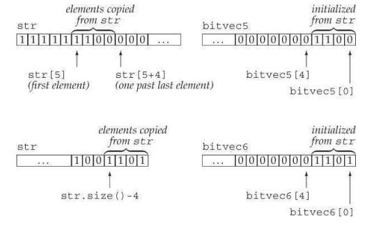

后面都是C++和标准库的一些附加特性，这些特殊在部分情况下很有用，但不是所有人都需要它们。这些特殊分为两类：

- 一种是对于求解大规模的问题
- 另一种是适用于特殊问题而非通用问题

# 标准库特殊设施

## tuple类型

**tuple**是类似`pair`的模板。

在不想定义一个新的数据结构来表示一组数据时，可以使用`tuple`。

`tuple`类型及其伴随类型和函数定义在`tuple`头文件里。

下表为`tuple`支持的操作：

| tuple支持的操作                              |                                                              |
| -------------------------------------------- | ------------------------------------------------------------ |
| `tuple<T1, T2, ..., Tn> t;`                  | `T`为类型，初始化                                            |
| `tuple<T1, T2, ..., Tn> t(v1, v2, ..., vn);` | `T`为类型，初始化并定义                                      |
| `make_tuple(v1, v2, v3, ..., vn);`           | 返回一个用给定初始值初始化的`tuple`。`tuple`的类型从初始值的类型推断。 |
| `t1 == t2`<br />`t1 != t2`                   | 两个`tuple`成员数量相同且成员对等时为真，否则为假            |
| `t1 relop t2`                                | `tuple`的关系运算使用字典序。两个`tuple`必须具有相同数量的成员。使用`<`运算符比较`t1`的成员和`t2`中的对应成员。 |
| `get<i>(t)`                                  | 返回`t`的第`i`个数据成员的引用；若`t`是右值，结果则是个左值引用；否则都是个右值引用。`tuple`的所有成员都是`public`的 |
| `tuple_size<tupleType>::value`               | 这是个类模板，可以通过一个`tuple`类型来初始化。它有个名为`value`的`public constexpr static`数据成员，类型是`size_t`，表示给定`tuple`类型中成员的数量。 |
| `tuple_element<i, tupleType>::type`          | 这是个类模板，可以通过一个整型常量和一个`tuple`类型来初始化。它有个名为`type`的`public`成员，表示给定`tuple`类型中指定成员的类型。 |

可以把`tuple`看成是个“快速而随意”的数据结构。

### 定义和初始化tuple

```cpp
tuple<size_t, size_t, size_t> threeD;	// 三个成员都是0
tuple<string, vector<double>, int, list<int>> someVal("constants", {3.14, 2.718}, 42, {0,1,2,3,4,5});
```

- 对于没有提供初始值的初始化版本，`tuple`的默认构造函数会将进行默认初始化。
- 也可以通过直接初始化(`{}`、`()`)来构造。

也可以用`make_pair`函数来生成`tuple`对象：

```cpp
// 表示书店交易记录的tuple, 包含ISBN、数量和每册书的价格
auto item = make_tuple("0-999-78345-X", 3, 20.00);
```

`item`是个`tuple<const char*, int, double>`。

#### 访问tuple的成员

要访问`tuple`的成员，就需要使用一个名为`get`的标准库函数模板。

使用`get`，必须指定显示模板实参，指出我们想要访问第几个成员。传递给`get`一个`tuple`对象，返回指定成员的引用：

```cpp
auto book = get<0>(item);			// item的第一个成员
auto cnt = get<1>(item);			// item的第二个成员
auto price = get<2>(item);			// item的第三个成员
get<2>(item) *= 0.8;				// 打折20%
```

如果不知道一个`tuple`准确的类型细节信息，可以用两个辅助类模板来查询`tuple`成员的数量和类型：

```cpp
typedef decltype(item) trans;		// trans是item的类型
// 返回trans类型对象中成员的数量
size_t sz = tuple_size<trans>::value;		// 返回3
// cnt的类型与item里第二个成员相同
tuple_element<1, trans>::type cnt = get<1>(item);		// cnt是int
```

- `tuple_size`有个名为`value`的`public static`数据成员，表示给定`tuple`中成员的数量。
- `tuple_element`模板除了一个`tuple`类型外，还接受一个索引值。它有个名为`type`的`public`成员，表示给定`tuple`类型中指定成员的类型。

#### 关系和相等运算符

`tuple`的关系和相等运算符的行为类似容器的对应操作。

只有两个`tuple`具有相同数量的时候，才应该比较它们。且，为了使用`tuple`的相等与不相等运算符，对每对成员使用`==`运算符都必须是合法的；为了使用关系运算符，必须对每对成员使用`<`都是合法的。

例如：

```cpp
	tuple<string, string> duo("1", "2");
	tuple<size_t, size_t> twoD(1, 2);
	bool b = (duo == twoD);			// 错误 不能比较size_t和string
	
	tuple<size_t, size_t, size_t> threeD(1,2,3);
	bool b1 = (twoD, threeD);		// 错误 成员数量不同

	tuple<size_t, size_t> origin(0, 0);
	bool b2 = (origin < twoD);		// 正确 b2为true
```

因为`tuple`定义了`<`和`==`运算符，所以我们可以把`tuple`序列传给算法，并且可以在无序容器中将`tuple`作为关键字类型。

### 使用tuple返回多个值

`tuple`的一个常见用途就是从一个函数中返回多个值。

## bitset类型

第四章介绍了将整型运算对象当作二进制位集合处理的一些内置运算符。

标准库中的`bitset`类可以让位运算的使用变得更加容易，并且能够处理超过最长整型类型大小的位集合。`bitset`类定义在头文件`bitset`里。

### 定义和初始化bitset

下表是`bitset`的构造函数：

| `bitset<n> b;`                        | `b`有`n`位，每一位都是`0`。该构造函数是一个`constexpr`       |
| ------------------------------------- | ------------------------------------------------------------ |
| `bitset<n> b(u);`                     | `b`是`unsigned long long`值`u`的低`n`位的拷贝。若`n`大于`unsigned long long`的大小，则`b`中超出`unsigned long long`的高位被置`0`.该构造函数是`constexpr` |
| `bitset<n> b(s, pos, m, zero, one);`  | `b`是`string s`从位置`pos`开始`m`个字符的拷贝。<br />`s`只能包含字符`zero`或者`one`；如果`s`包含任何其他字符，构造函数会抛出`invalid_argument`异常。字符在`b`中分别保存为`zero`和`one`。`pos`默认是`0`，`m`默认为`string::npos`，`zero`默认为`‘0’`，`one`默认是`‘1’` |
| `bitset<n> b(cp, pos, m, zero, one);` | 与上个构造函数相同，但是从`cp`指向的字符数组中拷贝字符。如果没提供`m`，那么`cp`必须指向一个C风格字符串。如果提供了`m`，则从`cp`开始必须至少有`m`个`zero`或`one`字符 |

`bitset`类是个类模板，类似`array`类，具有固定的大小。当我们定义一个`bitset`时，需要声明它包含多少个二进制位：

```cpp
bitset<32> bitvec(1U);		// 32位 地位是1 其它是0
```

该语句定义`bitvec`是一个包含32位的`bitset`。就如同`vector`包含未命名的元素一样，`bitset`中的二进制位也是未命名的，通过位置来访问它们。二进制位的位置是从`0`开始编号的。

所以`bitvec`包含编号从`0`-`31`的32个二进制位。编号从`0`开始的二进制位被称为**低位**(low-order)，编号到`31`结束的二进制位被称为**高位**(high-order)。

#### 用unsigned值初始化bitset

使用整型值初始化`bitset`时候，这个值会被转成`unsigned long long`类型并被当作位模式来处理。

`bitset`中的二进制位将是该模式的一个副本。

- 若`bitset`的大小==大于==一个`unsigned long long`中的二进制位数，那么剩余的高位被置为`0`。
- 若`bitset`的大小==小于==一个`unsigned long long`中的二进制位数，则只使用给定值中的低位，超出`bitset`大小的高位被丢弃：

```cpp
// bitvec1比初始值小 初始值中的高位被丢弃
bitset<13> bitvec1(0xbeef);			// 二进制位序列为1111011101111

// bitvec2比初始值大 高位被置为0
bitset<20> bitvec2(0xbeef);			// 二进制位序列为00001011111011101111

// 64位机器中 long long 0ULL 是64个0比特 所以~0ULL是64个1
bitset<128> bitvec3(~0ULL);			// 0~63是1 63~127是0
```

#### 从一个string初始化bitset

直接使用`string`或一个字符数组指针来初始化`bitset`的情况下，字符都直接表示位模式。当我们使用字符串表示数的是时候，字符串中下标最小的字符对应高位，反之亦然：

```cpp
bitset<32> bitvec4("1100");		// 2、3两位为1 剩余两位为0
```

如果`string`包含的字符数比`bitset`少，则`bitset`的高位被置为`0`。

`string`的下标编号习惯与`bitset`恰好相反：`string`下标最大的字符(最右边)用来初始化`bitset`的低位(下标为0的二进制位)。

也可以使用字符串的子序列来作为初始值：

```cpp
string str("1111111000000011001101");
bitset<32> bitvec5(str, 5, 4);					// 从str[5]开始的四个二进制位 1100
bitset<32> bitvec6(str, str.size()-4);			// 使用最后四个字符
```



### bitset操作

下标为`bitset`支持的操作：


这些操作定义了多种检测或者设置一个或多个二进制位的方法。

`bitset`类还支持我们在第四章中介绍过的位运算符。这些运算符用于`bitset`对象的含义与内置运算符用于`unsigned`运算对象相同。

```cpp
bitset<32> bitvec (1U) ;					// 32位; 低位为1，剩余位为0
bool is_set = bitvec.any () ;				// true，因为有1位置位
bool is_not_set = bitvec.none ();			// false，因为有1位置位了
bool all_set = bitvec.all ();				// false，因为只有1位置位
size_t onBits = bitvec.count ( );			// 返回1
size_t sz = bitvec.size ();					// 返回32
bitvec.flip();								// 翻转bitvec中的所有位
bitvec.reset ();							// 将所有位复位
bitvec.set (o);								// 将所有位置位
```

- 只要`bitset`对象有一个位被置位(等于`1`)的时候，操作`any`就会返回`true`。
- 当所有位复位(都是`0`)的时候，`none`返回`true`。
- 新标准引入了`all`操作，当所有位都置位的时候返回`true`。
- 操作`count`和`size`返回`size_t`值，分别表示对象中置位的位数或者总位数。
- 函数`size`是个`constexpr`函数，所以可以用在要求常量表达式的地方。

成员`filp`和`set`和`reset`以及`test`允许我们读写指定位置的位：

```cpp
bitvec.flip(O);							// 翻转第一位
bitvec.set (bitvec.size () - 1) ; 		// 置位最后一位
bitvec.set (0,0);						// 复位第一位
bitvec.reset (i);						// 复位第i位
bitvec.test (0);						// 返回false，因为第一位是复位的
```

下标运算符对`const`属性进行了重载。`const`版本的下标运算符在指定位置位的时候返回`true`，否则返回`false`。非`const`版本返回`bitset`定义的一个特殊类型，它允许我们操纵指定位的值：

```cpp
bitvec[0] = 0;				// 将第一位复位
bitvec[31] = bitvec[0];		// 将最后一位设置为与第一位一样
bitvec[0].flip();			// 翻转第一位
~bitvec[0];					// 等价操作，也是翻转第一位
bool b = bitvec[0];			// 将bitvec[0]的值转换为bool类型
```

#### 提取bitset的值

`to_ulong`和`to_ullong`操作都返回一个值，保存了与`bitset`对象相同的位模式。只有当`bitset`的大小小于等于对应的大小(`to_ulong`为`unsigned long`，`to_ullong`为`unsigned long long`)时，我们才能用这两个操作：

```cpp
unsigned long ulong = bitvec3.to_ulong();
cout << "ulong = " << ulong << endl;
```

如果`bitset`中的值不能放入给定类型里，那么这两个操作会抛出`overflow_error`异常。

#### bitset的IO运算符

输入运算符可以从一个输入流读取字符，读入的字符会被保存到一个临时的`string`对象里。直到遇到如下情况才会停止读取过程：

- 读取的字符数达到对应`bitset`的大小时，
- 遇到不是`1`或`0`的字符时
- 遇到文件尾或输入错误时

读取完成后用临时`string`对象来初始化`bitset`。

如果读取的字符数小于`bitset`的大小，则与往常一样，高位被置为`0`。

输出运算符打印一个`bitset`对象中的位模式：

```cpp
bitset<16> bits;
cin >> bits;							// 从cin读取最多16个0或1
cout << "bits: " << bits << endl;		// 打印刚刚读取的内容
```

## 正则表达式

**正则表达式**(regular expression，RE)是种描述字符序列的方法。

RE是新标准库中的，定义在头文件`regex`中，包含如下组件：


regex类表示一个正则表达式。

下标为`regex`的函数的参数，这些函数都返回`bool`值，且都被重载了，其中一个版本接受一个类型是`smatch`的附加参数。如果匹配成功，这些函数将成功匹配的相关信息保存在给定的`smatch`对象里。


### 使用正则表达式库

```cpp
#include <iostream>
#include <string>
#include <regex>

using namespace std;


int main()
{

	// 查找不在字符c之后的字符串ei
	string pattern("[^c]ei");
	// 需要包含pattern的整个单词
	pattern = "[[:alpha:]]*" + pattern + "[[:alpha:]]*";
	regex r(pattern);		// 构造一个用于查找模式的regex
	smatch results;			// 定义一个对象保存搜索结果 

	// 定义一个string保存与模式匹配和不匹配的文本
	string test_str = "receipt freind theif receive";
	// 用r在test_str中查找与pattern匹配的子串
	if (regex_search(test_str, results, r))		// 如果有匹配子串
		cout << results.str() << endl;			// 打印匹配的单词 
	system("pause");
	return 0;
}
```

1. 定义一个`string`用于保存希望查找的正则表达式
   - `[^c]`表明匹配任意不是`c`的字符
   - `[^c]ei`表示匹配这种字符后接`ei`的字符串。
   - 为了与整个单词匹配，还需要一个正则表达式与上面三字母模式之前和之后的字母匹配。
   - 默认`regex`使用的正则表达式语言是ECMAScript。ECMAScript中：
     - 模式`[[:alpha:]]`匹配任意字母
     - `*`匹配零个或多个
     - `+`匹配一个或多个
   - 所以`[[:alpha:]]*`表示匹配零个或多个字母
2. 将正则表达式放入`pattern`后，用它来初始化一个名为`r`的`regex`对象。
3. 定义一个`string`用来被匹配。
4. 定义一个`smatch`对象`results`，被传递给`regex_search`。如果找到匹配子串，`results`将会保存匹配位置的细节信息。
5. 调用`regex_search`若它匹配成功，就返回`true`，即表明可以用`results`的`str`成员来打印匹配到的部分。
6. 匹配成功，输出`friend`

#### 指定regex对象的选项

可以指定一些标志影响`regex`操作。这些标志控制`regex`对象的处理过程。


上表最后6个标志指出编写正则表达式所用的语言。对这6个标志，必须设置其中之一，且只能设置一个。默认ECMAScript标志被设置，从而`regex`使用ECMA-262规范，这也是很多Web浏览器所使用的正则表达式语言。

其它三个标志允许我们指定正则表达式处理过程中与语言无关的方面。例如可以指出希望正则表达式以大小写无关的方式进行匹配。

使用示例：

```cpp
//一个或多个字母或数字字符后接一个’.'再接"cpp"或"cxx"或"cc"
regex r("[[:alnum:]]+\\.(cpp|cxx|cc)$", regex::icase);
smatch results;
string filename;
while (cin >> filename)
	if (regex_search(filename,results, r))
		cout <<results.str() <<endl; //打印匹配结果
```

这里面的正则表达式会忽略匹配的大小写。

正则表达式语言也有特殊字符，如：

- `.`：匹配任意字符，可以在前面加上反斜线去掉特殊含义，但因为`\`也是C++里面的特殊字符，所以要用两个`\\`来表示这是个普通的字符`\`：第一个`\`表示去掉C++语言里反斜线的特殊含义，第二个`\`表示去掉正则表达式里`.`的特殊含义。

#### 指定或使用正则表达式时的错误

正则表达式是在运行的时候，当一个`regex`对象被初始化或被赋予一个新模式的时候，才被“编译”的。

一个正则表达式的语法是否正确是在运行的时候解析的。

若编写的正则表达式存在错误，那么会在运行时标准库抛出类型为`regex_error`的异常。

- `regex_error`有个`what`操作描述发生的错误
- `regex_error`还有个`code`操作返回错误类型对应的数值编码

下表为正则表达式的错误类型：


使用示例：

```cpp
int main()
{

	try{
		// 错误 alnum漏掉了右括号 构造函数会抛出异常
		regex r("[[:alnum:]+\\.(cpp|cxx|cc)$", regex::icase);
	} catch (regex_error e){
		cout << e.what() << "\ncode: " << e.code() << endl;
	}
	system("pause");
	return 0;
}
```

程序会生成：


正则表达式是在运行时编译的，编译正则表达式是非常慢的操作，特别是在使用了扩展的正则表达式语法或是复杂的正则表达式时。为了减少这种开销，应该尽量避免创建不必要的`regex`。特别是，如果在一个循环中使用正则表达式，应该在循环外创建它，而不是在每一步迭代时都编译它。

#### 正则表达式类和输入序列类型

我们可以搜索多种类型的输入序列。输入可以是普通`char`数据或者`wchar_t`数据，字符可以保存在标准库`string`中或是`char`数组中(或是宽字符版本`wstring`或`wchar_t`数组中)。RE为这些不同的输入序列类型都定义了对应的类型。

例如`regex`类保存`char`的正则表达式。标准库还定义了一个`wregex`类保存类型`wachar_t`，操作与`regex `完全相同。

我们使用的RE库必须与输入序列类型匹配。下表为RE库类型与输入序列类型的对应关系：


例如：

```cpp
	regex r("[[:alnum:]]+\\.(cpp|cxx|cc)$", regex::icase);
	smatch results;		// 将匹配string输入序列 而不是char*
	if (regex_search("myfile.cc", results, r))	// 错误 输入为char*
		cout << results.str() << endl;
```

这段代码将编译失败，因为`match`参数类型与输入序列的类型不匹配。如果希望希望搜索一个字符数组，必须使用`cmatch`对象：

```cpp
	regex r("[[:alnum:]]+\\.(cpp|cxx|cc)$", regex::icase);
	cmatch results;		// 将匹配string输入序列 而不是char*
	if (regex_search("myfile.cc", results, r))	// 错误 输入为char*
		cout << results.str() << endl;
```

### 匹配与Regex迭代器类型

对于捕获用RE到的单词，可以使用`sregex_iteraotr`来获得所有匹配。`regex`迭代器是一种迭代器适配器，被绑定到一个输入序列和一个`regex`对象上。

每种不同输入序列类型都有对应的特殊`regex`迭代器类型。迭代器操作如下表所述：


递增迭代器是，调用`regex_search`在输入`string`中查找下一个匹配。

#### 使用sregex_iterator

在一个文本文件中查找所有违法“i在e之前，除非在c之后”规则单词。假定名为`file`的`string`保存了我们要搜索的输入文件的全部内容：

```cpp
// 查找前一个字符不是c的字符串ei
string pattern("[^c]ei");
// 想要包含pattern的单词的全部内容
pattern = "[[:alpha:]]*" + pattern + "[[:alpha:]]*";
regex r(pattern, regex::icase);		// 在进行匹配时将忽略大小写
// 反复调用regex_search来寻找文件中的所有匹配
for (sregex_iterator it(file.begin(), file.end(), r), end_it; 
     it != end_it; ++it)
    cout << it->str() << endl;		// 匹配的单词
```

当我们定义`it`的时候，`sregex_iterator`的构造函数调用`regex_search`将`it`定位到`file`里第一个与`r`匹配的位置。当我们解引用迭代器的时候，会得到一个表示当前匹配结果的`smatch`对象，调用它的`str`成员来打印匹配的单词。

可以将该循环想象成不断从一个匹配位置跳到下一个匹配位置，如图所示：


#### 使用匹配数据

有时候可能只匹配到单词还不是那么有用，比如我们可能想看到匹配单词的上下文，如：


除了允许打印输入字符串中匹配的部分之外，匹配结果类还提供了有关匹配结果的更多细节信息。

匹配类型有如下成员：

1. `prefix`：表示输入序列中当前匹配到的内容的前面的`ssub_match`对象
2. `suffix`：表示输入序列中当前匹配到的内容的之后的`ssub_match`对象

一个`ssub_match`对象有两个名为`str`和`length`的成员，分别返回匹配的`string`和该`string`的大小。

示例：

```cpp
// 循环头与之前一样
for (sregex_iterator it(file.begin(), file.end(), r), end_it;
     it != end_it; ++it) {
    auto pos = it->prefix().length();			// 前缀的大小
    pos = pos > 40 ? pos - 40 : 0;				// 想要最多40个字符
    cout << it->prefix().str().substr(pos)		// 前缀的最后一部分
        << "\n\t\t>>> " << it->str() << " <<<\n"	// 匹配的单词
        << it->suffix().str().substr(0, 40)			// 后缀的第一部分
        << endl;
}
```

我们使用`substr`来打印指定位置到前缀部分末尾的内容。在第九章中可以找到关于`string`的额外操作`substr`。传入`0`即表示拷贝从0开始的所有字符。


`smatch`操作：


### 使用子表达式

```cpp
// r有两个子表达式：第一个是点之前表示文件名的部分，第二个表示文件扩展名
regex r("([[:alnum:]]+)\\.(cpp|cxx|cc)$", regex:icase);
```

该模式包含两个子表达式：

- `([[:alnum:]]+)`：匹配一个或者多个字符的序列
- `(cpp|cxx|cc)`：匹配文件扩展名

匹配对象除了提供匹配整体的相关信息外，还提供访问模式中每个子表达式的能力。子匹配是按位置来访问的。第一个子匹配位置为0，表示整个模式对应的匹配，随后是每个子表达式对应的匹配。

所以，本例的第一个子表达式表示文件名的子表达式，位置是1，文件扩展名对应的子表达式位置是2。

即如果`foo.cpp`，那么`results.str(0)`是`foo.cpp`，而`results.str(1)`是`foo`；`results.str(2)`是`cpp`。

#### 子表达式用于数据验证

常见用途是验证必须匹配特定格式的数据。

下是ECMAScript正则表达式语言的一些特性：

- `\{d}`：匹配单个数字，而`\{d}{n}`表示一个`n`个数字的序列。例如(`\{d}{3}`匹配三个数字的序列)
- `[字符]`：匹配其中任意一个字符。如`[-. ]`匹配一个段横线或一个点或一个空格。
- `\{d}{3}[-. ]?\{d}{4}`匹配这样的序列：开始是三个数字，后接一个可选的短横线或点或空格，然后是四个数字。
- 对于ECMAScript中的特殊字符，如`[]`和`()`，如果要匹配，必须用反斜线将它们转义：`\(\)`、`\\{d}{3}`用来匹配`\{d}{3}`。

示例：

```cpp
// 整个正则表达式包含七个子表达式：( ddd )分隔符 ddd 分隔符 dddd
// 子表达式1、3、4和6是可选的；2、5、7保存号码
"(\\()?(\\d{3})(\\))?([-. ])?(\\d{3})([-. ]?)(\\d{4})";
```

该模式的读法：

1. `(\\()?`：表示区号部分可选的左括号
2. `(\\d{3})`：表示区号
3. `(\\))?`：表示区号部分可选的右括号
4. `([-. ])?`：表示区号部分可选的分隔符
5. `(\\d{3})`：表示号码的下三位数字
6. `([-. ])?`：表示可选的分隔符
7. `(\\d{4})`：表示号码的最后四位数字

下面的代码读取一个文件，并用此模式查找与完整的电话号码模式匹配的数据。它会调用一个名为`valid`的函数来检查号码格式是否合法：

```cpp
string phone = "(\\()?(\\d{3})(\\))?([-. ])?(\\d{3})([-. ]?)(\\d{4})";
regex r(phone);		// regex对象 用于查找我们的模式
smatch m;
string s;
// 从文件读取每条记录
while (getline(cin, s)) {
    // 对每个匹配的电话号码
    for (sregex_iterator it(s.begin(), s.end(), r), end_it; it != end_it; ++it)
    	// 检查号码的格式是否合法
        if (valid(*it))
            cout << "valid: " << it->str() << endl;
    	else
            cout << "not valid: " << it->str() << endl;
}
```

#### 使用子匹配操作

使用下表的子匹配来编写`valid`函数。需要记住的重要一点是，我们的`pattern`有七个子表达式：


在一个合法的电话号码里，区号要么是完整括号包围的，要么完全没有括号。所以、`valid`要做什么工作依赖于号码是否以一个括号开始：

```cpp
bool valid(const smatch& m)
{
    // 如果区号前有个左括号
    if(m[1].matched)
        // 则区号后必须有个右括号，之后紧跟剩余号码或一个空格
        return m[3].matched && (m[4].matched == 0 || m[4].str() == " ");
    else
        // 否则，区号后不能有右括号
        // 另外两个组成部分间的分隔符必须匹配
        return !m[3].matched && m[4].str() == m[6].str();
}
```

### 使用regex_replace

正则还可以用来帮我们将一个序列替换为另一个序列。为此，可以调用`regex_replace`：


本例中替换字符串中第二个、第五个、第七个子表达式。因为这些子表达式用来形成号码的原格式而非新格式中的一部分。我们用一个符号`$`后跟子表达式的索引号来表示一个特定的子表达式：

```cpp
string fmt = "$2.$5.$7";		// 将号码格式改为ddd.ddd.dddd
regex r(phone);		// 用来寻找模式regex对象
string number = "(908) 555-1800";
cout << regex_replace(number, r, fmt) << endl;
```

输出：`908.555.1800`。

#### 只替换输入序列的一部分

替换一个大文件中的电话号码：


替换成如下形式：


使用如下程序可以完成：

```cpp
int main()
{
    string phone = "(\\()?(\\d{3})(\\))?([-. ])?(\\d{3})([-. ])?(\\d{4})";
    regex r(phone);		// 寻找模式所用的regex对象
    smatch m;
    string s;
    string fmt = "$2.$5.$7";		// 将号码格式改为ddd.ddd.dddd
    // 从输入文件中读取每条记录
    while (getline(cin, s))
        cout << regex_replace(s, r, fmt) << endl;
    return 0;
}
```

#### 用来控制匹配和格式的标志

标准库还定义了用于替换过程中控制匹配或格式的标志。如下表：


这些标志可以传递给函数`regex_search`或`regex_match`或是类`smatch`的`format`成员。

匹配和格式化标志的类型是`match_flag_type`。这些值都定义在名为`regex_constants`的命名空间里。`regex_constants`也是定义在`std`中的名字，所以必须在名字前同时加上两个命名空间的限定符：

```cpp
using std::regex_constants::format_no_copy;
using namespace std::regex_constants;
```

#### 使用格式标志

默认情况下，`regex_replace`输出整个输入序列。未与正则表达式匹配的部分会原样输出；匹配的部分按照格式字符串指定的格式输出。

可以通过在`regex_replace`调用中指定`format_no_copy`来改变这种默认行为：

```cpp
// 只生成电话号码：使用新的格式字符串
string fmt2 = "$2.$5.$7 ";		// 在最后一部分号码后放置空格作为分隔符
// 通知regex_replace只拷贝它替换的文本
cout << regex_replace(s, r, fmt2, format_no_copy) << endl;
```

输出：


## 随机数

新标准之前，C和C++都依赖于一个简单的C库函数`rand`来生成随机数。该函数生成均匀分布的伪随机整数，每个随机数的范围在`0`和一个系统相关的最大值(最小是32767)之间。

rand函数的问题：即使不是大多数，也有很多程序需要不同范围的随机数，一些应用需要随机浮点数。一些程序需要非均匀分布的数。而程序员为了解决这些问题而试图转换`rand`生成的随机数的范围、类型或分布时，常常会引入非随机性。

定义在头文件`random`的随机数库通过一组协作的类来解决这些问题：

- **随机数引擎类**(random-number engines)
- **随机数分布类**(random-number distribution)

下表描述了这两个类：


C++程序不应该使用库函数`rand`，而应该使用`default_random_engine`类和恰当的分布类对象。

### 随机数引擎和分布

随机数引擎是函数对象类。

通过调用一个随机数引擎对象来生成原始随机数：

```cpp
	default_random_engine e;		// 生成随机无符号数
	for (size_t i = 0; i < 10; ++i)
		// e() 调用对象来生成下一个随机数
		cout << e() << endl;
```

标准库定义了多个随机数引擎类，区别在于性能和随机性质量不同。每个编译器都会指定其中一个作为`default_random_engine`类型。这个类型一般具有最常用的特性。下表为随机数引擎操作：


大多数场合，随机数引擎的输出是不能直接用的，因为随机生成的范围通常与我们需要的不符合。

#### 分布类型和引擎

为了得到一个指定范围内的数，我们需要用一个分布类型的对象：

```cpp
// 生成0到9之间均匀分布的随机数
uniform_int_distribution<unsigned> u(0, 9);
default_random_engine e;		// 生成无符号随机整数
for (size_t i = 0; i < 10; ++i)
    // 将u作为随机数源
    // 每个调用返回在指定范围内并服从均匀分布的值
    cout << u(e) << " ";
```

结果会生成0-9间的随机数。

分布类下也是函数对象类。分布类型的调用运算符接受一个随机数引擎作为参数。

分布对象使用它的引擎参数生成随机数，并将其映射到指定的分布。

注意：传入的是引擎`e`，而非`e()`。

当我们说**随机数发生器**时，是指分布对象和引擎对象的组合。

#### 比较随机数引擎和rand函数

调用一个`default_random_engine`对象的输出类似`rand`的输出。

随机数引擎生成的`unsigned`整数在一个系统定义的范围内，而`rand`生成的数的范围在`0`在`RAND_MAX`之间。

一个引擎类型的范围可以通过调用该类型对象的`min`和`max`成员来获得：

```cpp
cout << "min: " << e.min() << " max: " << e.max() << endl;
```

#### 引擎生成一个数值序列

一个给定的随机数发生器一直会生成相同的随机数序列。一个函数如果定义了局部的随机数发生器，应该将其(包括引擎和分布对象)定义为`static`的。否则，每次调用函数都会生成相同的序列。

```cpp
// 返回一个vector 包含100个均匀分布的随机数
vector<unsigned> good_randVec()
{
    // 因为我们希望引擎和分布对象保持状态 因此应该把它们定义为static的 从而每次调用都生成新的数
    static default_random_engine e;
    static uniform_int_distribution<unsigned> u(0, 9);
    vector<unsigned> ret;
    for (size_t i = 0; i < 100; ++i)
        ret.push_back(u(e));
    return ret;
}
```

#### 设置随机数发生器种子

如果我们想每次运行程序都生成不同的随机结果，可以通过提供一个**种子**(seed)来达到该目的。

种子就是一个数值，引擎可以用它从序列中一个新位置重新开始生成随机数。

为引擎设置种子有两种方式：在创建引擎对象时提供种子，或者调用引擎的`seed`成员：

```cpp
default_random_engine e1;				// 使用默认种子

default_random_engine e2(2147483646);	// 使用给定种子

// e3和e4将生成相同的序列 因为它们使用了相同的种子
default_random_engine e3;				// 使用默认种子值
e3.seed(32767);							// 调用seed设置新种子值

default_random_engine e4(32767);		// 将种子值设为32767

for (size_t i = 0; i != 100; ++i){
    if (e1() == e2())
        cout << "unseeded match at iteration: " << i << endl;
    if (e3() != e4())
        cout << "seeded differs at iteration: " << i << endl;
}
```

本例定义了四个引擎。前两个引擎`e1`和`e2`的种子不同，所以生成不同的序列。后两个引擎`e3`和`e4`有相同的种子，将生成相同的序列。

选择一个好种子，可能最常用的方式是调用`time`。该函数定义在头文件`ctime`中，返回从一个特定时刻到当前经过了多少秒。函数`time`接受单个指针参数，指向用于写入时间的数据结构。若指针为空，则函数简单地返回时间：

```cpp
default_random_engine e1(time(0));		// 稍微随机些地种子
```

因为`time`返回以秒计的时间，因此这种方式只适合用于生成种子的间隔为秒级或更长的应用。

如果程序作为一个自动过程的一部分反复运行，将`time`的返回值作为种子的方式就无效了；它可能多次使用的都是相同的种子。

### 其他随机数分布

随机浮点数。

最常用但不正确的从`rand`获得一个随机浮点数的方法是用`rand`的结果除以RAND_MAX，也就是系统定义的`rand`可以生成的最大随机数的上届。这种方法不正确的原因是随机整数的精度通常低于随机浮点数，所以会有些浮点值永远不会被生成。

使用新标准库，我们可以定义一个`uniform_real_distribution`类型的对象，并让标准库来处理从随机整数到随机浮点值的映射：

```cpp
default_random_engine e;		// 生成无符号随机整数
// 从0到1的均匀分布
uniform_real_distribution<double> u(0, 1);
for (size_t i = 0; i < 10; ++i)
	cout << u(e) << " ";
```


#### 使用分布的默认结果类型

每个分布模板都有一个默认模板实参。生成浮点值的分布类型默认是`double`，生成整型值的默认是`int`。

所以其实可以：

```cpp
uniform_real_distribution<> u(0, 1);	// 默认生成double值
```

#### 生成非均匀分布的随机数

除了正确生成在指定范围内的数之外，新标准库的另一个优势是可以生成非均匀分布的随机数。

示例生成一个正态分布的值的序列，并画出值的分布：

```cpp
#include <random>
#include <iostream>
#include <vector>
#include <string>
#include <cmath>

using namespace std;

int main(int argc, char const *argv[])
{
	default_random_engine e;				// 生成随机整数
	normal_distribution<> n(4, 1.5);		// 均值4 标准差1.5
	vector<unsigned> vals(9);				// 9个元素值都是0
	for (size_t i = 0; i != 200; ++i) {
	    unsigned v = lround(n(e));			// 舍入到最接近的整数
	    if(v < vals.size())					// 如果结果在范围里
	        ++vals[v];						// 统计每个数出现了几次
	}
	for (size_t j = 0; j != vals.size(); ++j)
	    cout << j << ": " << string(vals[j], '*') << endl;
	system("pause");
	return 0;
}

```

1. 首先定义了随机数发生器对象和一个名为`vals`的`vector`。用`vals`来统计范围0-8种的每个数出现了几次。
2. for循环种调用`lround(n(e))`来将`n(e)`返回的值舍入到最接近的整数。
3. 获取到随机浮点数对应的证书后，将其作为计数器`vector`的下标。因为`n(e)`可能生成0-8之外的数，所以我们首先检查生成的数是否在范围内，然后再将其作为`vals`的下标。若结果确实在范围内，递增对应的计数器。

`lround`函数定义在`cmath`中。

#### bernoulli_distribution类

`bernoulli_distribution`不接受模板参数，因为它是个普通类，而非模板。所以这个分布总是一个返回一个`bool`值。

使用示例：

```cpp
default_random_engine e;
bernoulli_distribution b;
b(e);
```

因为引擎返回相同的随机数序列，所以我们必须在循环外声明引擎对象。否则每部循环都会创建一个新引擎，从而每步循环都会生成相同的值。类似的，分布对象也要保持状态，因此也应该在循环外定义。

```cpp
bernoulli_distribution b(.55);			// 55/45概率
```

## IO库再探

### 格式化输入与输出

除了条件状态外，每个`iostream`对象还维护一个格式状态来控制IO如何格式化的细节。格式状态控制格式化的某些方面，比如整型值是几进制、浮点值的精度、一个输出元素的宽度等等。

标准库定义了一组**操纵符**(manipulator)来修改流的格式状态，一个操纵符是一个函数或是一个对象，会影响流的状态，并且能够作为输入或者输出运算符的运算对象。

已经用过的操纵符：`endl`。它是一个操作，输出一个换行符并且刷新缓冲区。

#### 很多操纵符改变格式状态

操纵符用于两大类输出控制：

- 控制数值的输出形式以及控制补白的数量和位置
- 

