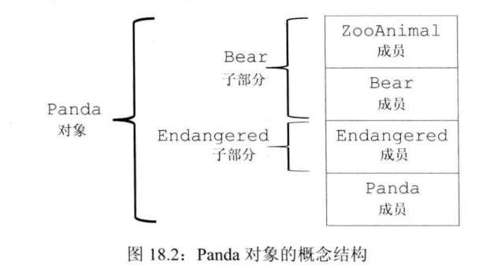
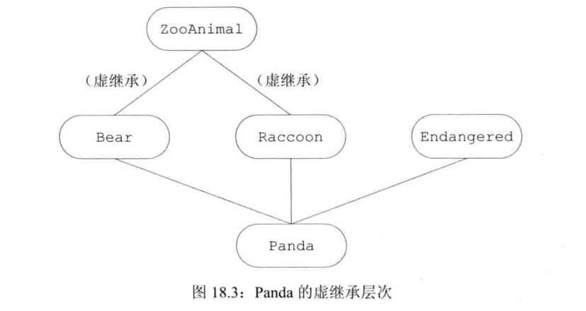

# 用于大型程序的工具

## 异常处理

**异常处理**(exception handling)机制允许程序中独立开发的部分能够在运行时，对出现的问题进行通信并做出相应的处理。

### 抛出异常

通过**抛出**(throwing)一条表达式来**引发**(raised)一个异常。

被抛出的表达式的类型以及当前的调用链共同决定了哪段**处理代码**(handler)将被用于处理该异常。

- 沿着调用链的函数可能会提早退出。
- 一旦程序开始执行异常处理代码，那么沿着调用链创建的对象将被销毁。

#### 栈展开

当`throw`出现在一个**try语句块**(try block)里面时，检查与该`try`块关联的`catch`子句。

**栈展开**(stack unwinding)过程：栈展开过程沿着嵌套函数的调用链不断查找，直到找了与一场匹配的`catch`子句为止；或者也可能一直没找到匹配的`catch`，则退出主函数后查找过程终止。

如果找不到匹配的`catch`时，程序将调用标准库函数`terminate`，终止程序的执行过程。

#### 栈展开过程中对象被自动销毁

编译器在销毁内置类型的对象时不需要做任何事情。

如果异常发生在构造函数里，那么当前的对象可能只构造了一部分。即使某个对象只构造了一部分，我们也要确保已构造的成员能够被正常地销毁。

类似的，异常也可能发生在数组或者标准库容器的元素初始化过程中。同样也应该确保这部分元素被正确地销毁。

#### 析构函数与异常

如果一个块分配了资源，并且在负责释放这些资源的代码前面发生了异常，那么释放资源的代码不会被执行。

所以，如果我们使用类来控制资源的分配，就能确保无论函数正常结束还是遭遇异常，资源都能被正确地释放。

出于栈展开可能使用析构函数的考虑，析构函数不应该抛出不能被他自身处理的异常。

在栈展开的过程中，运行类类型的局部对象的析构函数。因为这些析构函数是自动执行，所以它们不应该抛出异常。一旦在栈展开的过程中析构函数抛出了异常，并且析构函数自身没能捕获到该异常，那么程序将被终止。

#### 异常对象

**异常对象**(exception object)是种特殊的对象，编译器使用异常抛出表达式来对异常对象进行拷贝初始化。因此，`throw`语句中的表达式必须拥有完全类型。而且如果该表达式是类类型的话，则相应的类必须含有一个可访问的析构函数和一个可访问的拷贝或移动构造函数。如果该表达式是数组类型或者函数类型，那么这个表达式会被转换成与之对应的指针类型。

当我们抛出一条表达式时，该表达式的静态编译时类型决定了异常对象的类型。 很多情况下程序抛出的表达式类型来自于某个继承体系。

抛出指针要求在任何对应的处理代码存在的地方，指针所指的对象都必须存在。

### 捕获异常

**catch子句**(catch clause)中的**异常声明**(exception declaration)看起来像是只包含一个形参的函数形参列表。

声明的类型可以是左值引用，但不能是右值引用。

进入一个`catch`语句后，通过异常对象初始化异常声明中的参数。`catch`的参数类型可以是引用也可以是非引用类型(拷贝)。

通常情况下，如果`catch`接受的异常与某个继承体系有关，则最好将`catch`的参数定义成引用类型。

#### 查找匹配的处理代码

派生类异常的处理代码应该出现在基类异常的处理代码之前。

异常的类型和`catch`声明的类型是精确匹配的：

- 允许从非常量向常量的类型转换，即：一条非常量对象的`throw`语句可以匹配一个接受常量引用的`catch`语句。
- 允许从派生类向基类的类型转换。
- 数组被转换成指向数组类型的指针，函数被转换成指向该函数类型的指针。

如果在多个`catch`语句的类型之间存在着继承关系，那我们应该把继承链最底端的类(most derived type)放在前面，而将继承链最顶端的类(least derived type)放在后面。

#### 重新抛出

一条`catch`语句通过**重新抛出**(rethrowing)的操作将异常传递给另一个`catch`语句。这里的重新抛出仍然是一条`throw`语句，只不过不包含任何表达式：

```cpp
throw;
```

很多时候，`catch`语句会改变其参数的内容：

```cpp
catch (my_error &eObj) {						// 引用类型
    eObj.status = errCodes::servereErr;			// 修改了异常对象
    throw;										// 异常对象的status成员是severeErr
} catch (other_error eObj) {				// 非引用类型
    eObj.status = errCodes::badErr;			// 只修改了异常对象的局部副本
    throw;									// 异常对象的status成员没有改变
}
```

#### 捕获所有异常的处理代码

为了一次性捕获所有异常，可以用省略号作为异常声明，这样的处理代码称为**捕获所有异常**(catch-all)的处理代码，形如`catch(...)`：

```cpp
void manip() {
    try {
        // 这里的操作引发并抛出一个异常
    } catch (...) {
        // 处理异常的某些特殊操作
        throw;
    }
}
```

如果`catch(...)`与其他`catch`语句一起出现，那么`catch(...)`必须在最后位置。

### 函数try语句块与构造函数

要想处理构造函数初始值抛出的异常，必须将构造函数写成**函数try语句块**(也称为函数测试块，function try block)。

函数`try`语句块使得一组`catch`语句既能处理构造函数体(或析构函数体)，也能处理构造函数的初始化过程(或析构函数的析构过程)。

示例：

```cpp
template <typename T>
Blob<T>::Blob(std::initializer_list<T> il) try : data(std::make_shared<std::vector<T>>(il)) {
	// 空函数体
} catch(const std::bad_alloc &e) { handle_out_of_memory(e); }
```

注意：与该`try`关联的`catch`既能处理构造函数体抛出的异常，也能处理成员初始化列表抛出的异常。

在初始化构造函数的参数时也可能发生异常，这样的异常不属于`try`语句块的一部分。函数`try`语句块只能处理构造函数开始执行后发生的异常。如果在参数初始化的过程中发生了异常，那么异常属于调用表达式的一部分，在调用者所在的上下文中处理。

处理构造函数初始化异常的唯一方法是将构造函数写成函数`try`语句块。

### noexcept异常说明

C++11后，可以通过提供**noexcept说明**(noexcept specification)指定某个函数不会抛出异常。

```cpp
void recoup(int) noexcept;			// 不会抛出异常
void alloc(int);					// 可能抛出异常
```

对`recoup`做了**不抛出说明**(nonthrowing specification)。

说明要在函数的尾置返回类型之前。也可以在函数指针的声明和定义中指定`noexcept`。 在`typedef`或类型别名中则不能出现`noexcept`。在成员函数里，`noexcept`说明符要跟在`const`及引用限定符之后，而在`final`、`override`或虚函数`=0`之前。

#### 违反异常说明

编译器不会去检查代码到底会不会抛出异常，所以即使加了`noexcept`，代码还是有可能会抛出异常，并且能顺利通过编译。

可能出现的情况：函数声明了它不会抛出异常，但实际上还是抛出了。

如果抛出了异常，程序会调用`terminate`以确保遵守不在运行时抛出异常的承诺。

`noexcept`而用于两种情况：

- 我们确认函数不会抛出异常
- 我们根本不知道如何处理异常

通常情况下，编译器不能也不必在编译时验证异常说明。

```cpp
// 下面的已经在C++11后移除
void recoup(int) noexcept;		// 不抛出说明
void recoup(int) throw();		// 与上等价
```

#### 异常说明的实参

实参必须是`bool`：

- 为`true`：不会抛出
- 为`false`：可能抛出

```cpp
void recoup(int) noexcept(true);		// 不会抛出异常
```

#### noexcept运算符

`noexcept`说明符常与**noexcept运算符**(noexcept operator)混合使用。

`noexcept`不会求其运算对象的值。

```cpp
// 因为recoup使用了noexcept说明符，所以下面的表达式返回true
noexcept(recoup(i));		// 若recoup不抛出异常则结果为true 否则为false

noexcept(e)		// 当e调用的所有函数都做了不抛出说明且e本身不含有throw语句时，上述表达式为true，否则为false
```

可以用`noexcept`运算符得到如下的异常说明：

```cpp
void f() noexcept(noexcept(g()));			// f和g的异常说明一致
```

若`g`函数做了不抛出(异常)说明，则`f`也不会抛出异常；若`g`虽然有异常说明符但是允许抛出异常，则`f`也可能抛出异常。

`noexcept`有两层含义：

- 当跟在函数参数列表后面时它是异常说明符
- 当作为`noexcept`异常说明的`bool`实参出现时，是一个运算符

#### 异常说明与指针、虚函数和拷贝控制

函数指针以及该指针所指的函数必须具有一致的异常说明。即，如果我们为某个指针做了不抛出异常的声明，那么该指针将只能指向不抛出异常的函数。如果显式或隐式地说明了指针可能抛出异常，则该指针可以指向任何函数，即使是承诺了不抛出异常地函数也可以：

```cpp
void alloc(int);

// recoup和pf1都承诺不会抛出异常
void (*pf1)(int) noexcept = recoup;
// 正确: recoup不会抛出异常 pf2可能抛出异常 二者之间互不干扰
void (*pf2)(int) = recoup;

pf1 = alloc;		// 错误 alloc可能抛出异常 但是pf1已经说明了它不会抛出异常
pf2 = alloc;		// 正确 pf2和alloc都可能抛出异常
```

若虚函数承诺它不会抛出异常，则后续派生出来的虚函数也必须做出同样地承诺；与之相反，如果基类的虚函数允许抛出异常，则派生类的对应函数抛不抛出异常都行：

```cpp
class Base {
public:
    virtual double f1(double) noexcept;		// 不会抛出异常
    virtual int f2() noexcept(false);		// 可能抛出异常
    virtual void f3();						// 可能抛出异常
};

class Derived : public Base {
public:
    double f1(double);				// 错误 Base::f1承诺不会抛出异常
    int f2() noexcept(false);		// 正确 与Base::f2的异常说明一致
    void f3() noexcept;				// 正确 Derived的f3做了更严格的限定 这是允许的
};
```

编译器合成拷贝控制成员时，同时也生成一个异常说明。若对所有成员和基类的所有操作都承诺不会抛出异常，那么合成的成员也是`noexcept`的。如果合成成员调用的有一个函数可能抛出异常，那么合成的成员是`noexcept(false)`。

如果我们定义一个析构函数但是没有为它提供异常说明，则编译器将合成一个。合成的异常说明符将与假设由编译器为类合成析构函数时所得的异常说明一致。

### 异常类层次


类型`exception`定义了：

- 拷贝构造函数
- 拷贝赋值运算符
- 虚析构函数
- `what`虚成员，返回一个`const char*`，该指针指向一个以`unll`结尾的字符数组，并且确保不会抛出任何异常。

类`exception`、`bad_cast`、`bad_alloc`定义了默认构造函数。

类`runtime_error`、`logic_error`没有默认构造函数，但是有一个接受C风格字符串或标准库`string`类型实参的构造函数，这些实参用于提供关于错误的更多信息。

`what`负责返回用于初始化异常对象的信息。由于`what`是虚函数，所以当我们捕获基类的引用时，对`what`函数的调用将执行与异常对象动态类型对应的版本。

#### 书店应用程序的异常类

实际的应用程序通常会自定义`exception`(或者`exception`的标准库派生类)的派生类派生类以扩展其继承体系，用于表示与应用相关的异常条件。

例如：

```cpp
// 为某个书店应用程序设定的异常类
class out_of_stock: public std::runtime_error {
public:
    explicit out_of_stock(const std::string &s): std::runtime_error(s) { }
};

class isbn_mismatch: public std::logic_error {
public:
    explicit isbn_mismatch(const std::string &s): std::logic_error(s) { }
    
    isbn_mismatch(const std::string &s, const std::string &lhs, const std::string &rhs): std::logic_error(s), left(lhs), right(rhs) { }
    const std::string left, right;
};
```

- `out_of_stock`的类表示在运行时可能发生的错误，如有些顺序无法满足
- `isbn_mismatch`的类表示`logic_error`的特例，程序可以通过比较对象的`isbn()`结果来阻止或处理这一错误

继承体系的第二层将`exception`划分为两个大的类别：

- 运行时错误：表示只有在程序运行时才能检查到的错误
- 逻辑错误：我们能在代码中发现的错误

#### 使用我们自己的异常类型

与使用标准异常类的方式完全相同。

例如可以为`Sales_data`类定义一个复合加法运算符，当检测到参与加法的两个ISBN编号不一致时抛出名为`isbn_mismatch`的异常：

```cpp
// 若参与加法的量对象非同一书籍，则抛出一个异常
Sales_data& Sales_data::operator+=(const Sales_data& rhs)
{
    if (isbn() != rhs.isbn()) throw isbn_mismatch("wrong isbns", isbn(), rhs.isbn());
    units_sold += rhs.units_sold;
    revenue += rhs.revenue;
    return *this;
}
```

使用：

```cpp
Sales_data item1, item2, sum;
while (cin >> item1 >> item2) {		// 读取两条交易信息
    try {
        sum = item1 + item2;		// 计算它们的和
        // 使用sum
    } catch (const isbn_mismatch &e) {
        cerr << e.what() << ": left isbn(" << e.left << ") right isbn(" << e.right << ")" << endl;
    }
}
```

### 命名空间

多个库将名字放在全局命名空间中将引发**命名空间污染**(namespace pollution)。

**命名空间**(namespace)为防止名字冲突提供了更加可控的机制。

命名空间分割了全局命名空间，其中每个命名空间是一个作用域。

### 命名空间定义

只要能出现在全局作用域中的声明就能置于命名空间内：

```cpp
// 定义一个名为cplusplus_primer的命名空间
namespace cplusplus_primer {
    class Sales_data { /*...*/ };
    Sales_data operator+(const Sales_data&, const Sales_data&);
    class Query { /*...*/ };
    class Query_base { /*...*/ };
}		// 无须分号
```

命名空间可以定义在全局作用域里，也可以定义在其他命名空间里，但是不能定义在函数或类的里面。

#### 每个命名空间都是一个作用域

定义在命名空间里的名字可以被该命名空间里的其他成员直接访问，也可以被这些成员内嵌作用于里的任何单位访问。

位于该命名空间外的代码必须明确指出所用的名字属于哪个命名空间：

```cpp
cplusplus_primer::Query q = cplusplus_primer::Query("hello");
```

#### 命名空间可以是不连续的

```cpp
namespace nsp {
    // 相关声明
}
```

可能是定义了一个`nsp`的新命名空间，也可能是为已存在的命名空间新增一些成员。

该特性使得我们可以将几个独立的接口和实现文件组成一个命名空间。此时，命名空间的组织方式类似我们管理自定义类及函数的方式：

- 命名空间的一部分成员的作用是定义类，以及声明作为类接口的函数及对象，则这些成员应该置于头文件中，这些头文件将被包含在使用了这些成员的文件中。
- 命名空间成员的定义部分则置于另外的源文件中。

定义多个类型不相关的命名空间应该使用单独的文件分别表示每个类型(或关联类型构成的集合)。

通常不把`#include`放在命名空间内部，那像是在告诉用户：我们将头文件里的所有名字定义成该命名空间的成员。

#### 模板特例化

模板特例化必须定义在原始模板所属的命名空间里。只要我们在命名空间中声明了特例化，就能在命名空间外定义它了：

```cpp
namespace std {
    template<> struct hash<Sales_data>;
}

// 在std中添加了模板特例化的声明后 就能在命名空间std的外部定义它了
template<> struct std::hash<Sales_data>
{
	// 方法定义
};
```

#### 全局命名空间

全局作用域中定义的名字，也就是定义在**全局命名空间**(global namespace)中。

全局命名空间以隐式的方式定义，在所有的程序中存在。

作用域运算符用于全局作用域的成员：

```cpp
::名字
```

#### 嵌套的命名空间

命名空间里的命名空间：

```cpp
namespace cplusplus_primer {
    namespace QueryLib {
        class Query { /*...*/ };
    }
    namespace BookStore {
        class Query { /*...*/ };
    }
}
```

命名空间里的命名空间遵循的规则：内层覆盖外层，里面的只在里面有效，外面访问不了里面。

#### 内联命名空间

C++11后引入的**内联命名空间**(inline namespace)。

内联命名空间里的名字可以被外层命名空间直接使用。也就是在外层命名空间里可以直接访问。

只要在`namespace`前添加`inline`：

```cpp
inline namespace FifthEd {
    // 该命名空间表示本书第5版的代码
}
namespace FifthEd {	// 隐式内联
    class Query_base { /*...*/ };
}
```

`inline`必须出现命名空间第一次定义的地方，后续可以写也可以不写。

应用程序的代码在一次发布和另一次发布之间发生了改变时，常常会用到内联明明空间。

例如，将当前版本的代码放在一个内联命名空间里，而老版本的代码放在一个非内联命名空间里：

```cpp
namespace FourthEd {
    class Item_base { /*...*/ };
    class Query_base { /*...*/ };
}
```

然后再将它们定义在同名的头文件里：

```cpp
namespace cplusplus_primer {
    #include "FifthEd.h"
    #include "FourthEd.h"
}
```

因为`FifthEd`是内联的，所以`cplusplus_primer::`可以直接获得`FifthEd`的成员，如果想使用老版代码，就必须加上完整的外层命名空间：`cplusplus_primer::FourthEd::Query_base`。

#### 未命名的命名空间

**未命名的命名空间**(unnamed namespace)中定义的变量拥有静态生命周期：第一次使用前创建，直到程序结束时销毁。

未命名的命名空间只在所处的文件内有效，多个文件内即使有相同的未命名的命名空间也互不干扰。

未命名的命名空间内定义的名字的作用域与该命名空间所在的作用于相同。若是定义在文件的最外层作用域中，那么未命名的命名空间里的名字要和全局作用域里的名字有所区别：

```cpp
int i;				// 全局声明
namespace {
    int i;
}				// 二义性: 是全局的i?还是未命名的命名空间的i?
i = 10;
```

未命名的命名空间也能定义在其他命名空间里，然后通过所处的命名空间的名字来访问。

未命名的命名空间取代文件中的静态声明：取代了在程序中将名字声明为`static`的以使得其对于整个文件有效。这种做法是标准C++引入命名空间前的做法，现在应该使用未命名的命名空间。

### 使用命名空间成员

#### 命名空间的别名

**命名空间的别名**(namespace alias)使得我们可以为命名空间的名字设定一个短得多的同义词：

```cpp
namespace cplusplus_primer { /*...*/ };
```

可以为其设定一个短得多的同义词：

```cpp
namespace primer = cplusplus_primer;

namespace Qlib = cplusplus_primer::QueryLib;
Qlib::Query q;
```

一个命名空间可以有许多个同义词或者别名，所有别名都与命名空间原来的名字等价。

#### using声明：扼要概述

一条**using声明**(using declaration)语句一次只引入命名空间的一个成员。使得我们可以清楚知道程序所用的到底哪个名字。

`using`引入的名字的有效范围从`using`声明开始，直到`using`声明所在的作用域结束为止。

在类的作用域里，`using`声明语句只能指向基类成员。

#### using指示

**using指示**(using directive)和`using`声明：

- 类似之处：可以使用命名空间名字的简写形式。
- 不同之处：无法控制哪些名字可见，因为所有名字都可见。

如果提供了一个对`std`等命名空间的`using`指示而未做任何特殊控制的话，将重新引入由于使用了多个库而造成的名字冲突问题。

#### using指示与作用域

从效果上看，`using`声明就像是为命名空间的成员在当前作用域内创建了一个别名一样。

但`using`指示所具有的是将命名空间成员提升到包含命名空间本身和`using`指示的最近作用域的能力。

`using`指示一般被看作是出现在最近的外层作用域里。

若`using`指示所指明的命名空间中有与外层作用域相冲突的名字，那么将产生二义性错误，所以我们应该用作用域运算符明确指出使用哪个名字。

#### 头文件与using声明或指示

头文件如果在其顶层作用域里含有`using`声明或指示，那就会把名字注入到所有包含有该头文件的文件中。

通常，头文件应该只负责定义接口部分的名字，而不定义实现部分的名字。所以，头文件最多只能在它的函数或命名空间里使用`using`指示或`using`声明。

除非是在命名空间本身的实现文件中使用，否则在其他情况下我们应该避免使用`using`指示。

### 类、命名空间与作用域

可以从函数的限定名推断出查找名字时检查作用域的次序，限定名以相反次序指出被查找的作用域。

#### 实参相关的查找与类类型形参

命名空间里名字的隐藏规则有个重要例外：给函数传递一个类类型的对象时，除了在常规的作用域查找外还会查找实参类所属的命名空间。该例外对于传递类的引用或指针的调用同样有效。

```cpp
std::string s;
std::cin >> s;

// 等价于
operator>>(std::cin, s);
```

此例中，编译器会先找合适的函数，接着找输出语句的外层作用域。随后因为`>>`表达式的形参是类类型，所以编译器会找`cin`和`s`的类所属的命名空间。

该例外允许概念上作为类接口一部分的非成员函数无须单独的`using`声明就能被程序使用。

若该例外不存在，那么我就得为输出运算符专门提供一个`using`声明：

```cpp
using std::operator>>;
```

或者使用函数调用的形式以把命名空间的信息包含进来：

```cpp
std::operator>>(std::cin, s);			// 显式使用std::>>
```

#### 查找与std::move和std::forward

通常，如果应用程序里定义了一个标准库里已有的名字，那将出现以下两种情况中的一种：

1. 根据一般的重载规则确定某次调用应该执行函数的哪个版本
2. 应用程序根本就不会执行函数的标准库版本

考虑标准库`move`和`forward`这两个模板函数，因为它们都是接受一个右值引用的函数形参，而函数模板中，右值引用形参可以匹配任何类型。这就导致：如果我们的程序也定义一个接受单一形参的`move`或`forward`，那就会与标准库版本的冲突。

所以对于`move`和`forward`来说，我们最好是使用它们的带限定语的完整版本。

#### 友元声明与实参相关的查找

如果一个其它的未声明的类或函数第一次出现在友元声明中，那我们认为它是最近的外层命名空间的成员：

```cpp
namespace A {
    class C {
        // 两个友元 在友元声明之外没有其他的声明
        // 这些函数隐式地成为命名空间A的成员
        friend void f2();					// 除非另有声明 否则不会被找到
        friend void f(const C&);			// 根据实参相关的查找规则可以被找到
    }
}
```

此时`f`和`f2`都是命名空间`A`的成员。就算`f`不存在其他声明，我们也能通过实参相关的查找规则调用`f`：

```cpp
int main()
{
    A::C obj;
    f(cobj);					// 正确 通过在A::C中的友元声明找到A::f
    f2();						// 错误 A::f2没有被声明
}
```

因为`f`接受一个类类型的实参，而且`f`在`C`所属的命名空间进行了隐式的声明，所以`f`能够被找到，但因为`f2`没有形参，所以无法被找到。

### 重载与命名空间

#### 与实参相关的查找与重载

对于接受类类型参数的函数来说，其名字查找将在实参类(及其所属基类)所属的的命名空间中搜寻候选函数。在这些命名空间里所有与被调用函数同名的函数都将被添加到候选集里面，就算有些函数在调用语句处不可见亦是如此：

```cpp
namespace NS {
    class Quote { /*...*/ };
    void display(const Quote&) { /*...*/ }
}

// Bulk_item的基类声明在命名空间NS里
class Bulk_item : public NS::Quote { /*...*/ };

int main() {
    Bulk_item book1;
    display(book1);
    return 0
}
```

传递给`display`的实参是`Bulk_item`对象，所以该调用语句的候选函数不仅应该在调用语句所在的作用域里查找，也该在`Bulk_item`及其基类`Quote`所属的命名空间里找。

甚至命名空间`NS`里声明的函数`display(const Quote&)`也会被添加到候选函数集中。

#### 重载与using声明

`using`声明语句声明的是个名字，而非一个特定的函数：

```cpp
using NS::print(int);					// 错误 不能指定形参列表
using NS::print;						// 正确 using声明只声明一个名字
```

当我们为函数书写`using`声明的时候，该函数的所有版本都被引入到当前作用域里。

- 一个`using`声明囊括了重载函数的所有版本以确保不违反命名空间的接口。
- 一个`using`声明引入的函数将重载该声明语句所属作用域中已有的其他同名函数。
  - 如果`using`声明出现在局部作用域里，那么引入的名字会隐藏外层作用域的相关声明。
  - 如果`using`声明所在的作用域中已经有个函数与新引入函数同名且形参列表相同，那么这个`using`就会引发错误。
  - 此外，`using`声明会给引入的名字添加额外的重载实例，扩充候选函数集的规模。

#### 重载与using指示

`using`指示将命名空间的成员提升到外层作用域里，如果命名空间的某个函数与该命名空间所属作用域的函数同名，那么这个命名空间里的函数将被添加到重载集合里。

但是对于`using`指示，引入一个与已有函数同名且形参列表完全相同的函数并不会产生错误。只要我们使用时造旧使用作用域运算符指明所用的版本即可。

#### 跨越多个using指示的重载

若存在多个`using`指示，那么来自每个命名空间的名字都会成为候选函数集的一部分。

## 多重继承于虚继承

**多重继承**(multiple inheritance)是指从多个直接基类中产生派生类的能力。多重继承的派生类继承了所有父类的属性。

示例：

`Ling-Ling`是只大熊猫，大熊猫是熊科的成员，每个科是动物界的成员，该例中的动物界是指一个动物园中所有动物的总和。

定义抽象类`ZooAnimal`，用以保存动物园中动物的共有信息并提供公共接口。类`Bear`将存放`Bear`科特有的信息...

除`ZooAnimal`外，还包含其它一些辅助类，负责封装不同的抽象，如濒临的动物。以类`Panda`的实现为例，`Panda`是由`Bear`和`Endangered`共同派生而来。

### 多重继承

```cpp
class Bear : public ZooAnimal { /*...*/ };
class Panda : public Bear, public Endangered { /*...*/ };
```

在某个给定的派生列表里，同一个基类只能出现一次。

#### 多重继承的派生类从每个基类中继承状态



#### 派生类构造函数初始化所有基类

构造一个派生类的对象将同时构造并初始化它的所有基类子对象。

```cpp
// 显式地初始化所有基类
Panda::Panda(std::string name, bool onExhibit) : Bear(name, onExhibit, "Panda"), Endangered(Endangered::critical) { }

// 隐式地使用Bear地默认构造函数初始化Bear子对象
Panda::Panda() : Endangered(Endangered::critical) { }
```

基类地构造顺序与派生列表中基类地出现顺序保持一致，而与派生类构造函数初始值列表中基类地顺序无关。

一个`Panda`对象按照如下次序进行初始化：

- `ZooAnimal`是整个继承体系的最终基类，`Bear`是`Panda`的直接基类，`ZooAnimal`是`Bear`的基类，所以首先初始化`ZooAnimal`。
- 然后初始化`Panda`的第一个直接基类`Bear`。
- 然后初始化`Panda`的第二个直接基类`Endangered`。
- 最后初始化`Panda`。

#### 继承的构造函数与多重继承

C++11新标准中，允许派生类从它的一个或几个基类中继承构造函数。但是如果从多个基类里继承相同的构造函数，则程序将产生错误：

```cpp
struct Base1 {
    Base1() = default;
    Base1(const std::string&);
    Base1(std::shared_ptr<int>);
};

struct Base2 {
    Base2() = default;
    Base2(const std::string&);
    Base2(int);
};

// 错误 D1试图从两个基类中继承D1::D1(const string&)
struct D1 : public Base1, public Base2 {
    using Base1::Base1;						// 从Base1继承构造函数
    using Base2::Base2;						// 从Base2继承构造函数
}
```

若一个类从其多个基类中继承了相同的构造函数，则该类必须为该构造函数定义自己的版本：

```cpp
struct D2: public Base1, public Base2 {
    using Base1::Base1;							// 从Base1继承构造函数
    using Base2::Base2;							// 从Base2继承构造函数
    // D2必须自定义一个接受string的构造函数
    D2(const string &s): Base1(s), Base2(s) { }
    D2() = default;								// 一旦D2定义了它自己的构造函数 则必须出现合成的默认构造函数
}
```

#### 析构函数与多重继承

派生类的析构函数只负责清楚派生类本身分配的资源，派生类的成员及基类都是自动销毁的。

析构函数的调用顺序与构造函数相反。

#### 多重继承的派生类的拷贝与移动操作

与只有一个基类的继承相同，多重继承的派生类如果定义了自己的拷贝/赋值构造函数和赋值运算符，则必须在完整的对象上执行拷贝、移动或赋值操作。

在合成的拷贝控制成员中，每个基类分别使用自己的对应成员隐式地完成构造、赋值或销毁等工作。

```cpp
Panda ying_yang("ying_yang");
Panda ling_ling = ying_yang;			// 使用拷贝构造函数
```

会调用`Bear`的拷贝构造函数，后者又在执行自己的拷贝任务之前先调用`ZooAnimal`的拷贝构造函数。一旦`ling_ling`的`Bear`部分构造完成，就会调用`Endangered`的拷贝构造函数来创建对象相应的部分。最后执行`Panda`的拷贝构造函数。合成的移动构造函数的工作机理与之类似。

### 类型转换与多个基类

可以令某个可访问基类的指针或引用直接指向一个派生类对象。比如`ZooAnimal`、`Bear`、`Endangered`类型的指针或引用可以绑定到`Panda`对象上：

```cpp
// 接受Panda的基类引用的一系列操作
void print(const Bear&);
void highlight(const Endangered&);
ostream& operator<<(ostream&, const ZooAnimal&);

panda ying_yang("ying_yang");

print(ying_yang);			// 将一个Panda对象传递给一个Bear的引用
highlight(ying_yang);		// 将一个Panda对象传递给一个Endangered的引用
cout << ying_yang << endl;	// 将一个Panda对象传递给一个ZooAnimal的引用
```

对于编译器来说，转换到任意一种基类的一样好，因此不会进行比较和选择。所以有时会产生二义性错误：

```cpp
// 二义性错误 到底是哪个print
void print(const Bear&);
void print(const Endangered&);		
```

#### 基于指针类型或引用类型的查找

若通过`Endangered`的指针或引用访问一个`panda`对象的时候，`panda`接口中`panda`特有的部分和`Bear`的部分都不可见。

### 多重继承下的类作用域

多重继承时，名字的查找过程在所有直接基类中同时进行。若名字在多个基类中被找到，则对该名字的使用将具有二义性。

对于一个派生类而言，从它的几个基类中分别继承相同名字的成员是合法的，但是在使用这个名字的时候必须明确指出其版本。

可以为派生类为该函数定义一个新版本，以此避免二义性问题。例如`Panda`：

```cpp
double Panda::max_weight() const {
    return std::max(ZooAnimal::max_weight(), Endangered::max_weight());
}
```

### 虚继承

派生类可以通过它的两个直接基类分别继承同一个间接基类，也可以直接继承某个基类，然后通过另一个基类再一次间接继承该类。

默认情况下，派生类中含有继承链上每个类对应的子部分。若某个类在派生过程中出现了多次，则派生类中将包含该类的多个子对象。

C++可以通过**虚继承**(virtual inheritance)的机制解决上述问题。虚继承的目的是令某个类作出声明，承诺愿意共享其基类。

其中，共享的基类子对象称为**虚基类**(virtual base class)。这种机制下，不论虚基类在继承体系中出现了几次，在派生类中都只包含唯一一个共享的虚基类子对象。

#### 另一个Panda类

过去，科学界对大熊猫属于Raccoon科还是Bear科争论不休。为此可以对`panda`类进行修改：



根据该继承体系，可以发现虚继承的一个不太直观的特征：必须在虚派生的真实需求出现前就已经完成虚派生的操作。

虚派生只影响从指定了虚基类的派生类中进一步派生的类，不会影响派生类本身。

#### 使用虚基类

在派生列表中添加`virtual`：

```cpp
// 关键字public和virtual的顺序随意
class Raccoon : public virtual ZooAnimal { /*...*/ };
class Bear : virtual public ZooAnimal { /*...*/ };
```

通过上述代码，我们将`ZooAnimal`定义为`Raccoon`和`Bear`的虚基类。

`virtual`表明，我们希望在后续的派生类当中共享虚基类的同一份实例。置于什么样的类能够作为虚基类并没有特殊规定。

若某个类指定了虚基类，则该类的派生仍按常规方式进行：

```cpp
class Panda : public Bear, public Raccoon, public Endangered {};	// Panda中只有一个ZooAnimal基类部分
```

#### 支持向基类的常规类型转换

不管基类是不是虚基类，派生类对象都可以访问基类的指针或是引用操作。

#### 虚基类成员的可见性

因为在每个共享的虚基类里只有唯一一个共享的子对象，所以该基类的成员可以被直接访问，且不会产生二义性。

如果虚基类的成员只被一条派生路径覆盖，则我们仍然可以直接访问这个被覆盖的成员。但如果成员被多于一个基类覆盖，那么一般情况下派生类必须给这个成员自定义一个新的版本。

### 构造函数与虚继承

虚派生中，虚基类是由最底层的派生类初始化的。

例如`Panda`对象，由`Panda`的构造函数独自控制`ZooAnimal`的初始化过程。

创建一个`Panda`对象时，`Panda`位于派生的最低层，并由它负责初始化共享的`ZooAnimal`基类部分。即使`ZooAnimal`不是`Panda`的直接基类，`Panda`的构造函数也能初始化`ZooAnimal`。

#### 虚继承的对象的构造方式

首先使用提供给最低层派生类构造函数的初始值初始化该对象的虚基类子部份，然后按照直接基类在派生列表中出现的次序一次对其进行初始化。

例如创建`Panda`对象：

1. 先用`Panda`的构造函数初始值列表中提供的初始值构造虚基类`ZooAnimal`部分。
2. 构造`Bear`部分
3. 构造`Raccoon`部分
4. 构造第三个直接基类`Endangered`
5. 构造`Panda`

若`Panda`没有显式初始化`ZooAnimal`基类，那么会调用`ZooAnimal`的默认构造函数。如果`ZooAnimal`没有默认构造函数，那么代码会报错。

虚基类总是先于非虚基类构造，与它们在继承体系中的次序和位置无关。

#### 构造函数与析构函数的次序

一个类可以拥有多个虚基类，这些虚的子对象按照它们在派生列表里出现的顺序从左往右构依次构造。

合成的拷贝和移动构造函数按照完全相同的顺序执行，合成的赋值运算符中的成员也按照该顺序赋值。

而析构函数的顺序则正好相反。