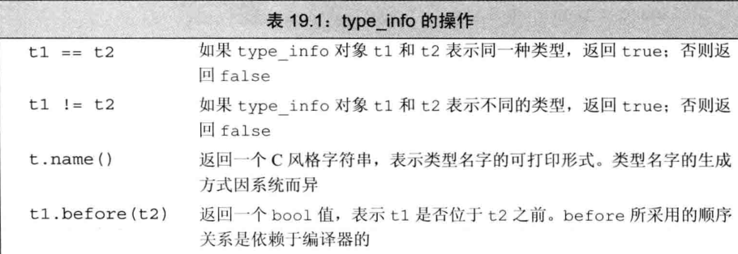
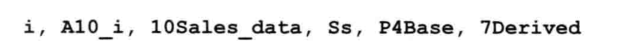

# 特殊工具与技术

## 控制内存分配

### 重载new和delete

首先要对`new`表达式和`delete`表达式的工作机理有更多了解。

使用`new`表达式时：

```cpp
// new表达式
string *sp = new string("a value");			// 分配并初始化一个string对象
string *arr = new string[10];				// 分配10个默认初始化的string对象
```

实际执行步骤：

1. `new`表达式分配一个名为`operator new`(或者`operator new[]`)的标准库函数。该函数分配一块足够大、原始、未命名的内存空间以便存储特定类型的对象(或对象的数组)。
2. 编译器运行相应的构造函数以构造这些对象，并为其传入初始值。
3. 对象被分配了空间并构造完成，返回一个执行该对象的指针。

使用`delete`表达式时：

```cpp
delete sp;				// 销毁*sp 然后释放sp指向的内存空间
delete [] arr;			// 销毁数组中的元素 然后释放对应的内存空间
```

实际执行步骤：

1. 对`sp`所指的对象或`arr`所指的数组中的元素执行对应的析构函数
2. 编译器调用名为`operator delete`(或者`operator delete[]`)的标准库函数释放内存空间。

当自定义了全局的`operator new`函数和`operator delete`函数后，我们就担负起了控制动态内存分配的职责。

`operator new`和`operator delete`可以在全局作用域里定义，也可以定义为成员函数。编译器发现一条`new`或`delete`后，就会在程序里找可供调用的`operator`函数，如果是类类型，就会现在类及其基类的作用域里找。

可以用作用域运算符调用特定的版本，比如全局就是`::new`。

#### operator new接口和operator delete接口

标准库定义了`operator new`函数和`operator delete`函数的8个重载版本。前4个可能抛出`bad_alloc`异常，后4个不会抛出异常：

```cpp
// 可能抛出异常
void *operator new(size_t);						// 分配一个对象
void *operator new[](size_t);					// 分配一个数组
void *operator delete(void*) noexcept;			// 分配一个对象
void *operator delete[](void*) noexcept;		// 分配一个数组

// 承诺不会抛出异常
void *operator new(size_t, nothrow_t&) noexcept;
void *operator new[](size_t, nothrow_t&) noexcept;
void *operator delete(void*, nothrow_t&) noexcept;
void *operator delete[](void*, nothrow_t&) noexcept;
```

`nothrow_t`是定义在`new`头文件里的一个`struct`，该类不包含任何成员。`new`头文件还定义了一个名为`nothrow`的`const`对象，用户可以通过该对象请求`new`的非抛出异常版本。

类似析构函数，`opeator delete`也不允许抛出异常。重载它们时，必须使用`noexcept`异常说明符指定其不抛出异常。

将上述运算符定义为类成员时，它们时隐式静态的，但我们无须显式声明`static`(声明也不会报错)。因为`new`用在对象构造前，`delete`用在对象销毁后，所以它们必须是静态的，且不能操纵类的任何数据成员。

`operator new`和`operator new[]`函数：

- 返回类型必须是`void*`
- 第一个形参类型必须是`size_t`，不能有默认实参

编译器为对象分配内存空间：

- 使用函数：`operator new`
- 把存储指定类型对象所需的字节数传给`size_t`形参 

编译器为数组分配内存空间：

- 使用函数：`operator new[]`
- 把存储数组里所有元素所需的空间传给`size_t`形参

若想自定义`new`，可以给它传递额外形参。此时用到这些自定义函数的`new`表达式必须使用`new`的定位形式。将实参传给新增的形参。

下面这个函数不能被用户重载：

```cpp
void *operator new(size_t, void*);
```

这种形式只供标准库使用，不可被重定义。

对于`operator delete`和`operator delete[]`：

- 返回类型必须是`void`
- 第一个形参类型必须是`void*`

执行一条`delete`表达式将调用相应的`operator`函数，并用指向待释放内存的指针来初始化`void*`形参。

如果把`operator delete`或`operator delete[]`定义成类的成员时，该函数可以包含另一个类型为`size_t`的形参。此时，该形参的初始值是第一个形参所指对象的字节数。`size_t`形参可以用于删除继承体系里的对象。如果基类有个虚析构函数，那么传递给`operator delete`的字节数会因待删除指针所指对象的动态类型不同而有所区别。而且，实际运行的`operator delete`函数版本也由对象的动态类型决定。

我们提供新的`oeprator new`和`operator delete`的目的在于改变内存分配的方式，但我们不能改变`new`运算符和`delete`运算符的基本含义。

实际上根本无法自定义`new`和`delete`，`new`的执行过程总是先调用`operator new`函数以获取内存空间，然后在得到的内存空间里面构造对象。而`delete`则先销毁对象，然后再调用`operator delete`函数释放对象所占的空间。

#### malloc函数和free函数

`malloc`和`free`继承自C，定义在`cstdlib`头文件中。

`malloc`接受一个表示待分配字节数的`size_t`，返回指向分配空间的指针或者返回`0`以表示分配失败。

`free`接受一个`void*`，是`malloc`返回的指针的副本，`free`将相关内存返回给系统。调用`free(0)`没有任何意义。

```cpp
void *operator new(size_t size) {
    if (void *mem = malloc(size))
		return mem;
    else
        throw bad_alloc();
}

void operator delete(void* mem) noexcept {
    free(mem);
}
```

### 定位new表达式

对于`operator new`分配的内存空间来说，我们无法使用`construct`函数构造对象。而是应该用`new`的**定位new**(placement new)形式构造对象。

可以用定位`new`传递一个地址：

```cpp
new (place_address) type
new (place_address) type (initializers)
new (place_address) type [size]
new (place_address) type [size] { braced initializer list }
```

其中`place_address`必须是个指针，同时在`initializers`中提供一个(可能为空)以逗号分隔的初始值列表，该初始值列表将用于构造新分配的对象。

当通过一个地址值调用时，定位`new`使用`operator new(size_t, void*)`"分配"它的内存。该函数不分配任何内存，只是简单地返回指针实参；然后由`new`表达式负责在指定的地址初始化对象以完成整个工作。

定位`new`允许我们在一个特定的、预先分配的内存地址上构造对象。

当只传入一个指针类型的实参时，定位`new`表达式构造对象但是不分配内存。

尽管在很多时候使用定位`new`与`allocator`的`construct`成员非常相似，但在它们间也有个重要的区别：传给`construct`的指针必须指向同一个`allocator`对象分配的空间，但是传给定位`new`的指针无须指向`operator new`分配的内存。

#### 显式的析构函数调用

通过对象的指针或引用调用析构函数与其它成员函数没有区别：

```cpp
string *sp = new string("a value");			// 分配并初始化一个string对象
sp->~string();
```

调用析构函数会销毁对象，但是不会释放内存。如果需要，可以重新使用该空间。

## 运行时类型识别

**运行时类型识别**(run-time type identification, RTTI)的功能由两个运算符实现：

- `typeid`运算符，用于返回表达式的类型
- `dynamic_cast`运算符，用于将基类的指针或引用安全地转换成派生类地指针或引用

如果把这两个运算符用于指针或引用，且该类型含有虚函数时，运算符将使用指针或引用所绑定对象的动态类型。

这两个运算符特别适用于这种情况：当想使用基类对象的指针或引用执行某个派生类操作且该操作不是虚函数。

但是不是什么时候都能定义虚函数。如果无法使用虚函数，那么就可以用RTTI运算符。

与虚成员函数相比，RTTI运算符有更多潜在的风险：程序员必须清楚知道转换的目标类型并且必须检查类型转换是否被成功执行。

在可能的情况下，最好定义虚函数，而不是直接接管类型管理的重任。

### dynamic_cast运算符

**dynamic_cast运算符**(dynamic_cast operator)的使用形式如下所示：

```cpp
dynamic_cast<type*>(e)			// e必须是个有效指针
dynamic_cast<type&>(e)			// e必须是个左值
dynamic_cast<type&&>(e)			// e不能是左值
```

`type`必须是个类类型，且通常情况下应该有虚函数。

`e`必须符合下述条件中任意一个：

1. `e`的类型是目标`type`的公有派生类
2. `e`的类型是目标`type`的公有基类
3. `e`的类型是目标`type`的类型

- 若符合，则类型转换成功
- 否则，转换失败。如果转换目标是指针类型，那么结果是`0`；如果转换目标是引用类型，那么会由`dynamic_cast`运算符抛出一个`bad_cast`异常。

#### 指针类型的dynamic_cast

假定`Base`类有个虚函数，`Derived`是`Base`的公有派生类。

若有个指向`Base`的指针`bp`，则我们能在运行时将它转成指向`Dervied`的指针：

```cpp
if (Dervied *dp = dynamic_cast<Derived*>(bp)){
    // 使用dp指向的Derived对象
} else {
    // 使用bp指向的Base对象
}
```

可以对一个空指针执行`dynamic_cast`，结果是所需类型的空指针。

在条件部分执行`dynamic_cast`操作可以确保类型转换和结果检查在同一条表达式中完成。

#### 引用类型的dynamic_cast

因为不存在空引用，所以对于引用类型而言，无法使用与指针类型完全相同的错误报告策略。

当对引用的类型转换失败时候，程序抛出名为`std::bad_cast`的异常，该异常定义在`typeinfo`标准库头文件中：

```cpp
void f(const Base &b)
{
    try {
        const Derived &d = dynamic_cast<const Derived&>(b);
        // 使用b引用的Derived对象
    } catch (bad_cast) {
        // 处理类型转换失败的情况
    }
}
```

### typeid运算符

**typeid运算符**(typeid operator)。

`typeid(e)`：

- `e`：任意表达式或类型名
- 结果：常量对象的引用。该对象的类型是`type_info`或`type_info`的公有派生类型。

`type_info`定义在`typeinfo`头文件里。

若表达式是个引用，则`typeid`返回该引用所引对象的类型。不过当`typeid`作用于数组或函数时，不会指向向指针的标准类型转换。

也就是对数组`a`执行`typeid(a)`，所得结果为数组类型而非指针类型。

- 当运算对象不属于类类型或是一个不包含任何虚函数的类时，`typeid`运算符指示的是运算对象的静态类型。
- 当运算对象是定义了至少一个虚函数的类的左值时，`typeid`的结果直到运行时才求得。

#### 使用typeid运算符

通常用`typeid`比较两条表达式的类型是否相同，或者比较一条表达式的类型是否与指定类型相同：

```cpp
Derived *dp = new Derived;
Base *bp = dp;					// 两个指针都指向Derived对象
// 运行时比较两个对象类型
if (typeid(*bp) == typeid(*dp)) {
	// bp和dp指向同一类型
}

// 检查运行时类型是否时某种指定的类型
if (typeid(*bp) == typeid(Derived)) {
    // bp实际指向Derived对象
}
```

`typeid`应该作用于对象，所以是`*bp`，而不是`bp`。

如果`typeid`作用于指针(而非指针所指对象)。那么返回的结果是该指针的静态编译时类型。

`typeid`是否需要运行时检查 决定了表达式是否会被求值。只有在类型含有虚函数的时候，编译器才会对表达式求值。

也就是说，如果表达式的动态类型可能于静态类型不同，那么就必须要在运行时对表达式求值来确定返回的类型。

对于`typeid(*p)`，如果`p`是个空指针，那么`typeid(*p)`会抛出一个名为`bad_typeid`的异常。

### 使用RTTI

例如当我们想给具有继承关系的类实现相等运算符时候，RTTI非常有用。

派生类的相等运算符需要考虑派生类的新成员。

需要清楚一个事实：如比较对象类型不同，则比较结果为`false`。也就是如果对基类对象和派生类使用`==`，那么应返回`false`。

基于该事务，相等运算符的形参是基类的引用，然后使用`typeid`检查两个运算对象的类型是否一致。若运算对象的类型不同，则`false`；类型一致，则去比较它们的成员。

对于类型一致的，可以定义一个虚函数`equal`，接收一个基类的引用，取比较它们的成员。

#### 类的层次关系

```cpp
class Base {
    friend bool operator==(const Base&, const Base&);
public:
    // Base的接口成员
private:
    virtual bool equal(const Base&) const;
    // Base的数据成员和其它用于实现的成员
};

class Derived: public Base {
public:
    // Derived的其它接口成员
protected:
    bool equal(const Base&) const;
    // Derived的数据成员和其它用于实现的成员
};
```

#### 类型敏感的相等运算符

```cpp
bool operator==(const Base &lhs, const Base &rhs)
{
    // 若typeid不同 返回false 否则虚调用equal
    return typeid(lhs) == typeid(rhs) && lhs.equal(rhs);
}
```

#### 虚equal函数

继承体系的每个类都定义自己的`equal`函数。

```cpp
bool Derived::equal(const Base &rhs) const
{
    // 我们清楚这两个类型是相等的 所以转换过程不会抛出异常
    auto r = dynamic_cast<const Derived&>(rhs);
 
    // 执行比较两个Derived对象的操作并返回结果
}
```

#### 基类equal函数

```cpp
bool Base::equal(const Base &rhs) const 
{
    // 执行比较Base对象的操作
}
```

### type_info类

**type_info**类的精确定义随着编译器的不同而略有差异。但C++标准规定`type_info`类必须定义在`typeinfo`头文件中，且至少提供下表所示操作：



因为`type_info`通常作为一个基类出现，所以它还应该提供一个公有的虚析构函数。当编译器希望提供额外的类型信息时，通常在`type_info`的派生类里完成。

`type_info`类没有默认构造函数，并且拷贝构造函数和移动构造函数都被定义为删除，所以不能定义或者拷贝`type_info`的对象，也不能为`type_info`类型的对象赋值。

创建`type_info`对象的唯一方式是用`typeid`运算符。

对于`t.name()`的返回值的唯一要求是，类型不同则返回的字符串必须有所区别：

```cpp
int arr[10];
Derived d;
Base *p = &d;

cout << typeid(42).name() << ", "
     << typeid(arr).name() << ", "
     << typeid(Sales_data).name() << ", "
     << typeid(std::string).name() << ", "
     << typeid(p).name() << ", "
     << typeid(p).name() << endl;
```

书作者的计算机上返回如下：



有的编译器提供了额外的成员函数以提供程序中所用类型的额外信息。

## 枚举类型

**枚举类型**(enumeration)使我们可以将一组整型常量组织在一起。每个枚举类型定义一种新的类型。

枚举属于字面值常量类型。

C++包含两种枚举：

- 限定作用域
- 不限定作用域

C++11后引入**限定域的枚举类型**(scoped enumeration)。定义限定作用域的枚举类型的一般形式：`enum class`或`enum struct`，后跟枚举类型名字以及用花括号括起来的以逗号分隔的**枚举成员**(enumerator)列举，最后是个分号：

```cpp
enum class open_modes (input, output, apped);
```

`open_modes`枚举类由三个枚举成员：`input`、`output`、`apped`。

定义**不限定作用域的枚举类型**(unscoped enumeration)时省略掉关键字`class`或`struct`，枚举类型的名字是可选的：

```cpp
enum color {red, yellow, green};		// 不限定作用域的枚举类型

// 未命名的、不限定作用域的枚举类型
enum {floatPrec = 6, doublePrec = 10, double_doublePrec = 10};
```

如果`enum`未命名，则我们只能在定义该`enum`时定义它的对象。

#### 枚举成员                 

- 限定作用域的枚举类型：枚举成员的名字遵循常规的作用域准则，并且在枚举类型的作用域外不可访问。
- 不限定作用域的枚举类型：枚举成员的作用域与枚举类型本身的作用域相同。

```cpp
enum color {red, yellow, green};			// 不限定作用域的枚举类型
enum stoplight {red, yellow, green};		// 错误 重复定义了枚举成员
enum class peppers {red, yellow, green};	// 正确 枚举成员被隐藏了
color eyes = green;							// 正确 不限定作用域的枚举类型的枚举成员位于有效的作用域里
peppers p = green;							// 错误 peppers的枚举成员不在有效的作用域中
color hair = color::red;					// 正确 允许显式地访问枚举成员
peppers p2 = peppers::red;					// 正确 使用peppers地red
```

默认，枚举值从`0`开始，依次加`1`。但也能为一个或几个枚举成员指定特定值：

```cpp
enum class intTypes {
    charTyp = 8, shortTyp = 16, intTyp = 16, longTyp = 32, long_longTyp = 64
}
```

若我们没有显式地提供初始值，则当前枚举成员的值等于之前枚举成员的值加`1`。

每个枚举成员本身就是常量表达式，所以可以在任何需要常量表达式的地方使用枚举成员。

例如定义枚举类型的`constexpr`变量：

```cpp
constexpr intTypes charbits = intTypes::charTyp;
```

也可以将`enum`作为`switch`的表达式，将枚举值作为`case`标签。

#### 和类一样，枚举也定义新的类型

只要`enum`有名字，就能定义并初始化该类型的成员。若想初始化`enum`对象或为`enum`对象赋值，则必须使用该类型的一个枚举成员或该类型的另一个对象：

```cpp
open_modes om = 2;				// 错误 2不属于类型open_modes
om = open_modes::input;			// 正确 input是open_modes的一个枚举成员
```

不限定作用域的枚举类型的对象或枚举成员自动转换为整型，所以我们能够在任何需要整型值的地方使用它们：

```cpp
int i = color::red;			// 正确 不限定作用域的枚举类型的枚举成员隐式转成int
int j = peppers::red;		// 错误 限定作用域的枚举类型不会进行隐式转换
```

#### 指定enum的大小

若未指定`enum`的潜在类型，则默认情况下限定作用域的`enum`成员类型为`int`。

于不限定作用域的枚举类型而言，其枚举成员不存在默认类型，只知道成员的潜在类型足够大，肯定能够容纳枚举值。

C++11后，可以指定在该`enum`中使用的类型：

```cpp
enum intValues : unsigned long long {
    charTyp = 255. shortTyp = 65535, intTyp = 65535, longTyp = 4294967295UL,
    long_longTyp = 18446744073709551615ULL
};
```

若指定了枚举成员的潜在类型(包括对限定作用域的`enum`的隐式指定)，则一旦某个枚举成员的值超出了该类型所能容纳范围，将引发程序错误。

指定`enum`潜在类型的能力使得我们能够控制不同实现环境中使用的类型，可以确保在一种实现环境中编译通过的程序所生成的代码与其它实现环境中生产的代码一致。

#### 枚举类型的前置声明

C++11后，可以提前声明`enum`。`enum`的前置声明必须指定其成员大小：

```cpp
// 不限定作用域的枚举类型intValues的前置声明
enum intValues : unsigned long long;			// 不限定作用域的 必须指定成员类型

enum class open_modes;							// 限定作用域的枚举类型可以使用默认成员类型int
```

`enum`的声明和定义必须匹配。

#### 形参匹配与枚举类型

```cpp
// 不限定作用域的枚举类型 潜在类型因机器而异
enum Tokens {INLINE = 128, VIRTUAL = 129};

void ff(Tokens);
void ff(int);

int main() {
    Tokens curTok = INLINE;
    ff(128);				// 精确匹配ff(int)
    ff(INLINE);				// 精确匹配ff(Tokens)
    ff(curTok);				// 精确匹配ff(Tokens)
    return 0;
}
```

要初始化`enum`对象，必须用该`enum`类型的另一个对象或它的一个枚举成员。就算某个整型值刚好和枚举成员相同，也不能作为函数的`enum`实参使用。

虽然不能把整型值传给`enum`形参，但是我们可以把一个(不限定作用域的枚举类型的)对象传给整型形参。这时候`enum`就会被提升成`int`或更大的整数，实际提升的结果由枚举类型的潜在类型决定：

```cpp
void newf(unsigned char);
void newf(int);

unsigned char uc = VIRTUAL;

newf(VIRTUAL);			// 调用newf(int)		129 被提升成int
newf(uc);				// 调用newf(unsigned char)	因为uc使用unsigned char作为存储 所以调用unsigned char
```

也就是不管`Tokens`的潜在类型到底是什么，它的对象和枚举成员都会被提升成`int`。

## 类成员指针

**成员指针**(pointer to member)是指可以指向类的非静态成员的指针。一般指针指向一个对象，但是成员指针指示的是类的成员，而非类的对象。类的静态成员不属于任何对象，所以不需要特殊的指向静态成员的指针，指向静态成员的指针与普通指针没有什么区别。

这里使用之前的`Screen`类作为示例。

### 数据成员指针

与普通指针不同的是，成员指针必须包含成员所属的类，所以必须在`*`前添加类名作用域，来表示当前定义的指针可以指向类的成员：

```cpp
// pdata可以指向一个常量(非常量)Screen对象的string成员
const string Screen::*pdata;
```

`pdata`：一个指向`Screen`类的`const string`成员的指针。

初始化或赋值一个成员指针时，需要指针它所指的成员，如令`pdata`指向某个非特定`Screen`对象的`contents`成员：

```cpp
pdata = &Screen::contents;
```

其中，将取地址运算符作用于`Screen`类的成员而非内存中的一个该类对象。

```cpp
auto pdata = &Screen::contents;
```

#### 使用数据成员指针

初始化一个成员指针或给成员指针赋值时，该指针没有指向任何数据。成员指针指定了成员而非该成员所属对象，只有解引用成员指针时才提供对象的信息。

两种成员指针访问运算符：

- `.*`
- `->*`

这两个运算符使得我们可以解引用指针并且获得该对象的成员：

```cpp
Screen myScreen, *pScreen = &myScreen;
// .*解引用pdata以获得myScreen对象的contents成员
auto s = myScreen.*pdata;
// ->*解引用pdata以获得pScreen所指对象的contents成员
s = pScreen->*pdata;
```

1. 先解引用成员指针以获得所需成员
2. 然后通过`.`或`->`获取成员

#### 返回数据成员指针的函数

有与数据成员一般情况下是私有的，所以通常不能直接获得数据成员的指针。

对于`Screen`的数据成员`contents`，最好的方式是定义一个函数，令其返回值是指向该成员的指针：

```cpp
class Screen {
public:
    // data是个静态成员 返回一个成员指针
    static const std::string Screen::*data() { return &Screen::contents; }
    // 如常...
};
```

调用：

```cpp
const string Screen::*pdata = Screen::data();
```

要想用`pdata`，必须将它绑定到`Screen`类型的对象上：

```cpp
// 获得myScreen对象的contents成员
auto s = myScreen.*pdata;
```

### 成员函数指针

类似指向数据成员的指针：

```cpp
// pmf是个指针 指向Screen的某个常量成员函数
// 前提是该函数不接受任何实参 并返回一个char
auto pmf = &Screen::get_cursor;
```

类似于其它函数指针，指向成员函数的指针也需要指定目标函数的返回类型和形参列表。

若成员函数是`const`成员或者引用成员，则必须将`const`限定符或引用限定符包含进来。

若成员存在重载，则必须显式地声明函数类型以明确指出我们想用哪个函数。

```cpp
char (Screen::*pmf2)(Screen::pos, Screen::pos) const;
pmf2 = &Screen::get;
```

处于优先级考虑，上述中`Screen::*`两端的括号必不可少。若没有这对括号，编译器将认为该声明是个无效的函数声明：

```cpp
// 错误 非成员函数p不能使用const限定符
char Screen::*p(Screen::pos, Screen::pos) const;
```

该声明试图定义一个`p`普通函数，并返回`Screen`类的一个`char`成员。因为它声明的是个普通函数，所以不能用`const`限定符。

成员函数和指向该成员的指针间不存在自动转换规则：

```cpp
// pmf指向一个Screen成员 该成员不接受任何实参且返回类型是char
pmf = &Screen::get;				// 必须显式地使用取地址运算符
pmf = Screen::get;				// 错误 在成员函数和指针间不存在自动转换规则
```

#### 使用成员函数指针

也是用`.*`或`->*`作用于指向成员函数的指针：

```cpp
Screen myScreen. *pScreen = &myScreen;
// 通过pScreen所指的对象调用pmf所指的函数
char c1 = (pScreen->*pmf)();
// 通过myScreen对象将实参0, 0传给含有两个形参的get函数
char c2 = (myScreen.*pmf2)(0, 0);
```

若去掉括号：

```cpp
myScreen.*pmf()
// 等同于
myScreen.*(pmf())
```

因为函数调用运算符的优先级较高，所以在声明指向成员函数的指针并使用这样的指针进行函数调用时，括号必不可少。

#### 使用成员指针的类型别名

```cpp
// Action是种可以指向Screen成员函数的指针 接受两个pos实参 返回一个char
using Action = char (Screen::*)(Screen::pos, Screen::pos) const;
// 使用
Action get = &Screen::get;				// get指向Screen的get成员
```

亦可以将指向成员函数的指针作为某个函数的返回类型或形参类型。其中，指向成员的指针形参也可以有默认实参：

```cpp
// action接收一个Screen的引用 和一个指向Screen成员函数的指针
Screen& action(Screen&, Action = &Screen::get);
```

`action`是个包含两个形参的函数，一个是`Screen`对象引用，一个是指向`Screen`成员函数的指针，成员函数必须接受两个`pos`形参并返回一个`char`。调用`action`时，只需要把`Screen`的一个符号要求的函数的指针或地址传入即可：

```cpp
Screen myScreen;
// 等价的调用
action(myScreen);					// 使用默认实参
action(myScreen, get);				// 使用之前定义的变量get
action(myScreen, &Screen::get);		// 显式传入地址
```

通过使用类型别名，可以令含有成员指针的代码更易读写。

当然也可以用`typedef`。

#### 成员指针函数表

对于普通函数指针和指向成员函数的指针来说，一种常见用法是将其存入一个函数表中。如果一个类含有几个相同类型的成员，那么这样一张表可以帮助我们从这些成员中选择一个。

假定`Screen`类含有几个成员函数，每个函数负责把光标向指定的方向移动：

```cpp
class Screen {
public:
    // 其它接口和实现成员与之前一致
    Screen& home();			// 光标移动函数
    Screen& forward();
    Screen& back();
    Screen& up();
    Screen& down();
};
```

这几个函数的共同点：都不接受任何参数，且返回值是发生光标移动的`Screen`的引用。

再定义一个`move`函数，使其可以调用上面的任意一个函数并执行对应的操作。为支持该函数，将在`Screen`中添加静态成员用于指向光标移动函数的指针的数组：

```cpp
class Screen {
public:
    // 如常...
    // Action是个指针 可以用任意一个光标移动函数对其赋值
    using Action = Screen& (Screen::*)();
    // 制定具体要移动的方向 其中enum
    enum Directions { HOME, FORWARD, BACK, UP, DOWN };
    Screen& move(Directions);
private:
    static Action Menu[];			// 函数表
};
```

数组`Menu`依次保存每个光标移动函数的指针，这些函数将按照`Directions`中枚举成员对应的偏移量存储。

`move`函数接受一个枚举成员并调用相应的函数：

```cpp
Screen& Screen::move(Directions cm)
{
    // 运行this对象中索引值为cm的元素
    return (this->*Menu[cm])();			// Menu[cm]指向一个成员函数
}
```

1. 先取索引值为`cm`的`Menu`元素，该元素指向`Screen`成员函数的指针。
2. 调用`move`函数时，给它传入一个表示光标移动方向的枚举成员。

```cpp
Screen myScreen;
myScreen.move(Screen::HOME);		// 调用myScreen.home;
myScreen.move(Screen::DOWN);		// 调用myScreen.down;
```

之后就是定义并且初始化函数表本身：

```cpp
Screen::Action Screen::Menu[] = {
    &Screen::home,
    &Screen::forward,
    &Screen::back,
    &Screen::up,
    &Screen::down,
};
```

### 将成员函数用作可调用对象

要通过一个指向成员函数的指针进行函数调用，必须先用`.*`或`->*`运算符将该指针绑定到特定对象上，所以成员指针不是一个可调用对象，这样的指针不支持函数调用运算符。

#### 使用function生成一个可调用对象

从指向成员函数的指针获得可调用对象的一种方式是使用标准库模板`function`：

```cpp
function<bool (const string&)> fcn = &string::empty;
find_if(svec.begin(), svec.end(), fcn);
```

我们告知`function`：`empty`是个接受`string`参数并返回`bool`值的函数。

通常，执行成员函数的对象将被传给隐式的`this`形参。

当`function`对象包含有一个指向成员函数的指针时，`function`类必须知道它必须使用正确的指向成员的指针运算符来执行函数调用。也就是说我们可以认为`find_if`中有类似如下的代码：

```cpp
// 假设it是find_if内部的迭代器 则*it是给定范围内的一个对象
if (fcn(*it))				// 假设fcn是find_it内部的一个可调用对象的名字
```

本质上看，`function`类将函数调用转换为如下形式：

```cpp
if(((*it).*p)())			// 假设p是fcn内部的一个指向成员函数的指针
    
/*
*it == string
string.*p == string.empty
(string.empty)() == string.empty()
*/
```

定义`function`对象时，必须指定该对象所能表示的函数类型，也就是可调用对象的形式。如果可调用对象是一个成员函数，那么第一个形参必须表示该成员是在(一般是隐式的)哪个对象上执行的。

并且，提供给`function`的形式中还必须指明对象是以指针还是引用的形式传入的。

```cpp
vector<string*> pvec;
function<bool (const string*)> fp = &string::empty;
// fp接受一个指向string的指针 然后用->*调用empty
find_if(pvec.begin(), pvec.end(), fp);
```

#### 使用mem_fn生成一个可调用对象

也可以用标准可功能`mem_fn`来让编译器负责推断成员的类型。`mem_fn`也定义在`functional`头文件里。

它从成员指针生成一个可调用对象，`mem_fn`可以根据成员指针的类型推断可调用对象的类型，而无须用户显式地指定：

```cpp
find_if(svec.begin(), svec.end(), mem_fn(&string::empty));
```

`mem_fn(&string::empty)`生成一个可调用对象，该对象接受一个`string`实参，返回`bool`值。

`mem_fn`生成的可调用对象可以通过对象调用，也可以通过指针调用：

```cpp
auto f = mem_fn(&string::empty);			// f接受一个string或string*
f(*svec.begin());				// 正确 传入一个string对象 f使用.*调用empty
f(&svec[0]);					// 正确 传入一个string指针 f使用->*调用empty
```

可以认为`mem_fn`生成的可调用对象含有一对重载的函数调用运算符，一个接受`string*`，一个接受`string&`。

#### 使用bind生成一个可调用对象

```cpp
// 选择范围中的每个string 并将其bind到empty的第一个隐式实参上
auto it = find_it(svec.begin(), svec.end(), bind(&string::empty, _1));
```

必须将函数中用于表示执行对象的隐式形参转为显式的。`bind`生成的可调用对象的第一个形参既可以是`string`的引用也可以是`string`的指针。

```cpp
auto f = bind(&string::empty, _1);
f(*svec.begin());			// 实参是个string(*svec) f使用.*调用empty
f(&svec[0]);				// 实参是个string的指针 f使用->*调用empty
```

