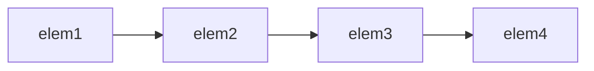
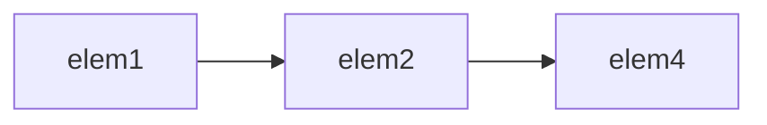

# 顺序容器

一个容器就是一些特定类型对象的集合。

**顺序容器**(sequential container)为程序员提供了控制元素存储和访问顺序的能力。

该顺序与元素加入容器时的位置相对应。

## 顺序容器概述

### 顺序容器

| 顺序容器类型 | 含义 |   快速访问   |   插入删除元素速度   |
| :----------- | :--- | :--- | ------------ |
| `vector` | 可变大小数组。 | 随机访问 | 尾部之外的位置慢 |
| `deque` | 双端队列 | 随机访问 | 头尾位置速度很快 |
| `list` | 双向链表 | 双向顺序访问 | 任何位置都很快 |
| `forward_list` | 单向链表 | 单向顺序访问 | 任何位置都很快 |
| `array` | 固定大小数组 | 随机访问 | 不能添加或者删除 |
| `string` | 保存字符 | 随机访问 | 尾部速度快 |

`deque`是个相对其他类型更加复杂的数据结构。`deque`支持快速的随机访问。和`string`和`vector`类似，`deque`的中间位置添加或者删除元素的代价很高。但是两端添加或者删除速度都很快，和`list`或者`forward_list`添加删除元素的速度相当。

除`array`之外，其他容器都提供高效、灵活的内存管理。容器保存元素的策略对容器操作的效率有固定的且时而重大额影响。有时候，存储策略还会影响特定容器是否支持特定操作。

比如`string`和`vector`将元素保存在连续的内存空间里面。因为元素是连续存储的，由元素的下标来计算其地址是非常快的。但是在这两种容器的中间位置添加或者删除元素就会非常耗时：在一次插入或者删除操作之后，需要移动插入、删除位置之后的所有元素，来保持连续存储。然后每次添加一个元素都有可能需要分配额外的存储空间。这种情况下每个元素都需要移动到新的存储空间里面。

`list`和`forward_list`相对于除了`string`之外的其他的容器类型的额外内存开销很大。这两个容器的设计目的是令容器任何位置的添加和删除操作都很快速。但是这两个容器不支持元素的随机访问，因为如果要访问一个元素，就需要我们去遍历整个容器。

`forward_list`和`array`是C++新增的类型。

与内置数组而言，`array`是更安全更容易使用的数组类型。但`array`的大小也是固定的。

`forward_list`的设计目标是达到与最好的手写的单向链表数组结构相当的性能。所以`forward_list`没有`size`操作，因为保存或计算其大小会比手写链表多出额外的开销。对于其他的容器来说，`size`是个快速的常量时间的操作。

新标准库的容器比旧版本快的多。现代C++程序应该使用标准库容器，而不是更加原始的数据结构，比如内置数组。

#### 使用哪种顺序容器

一般来说用`vector`最好。

- 如果程序有很多小的元素，且空间的额外开销很重要，就不要用`list`或`forward_list`
- 如果要用随机访问，就用`vector`或`deque`
- 如果要在中间插入或者删除，就用`list`或`forward_list`
- 如果要在头尾插入或者删除，但是不会在中间位置插入或者删除，就用`deque`
- 如果程序只有在读取输入时候才需要再容器中间插入元素，之后需要随机访问元素：
  - 确定是否真的要在容器中间位置添加元素。后面会说到可以用`sort`函数来重排容器元素
  - 如果必须要用，那就考虑再输入阶段用`list`，输入完成后就把`list`的内容拷贝到`vector`中

若程序既需要随机访问元素，又需要在容器中间插入元素，那就考虑：在`list`或者`forward_list`中访问元素与`vector`或`deque`中插入或删除元素的相对性能。

一般应用里占主导地位的操作，执行访问操作多还是插入或者删除操作多，决定了容器类型的选择。这时候就要对两种容器分别测试应用的性能就很必要了。

如果实在不确定用哪种，那就在程序里只用`vector`和`list`公共的操作：

- 用迭代器
- 不用下标操作
- 避免随机访问

这样在必要时候选择`vector`或`list`都很方便

## 容器库概括

一般每个容器都定义在一个头文件里，文件名和类型名一样。容器都是模板类。

```cpp
list<Sales_data>
deque<double>
```

某些容器操作对元素类型有自己的特殊要求。

比如顺序容器构造函数的一个版本接受容器大小参数，它使用了元素类型的默认构造函数。

有些类没有默认构造函数。可以定义一个保存这种类型对象的容器，但在构造这种容器时不可以只传递给它一个元素数目参数，我们还要给其初始值：

```cpp
// 假定noDefault是个没有默认构造函数肚饿类型
vector<noDefault> v1(10,init);		// 正确 init是元素初始值
vector<noDefault> v2(10);			// 错误 必须提供一个元素初始化器
```

### 容器操作

#### 类型别名

- `iterator`：此容器类型的迭代器类型
- `const_iterator`：只可读取元素的迭代器类型
-  `size_type`：无符号整数类型，可以保存该容器类型最大可能容器的大小
- `difference_type`：带符号整数类型，可以保存两个迭代器之间的距离
- `value_type`：元素类型
- `reference`：元素的左值类型，和`value_type&`相同
- `const_reference`：元素的`const`左值类型，也就是`const value_type&`

#### 构造函数

- `C c;`：默认构造函数，构造空容器
- `C c1(c2);`：用`c2`的值构造容器`c1`
- `C c(b, e);`：构造`c`，将迭代器`b`和`e`指定的范围内的元素拷贝到`c`(不支持`array`)
- `C c(a, b, c);`：列表初始化`c`

#### 赋值和swap

- `c1 = c2`：用`c1`中的元素替换`c2`中的元素
- `c1 = {a, b, c...}`：将`c1`中的元素替换成列表中的元素(不支持`array`)
- `a.swap(b)`：交换`a`和`b`的元素
- `swap(a, b)`：和上一条效果一样

#### 大小

- `c.size()`：`c`里元素数量(不支持`forward_list`)
- `c.max_size()`：`c`里最大可以保存的元素数量
- `c.empty()`：判断`c`是否为空

#### 添加或者删除元素(不支持array)

不同的容器，这些操作的接口不同

- `c.insert(args)`：将`args`里的元素拷贝到`c`里
- `c.emplace(inits)`：使用`inits`构造`c`里的一个元素
- `c.erase(args)`：删除`args`指定的元素
- `c.clear()`：删除`c`里所有元素，返回void

#### 关系运算符

- `==`，`!=`：所有容器都支持
- `<`，`<=`，`>`，`>=`：不支持无序关联容器

#### 获取迭代器

- `c.begin()`，``c.end()`：返回指向`c`的首元素和尾元素之后位置的迭代器
- `c.cbegin()`，`c.cend()`：返回`const_iterator`

#### 反向容器的额外成员

不支持`forward_list`

- `reverse_iterator`：按逆序寻址元素的迭代器
- `const_reverse_iterator`：不能修改元素的逆序迭代器
- `c.rbegin()`，`c.rend()`：返回指向`c`的尾元素还有首元素之前位置的迭代器
- `c.crbegin()`，`c.crend()`：返回`const_reverse_iterator`

### 迭代器

迭代器有公共的接口：若一个迭代器提供某个操作，那么所有提供相同操作的迭代器对该操作的实现方式都相同。

比如，标准容器类型上的所有迭代器都允许我们访问容器里的元素，而所有迭代器都是通过解引用运算符来实现这个操作的。

有一个例外不符合公共接口特点——`forward_list`迭代器不支持递减运算符`--`。

#### 迭代器范围

迭代器范围的概念是标准库的基础。

一个**迭代器范围**(iterator range)由一堆迭代器表示，两个迭代器分别指向同一个容器中的元素或者尾元素之后的位置。它们标记了容器中元素的一个范围。

这种元素范围称为**左闭合区间**(left-inclusive interval)，其标准数学描述为`[begin, end]`

表示范围从`begin`开始到`end`前结束。

#### 使用左闭合范围蕴含的编程假定

- 如果`begin`和`end`相等，那么范围就是空
- 如果`begin`和`end`不相等，那么范围至少包含一个元素，并且`begin`指向该范围中的第一个元素
- 我们可以对`begin`递增若干次，使得`begin==end`

安全循环：

```cpp
while (begin != end){
	*begin = val;
	++begin;
}
```

### 容器类型成员

已经用过：

- `size_type`
- `iterator`
- `const_iterator`

大多容器还提供反向迭代器。对一个反向迭代器执行`++`操作，会得到上一个元素。

还有类型别名，在不了解容器元素类型的情况下可以用容器的`value_type`。

如果需要元素类型的引用，可以用`reference`或`const_refernce`。为了使用这些类型，必须要显式使用它的类名：

```c++
// iter是通过list<string>定义的一个迭代器类型
list<string>::iterator iter;
// count是通过vector<int>定义的一个difference_type类型
vector<int>::difference_type count;
```

### begin和end成员

```cpp
list<string> a = {"Milton","Shakespare", "Austen"};
auto it1 = a.begin();			// list<string>::iterator
auto it2 = a.rbegin();			// list<string>::reverse_iterator
auto it3 = a.cbegin();			// list<string>::const_iterator
auto it4 = a.crbegin();			// list<string>::const_reverse_iterator
```

不以`c`开头的函数都是被重载过的。用来接收`const`或者非`const`的参数。

以`c`开头的版本是C++11引入的，用来支持`auto`与`begin`和`end`函数结合是哦那个。过去没有的时候只能显式声明希望使用哪种类型的迭代器：

```cpp
// 显式指定类型
list<string>::iterator it5 = a.begin();
list<string>::const_iterator it6 = a.begin();

// 是iterator还是const_iterator依赖于a的类型
auto it7 = a.begin();		// 只有a是const的时候 it7是const_iterator
auto it8 = a.cbegin();		// it8是const_iterator
```

### 容器定义和初始化

每个容器都定义了一个默认构造函数。除`array`之外的容器的默认构造函数都会创建一个指定类型的空容器，且都可以接受指定容器大小和元素初始值的参数。

- `C c;`：默认构造函数。若`C`是`array`，则`c`中元素按默认方式初始化；否则`c`为空
- `C c1(c2)`：`c1`初始化成`c2`的拷贝。必须是相同类型。如果是`array`，那么还必须大小相等。
- `C c1=c2`：同上一条
- `C c{a,b,c,..}`：`c`初始化成初始化列表里元素的拷贝。对于`array`，列表里元素数目必须等于或小于`array`的大小，任何遗漏的元素都进行值初始化。
- `C c={a,b,c,..}`：同上一条
- `C c(b,e)`：`c`初始化为迭代器`b`和`e`指定范围中的元素的拷贝。范围中元素的类型必须和`C`的元素类型相容。(`array`不适用)
  - 只有顺序容器(没有`array`)的构造函数才能接受大小参数
- `C seq(n)`：`seq`包含`n`个元素，这些元素进行了值初始化。`string`不适用
- `C seq(n,t)`：`seq`包含`n`个初始化为值`t`的元素

#### 将一个容器初始化为另一个容器的拷贝

- 拷贝整个容器
- 拷贝由另一个迭代器对指定的元素范围(不支持`array`)

当传递迭代器参数来拷贝一个范围的时候，允许容器类型不相同。且，新容器和原容器中的元素类型也可以不同，只要可以把要拷贝的元素转换成要初始化的容器的元素类型就可以。

```cpp
list<string> authors = {"Milton", "Shakespeare"};
vector<const char> articles = {"a", "an", "the"};

list<string> list2(authors);		// 正确 类型匹配
deque<string> authList(authors);	// 错误 容器类型不同

// 正确 可以把const char*元素转换成string 新容器的大小每个元素都用范围中对应元素的值进行初始化
forward_list<string> words(articles.begin(), articles.end());	
```

因为两个迭代器表示一个范围，所以可以用这种构造函数来拷贝一个容器里的子序列。

```cpp
// 拷贝元素 直到it指向的元素
deque<string> authList(authors.begin(), it);
```

列表初始化

新标准中可以对每个容器进行列表初始化

```cpp
// 每个容器有三个元素 用给定的初始化器进行初始化
list<string> authors = {"Milton", "Shakespeare"};
vector<const char*> articles = {"a", "an"};
```

这样做的时候，我们就显式地指定了容器里每个元素的值。以及隐式地指定了容器的大小。

#### 与顺序容器大小相关的构造函数

`array`除外的顺序容器还提供了另外一个构造函数，接受一个容器大小和一个可选的元素初始值。

如果不提供元素初始值，则标准库会创建一个值初始化器：

```cpp
vector<int> ivec(10, -1);			// 10个int元素，每个都初始化为-1
list<string> svec(10, "hi!");		// 10个string 每个都初始化成"hi!"
forward_list<int> ivec(10);			// 10个int 每个都初始化成0
deque<string> svec(10);				// 10个string 每个都是空string
```

#### 标准库array具有固定大小

定义`array`的时候除了指定元素类型，还要指定容器大小：

```cpp
array<int, 42>			// 类型：保存了42个int的数组
array<string, 10>		// 类型：保存10个string的数组
```

为使用`array`类型，还必须同时指定元素类型和大小：

```cpp
array<int, 10>::size_type i;	// 数组类型包含元素类型和大小
array<int>::size_type j;		// 错误 array<int>不是一个类型
```

一个默认构造的`array`是非空的，里面的元素都被默认初始化。对`array`的初始化，初始化的数目要小于或者等于`array`的大小。如果元素类型是个类类型，那么这个类必须要有个默认构造函数，使得值初始化可以进行：

```cpp
array<int, 10> ia1;			// 10个默认初始化的int
array<int, 10> ia2 = {0,1,2,3,4,5,6,7,8,9};		// 列表初始化
array<int, 10> ia3 = {42};	// ia3[0]是42,其余执行默认初始化
```

虽然不能对内置数组类型进行拷贝或者对象赋值操作，但是`array`没有这个限制：

```cpp
int digs[10] = {0,1,2,3,4,5,6,7,8,9};
int cpy[10] = digs;						// 错误 内置数组不支持拷贝或者赋值
array<int, 10> digits = {0,1,2,3,4,5,6,7,8,9};
array<int, 10> copy = digits;			// 正确 只要数组类型匹配就合法
```

`array`要求初始值的类型和元素数量必须和创建的容器相同。

### 赋值和swap

| 容器赋值运算                            |                                                              |
| --------------------------------------- | ------------------------------------------------------------ |
| `c1=c2`                                 | `c1`的元素替换为`c2`元素的拷贝。必须类型相同                 |
| `c={a,b,c...}`                          | `c1`的元素替换为初始化列表里元素的拷贝(`array`不适用)        |
| `swap(c1,c2)`                           | 交换`c1`和`c2`的元素。要求类型相同。<br />速度比拷贝元素快   |
| `c1.swap(c2)`                           | 同上                                                         |
|                                         |                                                              |
| `assign`的操作不适用于关联容器和`array` |                                                              |
| `seq.assign(b,e)`                       | 将`seq`的元素替换成迭代器`b`和`e`所表示的范围里的元素。<br />迭代器`b`和`e`不能指向`seq`里的元素 |
| `seq.assign(il)`                        | 将`seq`里的元素替换成初始化列表`il`里的元素                  |
| `seq.assign(n,t)`                       | 将`seq`里的元素替换成为`n`个值为`t`的元素                    |

赋值相关运算符会导致指向左边容器里面的迭代器、引用和指针失效。而`swap`操作会把容器内容交换。而不会导致指向容器的迭代器、引用和指针失效。但是`array`和`string`除外。

```cpp
c1 = c2;				// 将c1的内容替换成c2里元素的拷贝
c1 = {a,b,c};			// 赋值后 c1大小是3

array<int ,10> a1 = {0,1,2,3,4,5,6,7,8,9};
array<int, 10> a2 = {0};			// 所有元素值为0
a1 = a2;							// 替换a1里的元素
a2 = {0};							// 错误 不能把一个花括号列表赋予数组
```

因为右边运算对象的大小可能和左边运算对象的大小不同，所以`array`类型不支持`assign`，也不允许用花括号包围的值列表进行赋值。

#### 使用assign(仅顺序容器)

顺序容器(`array`除外)还定义了一个名为`assign`的成员，允许我们从一个不同但是相容的类型赋值，或者从容器的一个子序列赋值。

示例：

```cpp
list<string> names;
vector<const char*> oldstyle;
names = oldstyles;		// 错误 容器类型不匹配
names.assign(oldstyle.begin(), oldstyle.end());		// 正确 
```

因为旧元素被替换，所以传递给`assign`的迭代器不能指向调用`assign`的容器

`assign`的第二个版本接受一个整型值和一个元素值。用指定数目且具有相同值的元素替换容器中原有的元素：

```cpp
/*
相当于slist1.clear();
然后跟slist1.insert(slist1.begin(), 10, "Hiya!");
*/
list<string> slist1(1);		// 1个空string
slist1.assign(10,"Hiya!");	// 10个"Hiya!"
```

#### 使用swap

替换两个类型相同的容器的内容

```cpp
vector<string> svec1(10);		// 10个空string
vector<string> svec2(24);		// 24个空string
swap(svec1, svec2);				// 执行完成后svec1会有24个空string svec2会有10个空string
```

除了`array`之外，交换两个容器内容的操作会很快，因为其实元素本身没有被替换，替换的只是两个容器的内部数据结构。

除`string`之外，指向容器的迭代器、引用和指针在`swap`操作之后并不会失效。

例如`iter`在`swap`前指向`svec1[3]`，那么在`swap`之后，它会指向`svec2[3]`。

但是对一个`string`调用`swap`会导致迭代器、引用和指针失效。

因为`array`会真正交换它们的元素，所以其实交换两个`array`所耗费的时间取决于它们的元素数量。所以对于`array`而言，在`swap`替换了之后，尽管指针、引用和迭代器所绑定的元素还是不变，但是元素值其实已经和另一个`array`对应的元素进行了交换。

C++11后，容器既提供成员函数版本的`swap`，也提供非成员函数版本的。但最好还是用非成员版本的`swap`，这对泛型编程特别重要。

### 容器大小操作

- `.size()`：返回容器中元素数量
- `.empty()`：判断容器是否为空
- `.max_size()`：返回一个大于或者等于该类型容器所能容纳的最大元素数的值。`foward_list`不支持`size`成员函数

### 关系运算符

- 每个容器类型都支持相等运算符`==`和`!=`
- 除了无序关联容器外的所有容器都支持关系运算符
- 关系运算符左右两边的运算对象必须类型相同，且必须保存相同类型的元素

比较方式的工作方式与`string`的类似：

- 若两个容器大小相同且元素对应相同，则两个容器相等；否则两个容器不等
- 若两个容器大小不同，但小容器的每个元素都等于大容器里的对应元素，则小容器小于大容器
- 若两个容器都不是另一个容器的前缀子序列，在比较结果取决于第一个不相等的元素的比较结果

#### 容器的关系运算符使用元素的关系运算符完成比较

只有当其元素类型也定义了相应的比较运算符的时候，我们才可以用关系运算符来比较两个容器。

容器的相等运算符实际是使用元素的`==`运算符实现比较，而其它关系运算符使用元素的`<`运算符。

若元素类型不支持所需运算符，那么保存这种元素的容器就不能使用相应的关系运算。比如前面类中定义的`Sales_data`类型没有定义`==`和`<`运算，所以两个`Sales_data`类型对象就不能使用`==`和`<`作比较。

## 顺序容器操作

顺序容器和关联容器的不同之处在于两者组织元素的方式。

这些不同之处直接关系到元素如何存储、访问、添加以及删除。

### 向顺序容器添加元素

除`array`以外所有的标准库容器都提供灵活的内存管理。

#### 向顺序容器添加元素的操作

`forward_list`  有自己专有版本的`insert`和`emplace`

`forward_list`不支持`push_back`和`emplace_back`

`vector`和`string`不支持`push_front`和`emplace_front`

下表中的`t`代指单个元素，`args`指是多个元素，用于构造`c`的容器元素类型对象

| 向顺序容器添加元素的操作                       | 作用                                                         | 返回值                       | 备注                        |
| ---------------------------------------------- | ------------------------------------------------------------ | ---------------------------- | --------------------------- |
| `c.push_back(t)`<br />`c.emplace_back(args)`   | 在`c`尾部创建一个值是`t`或者是`args`的元素                   | void                         |                             |
| `c.push_front(t)`<br />`c.emplace_front(args)` | 与`push_back(t)`类似，不过是在头部                           | void                         |                             |
| `c.insert(p,t)`<br />`c.emplace(p,args)`       | 在迭代器`p`指向的元素之前创建值为`t`或`args`的元素           | 指向新增元素的迭代器         |                             |
| `c.insert(p,n,t)`                              | 在迭代器`p`指向的元素之前插入`n`个`t`元素                    | 指向新增的第一个元素的迭代器 | 如果`n`是`0`，就返回`p`     |
| `c.insert(p,b,e)`                              | 将迭代器`b`和`e`指定的范围内的元素插入到迭代器`p`指向的元素之前。 | 指向新增的第一个元素的迭代器 | `b`和`e`不能指向`c`中的元素 |
| `c.insert(p,{il})`                             | 将`il`的内容插入到迭代器`p`指向的元素之前                    | 指向新增的第一个元素的迭代器 | 若`{il}`为空，则返回`p`     |

**向`vector`、`string`、`deque`插入元素会使所有指向容器的迭代器、引用、指针都失效。**

使用上表操作时，谨记不同容器使用不同策略来分配元素空间，而这些策略直接影响性能。

#### 使用push_back

除`array`和`forward_list`之外的顺序容器都支持`push_back`。

示例循环读取`string`到`word`中，然后追加到容器尾部：

```cpp
// 从标准输入读取数据 将每个单词放到容器尾部
string word;
while(cin >> word)
	container.push_back(word);
```

由于`string`其实是字符容器，也可以对其添加字符：

```cpp
string words = "abc";
words.push_back('d');
```

使用一个对象初始化容器时，或者把一个对象插入到容器里，事实上用的是对象的拷贝，而非对象本身。容器中的元素和提供值的对象没有任何关联。

#### 使用push_front

循环将`0`、`1`、`2`、`3`添加到`ilist`头部示例。

```cpp
list<int> ilist;
for (size_t ix = 0; ix != 4; ++ix)
	ilist.push_front(ix);

// ilist的最终值是3,2,1,0
```

每个元素插入到`list`的新的开始位置(new beginning)。

`deque`提供了`vector`不支持的`push_front`。

`deque`和`vector`在首尾之外的地方插入元素会很耗费时间。

#### 在容器中的特定位置添加元素

```cpp
slist.insert(iter, "Hello!");		// 将"Hello!"添加到iter之前的位置
```

有些容器不支持`push_front`，但是支持`insert`。也就是我们其实可以用`insert`做出类似`push_front`的操作

```cpp
vector<string> svec;
list<string> slist;

slist.insert(slist.begin(), "Hello!");

// vector不支持push_front 但是可以用insert做出类似push_front的操作
svec.insert(svec.begin(), "Hello");
```

虽然用`insert`替代`push_front`合法，但是有时可能很耗时。

#### 插入范围内的元素

```cpp
// 在svec末尾插入10个"Anna"
svec.insert(svec.end(), 10, "Anna");

vector<string> v ={"quasi", "simba", "frollo", "scar"};
slist.insert(slist.begin(), v.end() - 2, v.end());				// 把v最后两个元素添加到slist的开始位置

slist.insert(slist.end(), {"these", "words", "will", "go", "at", "the", "end"});	

// 运行时错误 迭代器表示要拷贝的范围 不能指向与目的位置相同的容器
slist.insert(slist.begin(), slist.begin(), slist.end());
```

C++11后，接受元素个数或者范围的`insert`版本返回指向第一个新加入元素的迭代器。旧版本返回`void`。

若范围为空，则返回第一个参数。

#### 使用insert的返回值

可以用来对容器中一个特定位置反复插入元素：

```cpp
list<string> lst;
auto iter = lst.begin();		// std::list<std::string>::iterator iter
while (cin >> word)
	iter = lst.insert(iter, word);			// 用户输入内容，就插入到lst的第一个位置 也就与push_front效果相同
```

#### 使用emplace操作

C++11引入`emplace`三个成员，这些操作构造而非拷贝元素。

调用`emplace`时候，是将参数传递给元素类型的构造函数。

`emplace`成员用这些参数在容器管理的内存空间里面直接构造元素。

```cpp
// 在c末尾构造一个Sales_data对象
// 使用3个参数构造Sales_data对象
c.emplace_back("978-0590353403", 25, 15.99);

c.push_back("978-0590353403", 25, 15.99);		// 错误 没有接受3个参数的push_back版本
c.push_back(Sales_data("978-0590353403", 25, 15.99));	// 正确 创建一个临时Sales_data对象传递给push_back
```

调用`emplace_back`的时候，会在容器管理的内存空间里直接创建对象。但是调用`push_back`会创建一个局部临时变量，并将其压入到容器里面。

`emplace`函数的参数根据元素类型而变化，参数必须和元素类型的构造函数相匹配：

```cpp
c.emplace_back();						// 使用Sales_data的默认构造函数

// iter指向c里面的一个元素 其中保存了Sales_data元素
c.emplace(iter, "999-999999999");		// 使用Sales_data(string)

// 使用Sales_data的接受一个ISBN、一个count、一个price的构造函数
c.emplace_front("978-0590353403", 25, 15.99);
```

### 访问元素

在顺序容器中访问元素的操作：

- `c.back()`：返回`c`中尾元素的引用。如果`c`是空，那么函数行为未定义
- `c.front()`：返回`c`中首元素的引用。如果`c`是空，那么函数行为未定义
- `c[n]`：返回`c`中下标是`n`的引用。`n`是个无符号整数。如果`n`大于`c`的元素数量，那么函数行为未定义
- `c.at(n)`：返回`c`中下标是`n`的引用。如果下标越界，则抛出`out_of_range`异常

`at`和下标操作只适用于`string`、`vector`、`deque`、`array`

`back`不适用于`forward_list`

对空容器使用`front`和`back`与使用越界的下标后果相同。

由于返回的都是引用，所以其实可以通过其来修改元素值：

```cpp
if (!c.empty()){
    c.front() = 42;
    auto &v = c.back();				// v的类型是 vector<string>::iterator&
    v = 1024;
    auto v2 = c.back();				// v2不是引用 是c.back()的拷贝
    v2 = 0;							// 没有修改c.back()所代表的元素值
}
```

#### 下标操作和随机访问

提供快速随机访问的容器如`string`、`vector`、`deque`、`array`也都提供下标运算符。

### 删除元素

因为删除元素会改变容器大小，所以不适用`array`

`forward_list`有特殊版本的`erase`，且不支持`pop_back`

`vector`和`string`不支持`pop_front`

| 方式            | 作用                                                         | 返回                                                         |
| --------------- | ------------------------------------------------------------ | ------------------------------------------------------------ |
| `c.pop_back()`  | 删除`c`的尾元素。如果`c`是空，那么函数行为未定义             | void                                                         |
| `c.pop_front()` | 删除`c`的首元素。若`c`是空，那么函数行为未定义               | void                                                         |
| `c.erase(p)`    | 删除迭代器`p`所指定的元素<br />若`p`是尾后迭代器，则函数行为未定义 | 返回指向被删元素之后元素的迭代器<br />若`p`指向尾元素，则返回尾后迭代器 |
| `c.erase(b,e)`  | 删除迭代器`b`和`e`所指定范围的元素                           | 返回指向最后一个被删元素之后的迭代器<br />若`e`本身就是尾后迭代器，则返回尾后迭代器 |
| `c.clear()`     | 删除`c`中所有元素                                            | void                                                         |

删除`deque`中除首位位置之外的任何元素都会使得所有迭代器、引用、指针失效

指向`vecotr`或者`string`删除点之后位置的迭代器、引用、指针都会失效

删除元素的成员函数不会检查它们的参数。删除元素前要确保要删除的元素是否存在。

#### pop_front和pop_back成员函数

这些操作返回void，如果需要弹出的元素的值，那么就得在执行弹出操作之前保存它：

```cpp
while(!ilist.empty()){
    process(ilist.front());			// 对ilist的首元素做处理
    ilist.pop_front();				// 完成处理之后删除首元素
}
```

#### 从容器内部删除一个元素

循环删除一个`list`中的所有奇数元素

```cpp
list<int> lst = {0,1,2,3,4,5,6,7,8,9};
auto it = lst.begin();					// it 的类型是list<int>::iterator
while(it != lst.end())
    if (*it % 2)						// 若元素是奇数
        it = lst.erase(it);				// 删除这个元素
	else
        ++it;							// 迭代器移位
```

#### 删除多个元素

接受一堆迭代器参数的`erase`版本允许我们删除一个范围内的元素

```cpp
// 返回指向最后一个被删元素之后位置的迭代器
elem1 = slist.erase(elem1, elem2);			// 调用后 elem1 == elem2
```

参数中的迭代器`elem1`指向要删除的第一个元素，`elem2`指向要删除的最后一个元素之后的位置。

删除容器中的所有容器，可以直接用`.clear()`，也可以用`erase()`，在`erase()`中的第一个参数用`begin`、第二个参数用`end`

### 特殊的forward_list操作

理解`forward_list`为什么有特殊版本的添加和删除操作。



删除`elem3`会改变`elem2`的值



删除一个元素会改变序列中的链接。删除`elem3`会改变`elem2`，本来`elem2`指向`elem3`，但是删除`elem3`之后，`elem2`就指向`elem4`了。

添加或者删除元素时，操作元素的前面的那个元素在操作之后会发生改变。为了添加或者删除元素，我们需要访问其前驱，以便改变前驱的链接。

但是`forward_list`是单向链表。在单向链表中，没有简单的方法来获取一个元素的前驱。

所以，在一个`forward_list`中添加或者删除元素是通过改变给定元素之后的元素来完成的。这样才能使得我们总是可以访问到被添加或者删除操作所影响的元素。

因为这些操作和其他容器的操作实现方式不同，所以`forward_list`没有定义`insert`、`emplace`、`erase`，而是定义了`insert_after`、`emplace_after`、`erase_after`。

比如在上面的图中若要删除`elem3`，应该用指向`elem2`的迭代器调用`erase_after`。为支持这些操作，所以`forward_list`定义了`before_begin`，返回一个**首前**(off-the-beginning)迭代器。

下面是可以对`forward_list`中插入或者删除元素的操作：

| 操作                       | 作用                                  | 返回                                                         |
| -------------------------- | ------------------------------------- | ------------------------------------------------------------ |
| `lst.before_begin()`       |                                       | 链表首元素前不存在的元素的迭代器<br />不可解引用             |
| `lst.cbefore_begin()`      |                                       | 同上，但是是`const`版本                                      |
|                            |                                       |                                                              |
| `lst.insert_after(p,t)`    | 在迭代器`p`之后的位置插入`t`          | 指向最后一个插入元素的迭代器(也就是`t`的迭代器)<br />若`p`是尾后迭代器，则函数行为未定义 |
| `lst.insert_after(p,n,t)`  | 在迭代器`p`之后的位置插入`n`个`t`     | 同上                                                         |
| `lst.insert_after(p,b,e)`  | 在迭代器`p`和迭代器`b`的范围内插入`t` | 同上，若范围是空，则返回`p`                                  |
| `lst.insert_after(p,{il})` | 在迭代器`p`之后的位置插入`{}`内的值   | 同上                                                         |
|                            |                                       |                                                              |
| `emplace_after(p,args)`    | 使用`args`在`p`指定的位置之后创建元素 | 指向该新元素的迭代器<br />若`p`是尾后迭代器，则函数行为未定义 |
|                            |                                       |                                                              |
| `lst.erase_after(p)`       | 删除`p`指向的位置之后的元素           | 指向被删元素之后元素的迭代器，若不存在这种元素，则返回尾后迭代器<br />若`p`指向`lst`的尾元素或者一个尾后迭代器，则函数行为未定义 |
| `lst.erase_after(b,e)`     | 删除`b`到`e`之间(不包括`e`本身)的元素 | 同上                                                         |

对`forward_list`增删元素时，必须要关注两个迭代器：

- 要处理的元素
- 指向要处理的元素的前驱

示例使用`forward_list`删除奇数元素的循环程序：

```cpp
#include<iostream>
#include<forward_list>

int main(){
    std::forward_list<int> flst = {0,1,2,3,4,5,6,7,8,9};
    std::forward_list<int>::iterator prev = flst.before_begin();    // 表示flst的首前元素
    std::forward_list<int>::iterator curr = flst.begin();           // 表示flst的第一个元素
    while (curr != flst.end()){                                     // 如果还是有元素要处理
        if (*curr % 2)                                                  // 如果元素是奇数 
            curr = flst.erase_after(prev);                                  // 删除首前元素的下一个元素(该元素)并且移动curr
        else
        {
            prev = curr;                                                    // prev指向当前元素
            ++curr;                                                         // 移动迭代器 指向下个元素
        }
        
    }
    for(auto i : flst)
        std::cout << i << ' ';
    return 0;
}
```

### 改变容器大小

- `c.resize(n)`：调整`c`的大小为`n`个元素。如果`n`小于当前`c`的元素数量，则多出的元素被丢弃。如果必须添加新的怨怒，那么就对新元素进行值初始化
- `c.resize(n,t)`：调整`c`的大小为`n`个元素。任何新添加的元素都被初始化为值`t`

`resize`不适用于`array`

```cpp
list<int> ilist(10,42);			// 10个int 每个值都是42
ilist.resize(15);				// 将5个值为0的元素添加到ilist尾部
ilist.resize(25,-1);			// 将10个-1添加到ilist尾部
ilist.resize(5);				// 从ilist尾部删除20个元素
```

如果`resize`缩小容器，那么指向被删除元素的迭代器、引用、指针都会失效。

对`vector`、`string`、`deque`使用`resize`可能会导致迭代器、指针、引用失效。

### 容器操作可能使迭代器失效

向容器添加元素后：

- 若容器是`vector`或者`string`，且存储空间被重新分配，则指向容器的迭代器、指针、引用都会失效。若存储空间没有重新分配，那么指向插入位置之前的元素的迭代器、指针、引用都还有效，但是指向插入位置之后的迭代器、指针、引用都会失效。
- 对`deque`，插入到除首尾位置之外的任何位置都会导致迭代器、指针、引用失效，但是指向存在的元素的引用和指针不会失效。
- 对`list`和`forward_list`，指向容器的迭代器、指针、引用都有效。

删除元素后，除了被删除的元素本身的迭代器、指针、引用会失效，还有其他的也会被牵连到：

- 对`list`和`forward_list`，指向容器其他位置的迭代器、引用、指针都还有效。
- 对`deque`，若是对首尾之外的删除，那么指向被删除元素外其他元素的迭代器、引用、指针也会失效。若是删除尾元素，则只有尾后迭代器失效，若删除首元素，那么其他的不会受影响。
- 对`vector`和`string`，指向被删除元素之前的迭代器、引用、指针都有效

删除元素时，尾后迭代器总会失效。

#### 改变容器的循环程序

增删`vector`、`stirng`、`deque`元素的循环程序必须考虑迭代器、引用和指针可能会失效的问题。

```cpp
// 傻瓜循环 删除偶数元素 复制每个奇数元素
vector<int> vi = {0,1,2,3,4,5,6,7,8,9};
auto iter = vi.begin();			// 调用begin而不是cbegin 因为需要改变vi
while (iter != vi.end()){
    if (*iter % 2){
        iter = vi.insert(iter, *iter);		// 复制当前元素值
        iter += 2;							// 向前移动迭代器 跳过当前元素以及插入到它之前的元素
    } else
        iter = vi.erase(iter);				// 删除偶数元素
    // 不应该向前移动迭代器 iter指向我们删除的元素之后的元素
}
/*
i = iter
n = insert
0 1 2 3 4 5 6 7 8 9		i --> [0]	i = 0

(false)
1 2 3 4 5 6 7 8 9		i --> [0]	i = 1

(true)
1 n i 3 4 5 6 7 8 9		i --> [2]	n = 1	i = 2

(false)
1 1 3 4 5 6 7 8 9		i --> [2]	i = 3

(true)
1 1 3 n i 5 6 7 8 9		i --> [4]	n = 3 	i = 4

(false)
1 1 3 3 5 6 7 8 9		i --> [4]	i = 3
...
*/
```

#### 不要保存end返回的迭代器

在增删`vecotr`或`string`的元素、在`deque`首元素外任何位置增删元素后，原来的`end`返回的迭代器会失效。

所以增删元素的循环过程必须反复调用`end`而不能在循环前保存`end`返回的迭代器。

## vector对象是如何增长的

为了支持快速随机访问，`vector`将元素连续存储，每个元素紧挨着前一个元素存储。

假如容器元素是连续存储的，容器大小可变，那么向`vector`和`string`添加元素就会发生：若没有空间容纳新元素，那么容器不可能简单地把它添加到内存中其它位置——因为元素必须连续存储。容器必须分配新的内存空间来保存已有元素和新元素，把已有元素从旧位置移动到新空间，然后再添加元素，然后释放掉旧存储空间。如果每次添加新元素，就执行一次这样的操作：将已有元素移动到新空间，添加新元素，释放旧元素空间，毫无疑问，性能会慢到不可接受。

当不得不获取新的内存空间时，`vector`和`string`的实现通常会分配比新的空间需求更大的内存空间。容器预留这些空间作为备用，这样就不用每次添加新元素都重新分配容器的内存空间了。 

#### 管理容量的成员函数

容器大小管理操作：

- `c.shrink_to_fit()`：将`capacity()`减少为与`size()`相同大小
- `c.capacity()`：返回不重新分配内存空间的话(或者说不扩张内存空间的情况)，`c`可以保存多少元素
- `c.reserve(n)`：分配至少能够容纳`n`个元素的内存空间，也就是通知容器告诉他应该准备保存多少个元素

`sharink_to_fit`只适用于`vector`、`string`、`deque`

`capacity`和`reserve`只适用于`vector`和`string`

`reserve`不会改变容器中元素的数量，只影响`vector`预先分配多大的内存空间

只有需要的内存空间(`n`)超出当前容量时候，`reserve`调用才会改变`vector`的容量。

也就是说不能通过`reserve`来缩小容器占用的内存空间。其实前面学的`resize`也只是减少元素数目，并不会减少容器容量。

C++11后可以调用`shrink_to_fit`来要求`deque`、`vector`、`string`退回不需要的内存空间。该函数指出我们不再需要任何多余的内存空间。但是实际上`shrink_to_fit`也不保证能够退回内存空间。

#### capacity和size

- `size`指的是它已经保存的元素的数目
- `capacity`指的是在不分配新的内存空间的前提下它最多可以保存的元素数量

```cpp
int main(){
    vector<int> ivec;
    // 此时的size是0 而capacity的值依赖于具体实现
    cout << " ivec: size: " << ivec.size()
         << " capacity: "	<< ivec.capacity() << endl;

    // 向ivec添加24个元素
    for (vector<int>::size_type ix = 0; ix != 24; ++ix)
        ivec.push_back(ix);

    // 此时size是24 而capacity应该是大于等于24 具体的值依赖于标准库的实现
    cout << " ivec: size: " << ivec.size()
         << " capacity: "	<< ivec.capacity() << endl;

    return 0;
}
```

返回如下

```
 ivec: size: 0 capacity: 0
 ivec: size: 24 capacity: 32
```

`32`比`24`多出的`8`是标准库分配的额外内存空间

我们还可以再多分配一些内存空间：

```cpp
    ivec.reserve(50);           // 将capacity设置为最少50 但是其实可能会更加大 这时候的size因为元素的多少没有变 所以还是24
    cout << " ivec: size: " << ivec.size()
         << " capacity: "	<< ivec.capacity() << endl;
```

然后再用光这些多余的预留空间：

```cpp
    // 添加元素用掉多余容量
    while (ivec.size() != ivec.capacity())
        ivec.push_back(0);
    
    // 此时capacity应该没有变 size和capacity不相等
    cout << " ivec: size: " << ivec.size()
         << " capacity: "	<< ivec.capacity() << endl;
```

返回

```
 ivec: size: 50 capacity: 50
```

因为我们只使用了预留空间，所以不用给`vector`分配新的空间。实际上只要没有操作需求超出`vector`的容量，`vector`就不能重新分配内存空间

如果我们再添加一个元素

```cpp
	ivec.push(51);
    cout << " ivec: size: " << ivec.size()
         << " capacity: "	<< ivec.capacity() << endl;
```

那么返回就是

```
 ivec: size: 51 capacity: 100
```

如果我们调用`shrink_to_fit`来尝试要求`vector`退还多余内存，需要注意我们只是请求，它不一定保证会退还。

每个`vector`实现都可以选择自己的内存分配策略。但是必须遵守：只有万不得已的时候才可以分配新的内存空间。

只要插入操作之后`size`和`capacity`相等，或者调用`resize`或者`reserve`时给定的大小超出当前`capacity`，`vector`才可能重新分配内存空间。

所有分配策略要遵循的原则：确保用`push_back`向`vector`添加元素的操作有高效率。

从技术层面来看，就是通过在一个初始为空的`vector`上调用_n_次`push_back`来创建一个有_n_个元素的`vector`，所花费的时间不可以超过_n_的常数倍。

## 额外的string操作

### 构造string的其他方法

`n`、`len2`、`pos2`都是无符号值

| 方法                       | 含义                                                         |
| -------------------------- | ------------------------------------------------------------ |
| `string s(cp,n)`           | `s`是`cp`指向的数组里前面`n`个字符的拷贝。<br />该数组最少应该有`n`个字符 |
| `string s(s2, pos2)`       | `s`是`string s2`从下标`pos2`开始的字符的拷贝。<br />若`pos2>s2.size()`，则函数行为未定义 |
| `string s(s2, pos2, len2)` | `s`是`string s2`从下标`pos2`开始`len2`个字符的拷贝。<br />若`pos2>s2.size()`，构造函数的行为未定义。<br />不管`len2`值是多少，构造函数最多拷贝`s2.size()-pos2`个字符 |

示例：

```cpp
const char *cp = "Hello World!!!";
char noNull[] = {'H', 'i'};
string s1(cp);					// s1 == "Hello World!!!"
string s2(noNull, 2);			// s2 == "Hi"
string s3(noNull);				// 未定义 noNull不是以空字符结束
string s4(cp + 6, 5);			// 从cp[6]开始拷贝5个字符 s4 == "World"
string s5(s1, 6, 5);			// 从s1[6]开始拷贝5个字符 s5 == "World"
string s6(s1, 6);				// 从s1[6]开始拷贝直至末  s6 == "World!!!"
string s7(s1, 6 ,20);			// 正确 只拷贝到s1末尾    s7 == "World!!!"
string s8(s1, 16);				// 抛出out_of_range异常
```

通常用`const char*`创建`string`时，指针指向的数组必须以空字符结尾，拷贝操作遇到空字符会停止。

#### substr操作

`substr`操作返回一个`string`，是原始`string`的一部分或者全部的拷贝。

可以传递给它一个开始位置和计数值：

```cpp
string s("hello world");
string s2 = s.substr(0, 5);			// s2 = hello
string s3 = s.substr(6);			// s3 = world
string s4 = s.substr(6, 11);		// s4 = world
string s5 = s.substr(12);			// 越界 抛出out_of_range异常
```

### 改变string的其他方法

`string`除了接受迭代器的`insert`和`erase`版本外，还可以接受下标的版本。

```cpp
s.insert(s.size(), 5, '!');		// 在s末尾插入5个!
s.erase(s.size() - 5, 5);		// 从s删除最后5个字符
```

还提供了接受C风格字符数组的`insert`和`assign`版本。

比如我们可以把空字符结尾的字符数组`insert`到或`assign`给一个`string`：

```cpp
const char *cp = "Stately, plump Buck";
s.assign(cp, 7);				// cp指向地址开始的7个字符 s == "Stately"
// s == "Stately, plump Buck"
s.insert(s.size(), cp + 7);		// 在当前size的最大长度后插入 第二个参数(cp+7)之后的元素
```

也可以指定把其它`string`或者子字符串的字符 插入到 现在的`string`里 或者 赋予当前的`string`：

```cpp
string s = "some string", s2 = "some other string";
s.insert(0, s2);			// 在s中位置0之前插入s2的拷贝

// 在s[0]之前插入s2中s2[0]开始的s2.size()个字符
s.insert(0, s2, 0, s2.size());
```

#### append和replace函数

下表中的`args`代指一个或多个字符

| 操作                     | 含义                                                         | 返回                                                         |
| ------------------------ | ------------------------------------------------------------ | ------------------------------------------------------------ |
| `s.insert(pos, args)`    | 在`pos`前插入`args`<br />`pos`可以是下标或者迭代器           | 接受下标：指向`s`的引用<br />接受迭代器：第一个插入字符的迭代器 |
| `s.erase(pos, len)`      | 删除从`pos`开始的`len`个字符<br />若没有`len`，则删除`pos`开始到结束的所有字符 | 指向`s`的引用                                                |
| `s.assign(args)`         | 把`s`里的字符替换成`args`指定的字符                          | 指向`s`的引用                                                |
| `s.append(args)`         | 把`args`追加到`s`                                            | 指向`s`的引用                                                |
| `s.replace(range, args)` | 删除`s`里范围`range`内的字符，换成`args`指定的字符。<br />`range`是下标和长度，或者是对指向`s`的迭代器 | 指向`s`的引用                                                |

`args`可能是下列形式之一：

- `str`：字符串`str`
- `str, pos, len`：`str`中从`pos`开始最多`len`个字
- `cp`，`len`：`cp`指向的字符数组的前`len`个字符
- `cp`：`cp`指向的以空字符结尾的字符数组
- `n`，`c`：`n`个字符`c`
- `b`，`e`：迭代器`b`和`e`指定的范围内的字符
- 初始化列表：花括号包围的，以逗号分隔的字符列表

其中`str`不能和`s`相同，迭代器`b`和`e`不能指向`s`

这两个函数可以改变`string`的内容：

```cpp
string s("C++ Primer"), s2 = s;
s.insert(s.size(), " 4th Ed.");		// s == "C++ Primer 4th Ed."
s2.append(" 4th Ed.");				// 与上面的效果相同


// 将 4th 替换成 5th 的等价方法
s.erase(11, 3);						// s == "C++ Primer Ed."
s.insert(11, "5th");				// s == "C++ Primer 5th Ed."

s2.replace(11, 3, "5th");			// 从位置11开始 删除3个字符并插入5th

// 插入更长的
s.replace(11, 3, "Fifth");			// s == "C++ Primer Fifth Ed."
```

### string索索操作

| 操作                        | 含义                                              |
| --------------------------- | ------------------------------------------------- |
| `s.find(args)`              | 查找`s`中`args`第一次出现的位置                   |
| `s.rfind(args)`             | 查找`s`中`args`最后一次出现的位置                 |
| `s.find_first_of(args)`     | 在`s`中查找`args`中任何一个字符第一次出现的位置   |
| `s.find_last_of(args)`      | 在`s`中查找`args`中任何一个字符最后一次出现的位置 |
| `s.find_first_not_of(args)` | 在`s`中查找第一个不在`args`中的字符               |
| `s.find_last_not_of(args)`  | 在`s`中查找最后一个不在`args`中的字符             |

`args`必须是以下形式之一：

- `c`，`pos`：从`s`中位置`pos`开始查找字符`c`。默认`pos`是0
- `s2`，`pos`：从`s`中位置`pos`开始查找字符串`s2`。默认`pos`是0
- `cp`，`pos`：从`s`中位置`pos`开始查找指针`cp`指向的以空字符结尾的C风格字符串。默认`pos`是0
- `cp`，`pos`，`n`：从`s`中位置`pos`开始查找指针`cp`指向额数组的前`n`个字符。`pos`和`n`没有默认值

上表每个操作都返回`string::size_type`值，表示匹配发生位置的下标。

若搜索失败，则返回`string::npos`的`static`成员。

标准库将`npos`定义成`const string::size_type`类型，并且初始化为值`-1`。因为`npos`是个无符号类型，所以这个`-1`初始值表明`npos`等于任何`string`最大的可能大小。

```cpp
string name("AnnaBelle");
auto pos1 = name.find("Anna");			// pos1 == 0

string lowercase("annabelle");
pos1 = lowercase.find("Anna");			// pos1 == npos 因为Anna和anna不同

string numbers("0123456789"), name("r2d2");
auto pos = name.find_first_of(numbers);				// 返回1 name中第一个数字的下标 2出现在name的下标为1的位置

string dept("03714p3");
auto pos = dept.find_first_not_of(numbers);			// 返回5 字符'p'的下标
```

因为`last`的功能其实和`first`的差不多，所以只给出使用`first`的示例

#### 指定搜索起始位置

可以传递给`find`一个开始位置，一种常见的程序设计模式是用这个可选参数在字符串中循环地搜索子字符串出现的所有位置：

```cpp
string::size_type pos = 0;
// 每步循环查找name中下一个数
while ((pos = name.find_first_of(numbers, pos)) != string::npos) {
    cout << "found number at index:" << pos << " element is " << name[pos] << endl;
    ++pos;		// 移到下个字符
}
```

#### 逆向搜索

前面的`find`是从左到右，标准库还提供了从右到左的`rfind`。

```cpp
string river("Mississippi");
auto first_pos = river.find("is");			// 返回1 "Mis"
auto last_pos = river.rfind("is");			// 返回4 "Missis"
```

### compare函数

除关系运算符之外，还可以用`compare`函数跟指定参数的字符串作比较。

这些函数和C标准库的`strcmp`函数相似。

最终会返回`0`、正数、负数。

| 参数形式                     | 含义                                                         |
| ---------------------------- | ------------------------------------------------------------ |
| `s2`                         | 比较`s`和s2                                                  |
| `pos1`,`n1`,`s2`             | 把`s`中从`pos1`开始的`n1`个字符与`s2`作比较                  |
| `pos1`,`n1`,`s2`,`pos2`,`n2` | 把`s`中从`pos1`开始的`n1`个字符与`s2`中从`pos2`开始的`n2`个字符作比较 |
| `cp`                         | 比较`s`与`cp`指向的以空字符结尾的字符数组                    |
| `pos1`,`n1`,`cp`             | 把`s`中从`pos1`开始的`n1`个字符与`cp`指向的以空字符结尾的字符数组作比较 |
| `pos1`,`n1`,`cp`,`n2`        | 把`s`中从`pos1`开始的`n1`个字符与`cp`指向的地址开始的`n2`个字符作比较 |

### 数值转换

字符串中常有表示数值的字符。

C++11引入多个函数，可以实现数值数据和标准库`string`间的转换：

```cpp
int i = 42;
string s = to_string(i);			// 将整数i转换成字符表现形式
double d = stod(s);					// 把字符串s转成浮点数
```

有个要求，需要转换成数值的`string`里的第一个非空白符必须是数值里可能出现的字符：

```cpp
string s2 = "pi = 3.14";
d = stod(s2.substr(s2.find_first_of("+-.0123456789")));		// 转换s里以数字开始的第一个子串 结果d = 3.14
```

`string`参数里第一个非空白符必须是符号`+`或`-`或者数字。还可以是以`0x`或者`0X`开头来表示16进制数。

对于那些把字符串转换浮点值的函数，`string`参数也可以以小数点`.`开头，并可以包含`e`或者`E`来表示指数部分。

对于可以把字符串转换成整型值的函数，根据基数的不同，`string`参数可以包含字母字符，对应大于数字`9`的数。

如果`string`不能转换成数值，那么这些函数会抛出`invalid_argument`异常。

如果转换得到的数值没办法用任何类型来表示，则抛出`out_of_range`异常。

| 转换操作          | 含义                                                         |
| ----------------- | ------------------------------------------------------------ |
| `to_string(val)`  | 重载函数，返回数值`val`的`string`表示。<br />`val`可以是任何算术类型。<br />对每个浮点类型和`int`或更大的整数，都有对应版本的`to_string`。<br />小整型会被提升。 |
|                   |                                                              |
| `stoi(s, p, b)`   | 返回`s`的起始子串(表示整数内容)的数值，返回值类型分别是`int`、`long`、`unsigned long`、`long long`、`unsigned long long`。<br />`b`表示转换所用的基数，默认值是`10`。<br />`p`是`size_t`指针，用于保存`s`中第一个非数值字符的下标，`p`默认是`0`，也就是说函数不保证下标。 |
| `stol(s, p, b)`   | 同上                                                         |
| `stoul(s, p, b)`  | 同上                                                         |
| `stoll(s, p, b)`  | 同上                                                         |
| `stoull(s, p, b)` | 同上                                                         |
|                   |                                                              |
| `stof(s, p, b)`   | 返回`s`的起始子串(表示浮点数内容)的数值，返回值类型分别是`float`、`double`、`long double`<br />参数`p`的作用与整形转换函数的一样。 |
| `stod(s, p, b)`   | 同上                                                         |
| `stold(s, p, b)`  | 同上                                                         |

## 容器适配器

除顺序容器外，标准库还定义了三个顺序容器适配器：

- `stack`
- `queue`
- `priority_queue`

**适配器**(adaptor)是标准库的一个通用概念。

容器、迭代器和函数都有适配器。

本质上适配器是一种机制，能够使得某种事物的行为看起来像另外一种事物一样。

一个容器适配器接受一种已有的容器类型，使其行为看起来像一种不同的类型。比如，`stack`适配器接受一个顺序容器(除`array`和`forward_list`外)，并使其操作起来像个`stack`一样。

| 所有容器适配器都支持的操作和类型 | 含义                                                         |
| -------------------------------- | ------------------------------------------------------------ |
| `size_type`                      | 一种类型，足以保存当前类型的最大对象的大小                   |
| `value_type`                     | 元素类型                                                     |
| `container_type`                 | 实现适配器的底层容器类型                                     |
| `A a;`                           | 创建一个名为`a`的空适配器                                    |
| `A a(c)`                         | 创建一个名为`a`的适配器，带有容器`c`的拷贝                   |
| 关系运算符                       | 每个适配器都支持所有关系运算符，这些运算符返回底层容器的比较结果 |
| `a.empty()`                      | 判断`a`是否为空                                              |
| `a.size()`                       | 返回`a`的元素数目                                            |
| `swap(a, b)`                     | 交换`a`和`b`的内容，它们两个必须要是相同类型，包括底层容器类型也必须相同 |
| `a.swap(b)`                      | 同上                                                         |

#### 定义一个适配器

适配器都定义两个构造函数：

- 默认构造函数创建一个空对象
- 接受一个容器的构造函数拷贝该容器来初始化适配器

比如假设`deq`是`deque<int>`，我们可以用`deq`来初始化一个新的`stack`：

```cpp
stack<int> stk<deq>;		// 从deq拷贝元素到stk
```

默认情况下`stack`和`queue`是基于`deque`实现的，`priority_queue`是在`vector`上实现的。

可以在创建一个适配器时将一个命名的顺序容器作为第二个类型参数，以此来重载默认容器类型：

```cpp
// 在vector上实现的空栈
stack<string, vector<string>> str_stk;
// str_stk2在vector上实现 初始化时候保存svec的拷贝
stack<string, vector<string>> str_stk2(svec);
```

所有适配器都要求容器要可以添加和删除元素，所以适配器不能构造在`array`上。

也不能用`forward_list`构造适配器，因为所有适配器都要求容器能可以添加、删除以及访问尾元素。

- `stack`要求`push_back`、`pop_back`、`back`
- `queue`要求`back`、`push_back`、`front`、`push_front`
- `priority_queue`要求`push_back`、`pop_back`、`front`、随机访问

#### 栈适配器

`stack`类型定义在`stack`头文件里。

下述表为`stack`支持的操作：

| 操作              | 含义                                                         |
| ----------------- | ------------------------------------------------------------ |
| `s.pop()`         | 删除栈顶元素，但是不返回该元素值                             |
| `s.push(item)`    | 创建一个新元素压入栈顶，该元素通过拷贝或者移动`item`而来，或者由`args`构造 |
| `s.emplace(args)` | 同上                                                         |
| `s.top()`         | 返回栈顶元素，但是不把元素弹出栈                             |

使用`stack`示例：

```cpp
stack<int> intStack;			// 空栈
// 填满栈
for (size_t ix = 0; ix != 10; ++ix)
    intStack.push(ix);					// intStack保存0到9 十个数
while (!inStack.empty()) {				// intStack中有值就继续循环
    int value = intStack.top();
    // 使用栈顶值
    intStack.pop();				// 弹出栈顶元素 继续循环
}
```

每个容器适配器都基于底层容器类型的操作定义了自己的特殊操作。我们只可以使用适配器操作，而不能使用底层容器类型的操作。例如：

```cpp
intStack.push(ix);			// intStack保存0到9
```

该语句试图在`intStack`底层`deque`对象上调用`push_back`。虽然`stack`基于`deque`实现，但是我们不能直接用`deque`的`push_back`操作，只能用`stack`的`push`。

#### 队列适配器

`queue`和`priority_queue`适配器定义在`queue`头文件里面。下表是它们支持的操作：

| 操作              | 含义                                                         |
| ----------------- | ------------------------------------------------------------ |
| `q.pop()`         | 弹出(书上是"返回"，感觉是错了)`queue`的首元素或者`priority_queue`的最高优先级的元素，但是不返回此元素 |
| `q.front()`       | 返回首元素或者尾元素，但是不删除该元素                       |
| `q.back()`        | 只适用于`queue`                                              |
| `q.top()`         | 返回最高优先级元素，但是不删除该元素<br />只适用于`priority_queue` |
| `q.push(item)`    | 在`queue`末尾或者`priority_queue`中恰当的位置创建一个元素，元素值是`item`迭代器，或者由`args`构造 |
| `q.emplace(args)` | 同上                                                         |

标准库`queue`使用一种先进先出(first-in，first-out，FIFO)的存储和访问策略。

进入队列的对象被放到队尾，而离开队列的对象则从队首删除。

就像饭店一样，先进的先做，后进的等着，然后先进的吃完了走人，后进的才能吃上。

`priority_queue`允许为队列中的元素设置优先级。新加入的元素会排在所有优先级比它低的已有元素之前。饭店按照客人预定时间而不是到来时间的早晚给他们做饭。这就是一个优先队列的例子。

默认，标准库的元素类型上使用`<`运算符来确定相对优先级。后面会学到。